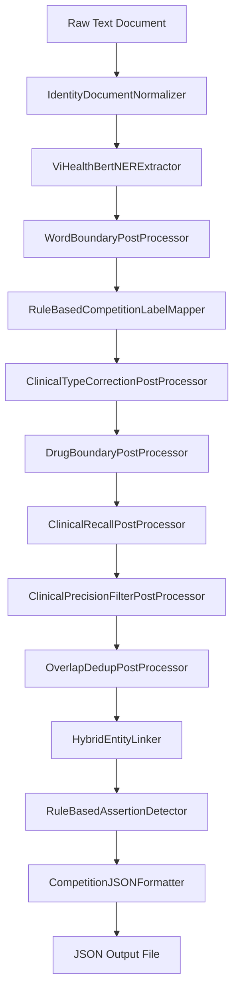

# Technical Repository Explanation: Vietnamese Clinical NER & Entity Linking Pipeline

This repository implements a production-grade NLP pipeline designed to process unstructured Vietnamese clinical notes, extract key medical entities, map them to international standard ontologies (ICD-10 and RxNorm), and flag contextual assertions (negation, history).

---

## 1. Project Directory Structure

```text
Ontological-Reasoning-in-Medical-Knowledge-Retrieval/
├── .env.example             # Template environment configuration
├── .gitignore               # Ignored files/directories in git
├── README.md                # General introduction and execution quickstart
├── requirements.txt         # Package dependencies (PyTorch, Transformers, etc.)
├── state.md                 # Master project state, requirements, and changelog
├── data/                    # Local clinical notes, ontologies, and embeddings
│   ├── var/test/            # 100 raw clinical note text files
│   └── viettel/             # Dictionary lookup files and datasets
│       ├── base/            # Extracted mapping CSVs & precomputed .npy embeddings
│       │   ├── short_diagnosis.csv  # ICD-10 code mapping
│       │   ├── short_drug.csv       # RxNorm drug mapping
│       │   ├── short_symptom.csv    # Symptom mapping derived from KG
│       │   ├── short_diagnosis.npy  # SapBERT embeddings for diagnoses
│       │   ├── short_drug.npy       # SapBERT embeddings for drugs
│       │   └── short_symptom.npy    # SapBERT embeddings for symptoms
│       ├── combine/         # Processed mapping dictionaries (e.g., RxNorm)
│       └── mapping/         # Raw source data for ontologies (RxNorm RRF files)
├── modules/                 # Core Python source codebase (refactored to OOP)
│   ├── core/                # Data structures and schemas
│   │   ├── config.py        # Centralized configuration
│   │   ├── constants.py     # Global labels, types, and codes
│   │   └── schemas.py       # Pydantic schemas for Doc, Mention, Span, Link
│   ├── components/          # Reusable NLP components
│   │   ├── ner/             # NER extraction (ViHealthBertNERExtractor)
│   │   ├── normalization/   # Document text normalizers
│   │   ├── postprocessing/  # Mention adjustments (Recall, Precision, Word boundaries)
│   │   ├── classification/  # Mentions to label mapping (RuleBasedCompetitionLabelMapper)
│   │   ├── linking/         # Entity linking/mapping (HybridEntityLinker)
│   │   └── assertions/      # Contextual assertion detectors (RuleBasedAssertionDetector)
│   ├── pipelines/           # Composed end-to-end pipelines
│   │   ├── base.py          # Base pipeline interface
│   │   ├── clinical.py      # Standard clinical pipeline orchestration
│   │   ├── factory.py       # Registry and factory for fetching pipelines
│   │   ├── v5.py            # Rebuilt V5 composable pipeline
│   │   └── v6.py            # V6 refined pipeline (current SOTA)
│   ├── legacy/              # Frozen legacy monolithic scripts
│   │   ├── utils_legacy.py
│   │   └── test_sample_pipeline_legacy.py
│   ├── dataset/             # Scripts for preprocessing and parsing raw dictionaries
│   │   ├── dataset_processing/  # Raw parser scripts (RRF -> short_drug.csv)
│   │   └── preprocessing/       # Scripts to build embedding indexes
│   ├── model/               # Model initialization and training logic
│   └── evaluation/          # Evaluation runner scripts
│       └── run_pipeline.py  # Central pipeline runner and exporter
└── output/                  # Final generated JSON files matching evaluation schema
```

---

## 2. Core Architectural Components

### 2.1 NER Inference & Fine-Tuning
The Named Entity Recognition (NER) component identifies entity boundaries and labels from raw clinical text.
*   **Model (`modules/components/ner/vihealthbert.py`):** Utilizes `transformers` to load a pre-trained transformer model (e.g., `vihealthbert`, `vipubmed-deberta`) with token classification heads, processing input line-by-line to respect token constraints.
*   **Tags & Token Matching:**
    *   **Vietnamese Labels:** `O`, `B-Disease/Symptom`, `I-Disease/Symptom`, `B-Procedure/Treatment`, `I-Procedure/Treatment`, `B-Drug`, `I-Drug`.

### 2.2 Entity Linking & Retrieval
Once boundaries are extracted, entities are matched against canonical dictionaries using semantic embeddings:
*   **Retrieval Models (`modules/components/linking/hybrid.py`):** 
    *   Vietnamese: `cambridgeltl/SapBERT-UMLS-2020AB-all-lang-from-XLMR`
    *   English: `cambridgeltl/SapBERT-from-PubMedBERT-fulltext`
*   **Pre-computed Embedding Maps (`data/viettel/base/`):** Pre-calculated `.npy` numpy array embeddings of target concepts.
*   **Dual-Retrieval Matching:**
    *   When the NER model yields a disease-related tag, it is simultaneously embedded and compared using cosine similarity against both `short_diagnosis.csv` (ICD-10 codes) and `short_symptom.csv` (symptom identifiers).
    *   It is classified dynamically as `CHẨN_ĐOÁN` or `TRIỆU_CHỨNG` based on the highest cosine similarity score.
*   **Reranking & Hybrid Scoring:**
    *   To match strict dosage details in drug mapping, the pipeline retrieves the top-3 candidate strings using SapBERT.
    *   A secondary lexical similarity check (`difflib.SequenceMatcher`) acts as a tie-breaker to favor exact string matches over pure semantic synonyms.

### 2.3 Post-Processing & Normalization
V6 implements a highly refined post-processing stack to improve precision and recall:
*   **Word Boundary Fix (`word_boundary.py`):** Pads extracted NER span boundaries to the nearest whitespace or punctuation to capture whole words.
*   **Clinical Type Correction (`type_correction.py`):** Corrects systematic NER errors, e.g., mapping symptom phrases away from diagnosis tags and restoring drug mentions mislabeled as procedures.
*   **Drug Boundary Expansion (`drug_boundary.py`):** Scans for dosage and frequency context around drug names (e.g. `325mg x 1`, `po daily`) using regex and expands the span.
*   **Clinical Recall (`clinical_recall.py`):** Recalls high-value missed tests (e.g. `ECG`, `CEA`), symptoms (`ho`, `sốt`, `khó thở`), and automatically parses numeric lab results (e.g. `glucose 6.8`) from note sections.
*   **Clinical Precision Filter (`precision_filter.py`):** Removes common noise terms (e.g. "nhẹ", "nặng", "bệnh lý") and standalone dosage tokens (e.g. "po", "bid", "mg").
*   **Overlap Deduplication (`overlap_dedup.py`):** Resolves nesting and duplicate conflicts in the final prediction list.

### 2.4 Contextual Assertions (Modifiers)
Clinical modifiers are flagged using rule-based algorithms inside `modules/components/assertions/rule_based.py`:
*   `isHistorical`: Checked against clinical section boundaries. If an entity falls under the first section (`1. Tiền sử bệnh`), it is tagged as historical.
*   `isNegated`: Evaluated via bullet-point rules and clause-based syntax processing. Commas indicate lists of negated symptoms (e.g., *"Không ho, sốt, đau ngực"* negates all), while adversative clauses (e.g., *"nhưng có"*) block negation propagation.
*   **V6 Label Restriction:** restircts assertions to eligible competition labels only (`CHẨN_ĐOÁN`, `THUỐC`, `TRIỆU_CHỨNG`).

---

## 3. End-to-End Pipeline Workflow

The evaluation pipeline runner `modules/evaluation/run_pipeline.py` orchestrates the component classes:



---

## 4. Run Configurations

### Re-generating Dictionary Embeddings
```bash
python modules/dataset/preprocessing/generate_embeddings.py
python modules/dataset/preprocessing/generate_embedding_symptom.py
```

### Executing the Refactored Pipeline
To run the SOTA V6 refined pipeline:
```bash
python modules/evaluation/run_pipeline.py --pipeline v6_refined
```
To run the legacy V5 behavior using refactored classes:
```bash
python modules/evaluation/run_pipeline.py --pipeline v5_refactored
```
To run the frozen legacy monolithic pipeline:
```bash
python modules/evaluation/run_pipeline.py --pipeline legacy_v5
```

All output runs are written by default to `output/<version>/runN/` (version defaults to the pipeline name) with `submission/` (JSON) and `trace/` (logs). Override with `--version-name`, `--run-name`, or flat `--output-dir`.

### Debugging & Tracing Pipeline Execution
A detailed tracing and logging feature is built into the refactored pipeline (`ClinicalEntityLinkingPipeline`). When running the pipeline runner, step-by-step intermediate trace logs are generated by default under `output/<version>/runN/trace/` (e.g., `1_trace.txt`).

These trace logs capture:
- The input document and its normalization status.
- The raw entities extracted by the NER model.
- Mentions after each post-processing and classification component, along with detailed **Diffs** (Added, Removed, and Modified mentions) compared to the previous step.
- Canonical candidate assignments and confidence scores from the linker.
- Final assertion status (e.g. negation, historical) from the assertion detector.

You can explicitly control trace logging using command-line arguments:
- `--trace` (default): Enable writing step-by-step trace logging files under `run/trace/`.
- `--no-trace`: Disable writing step-by-step trace logging files.

