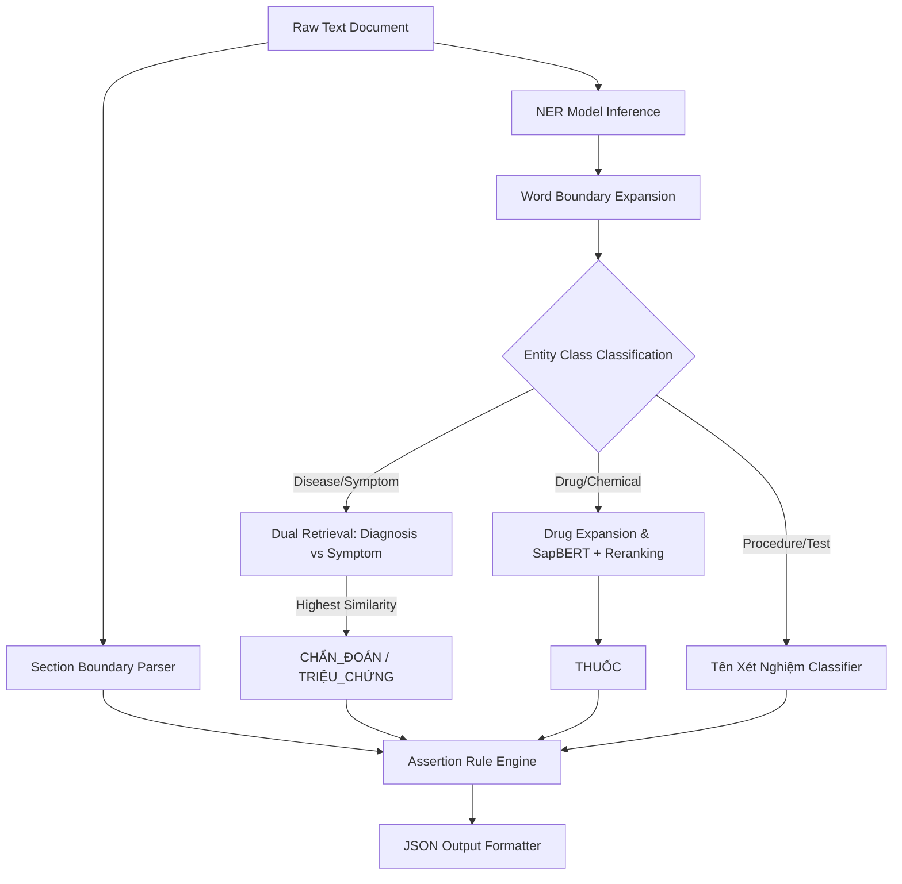

# Technical Repository Explanation: Vietnamese Clinical NER & Entity Linking Pipeline

This repository implements a production-grade NLP pipeline designed to process unstructured Vietnamese clinical notes, extract key medical entities, map them to international standard ontologies (ICD-10 and RxNorm), and flag contextual assertions (negation, history).

---

## 1. Project Directory Structure

```text
Ontological-Reasoning-in-Medical-Knowledge-Retrieval/
├── .env.example             # Template environment configuration
├── .gitignore               # Ignored files/directories in git
├── README.md                # General introduction and execution quickstart
├── requirements.txt         # Package dependencies (PyTorch, Transformers, etc.)
├── state.md                 # Master project state, requirements, and changelog
├── data/                    # Local clinical notes, ontologies, and embeddings
│   ├── var/test/            # 100 raw clinical note text files
│   └── viettel/             # Dictionary lookup files and datasets
│       ├── base/            # Extracted mapping CSVs & precomputed .npy embeddings
│       │   ├── short_diagnosis.csv  # ICD-10 code mapping
│       │   ├── short_drug.csv       # RxNorm drug mapping
│       │   ├── short_symptom.csv    # Symptom mapping derived from KG
│       │   ├── short_diagnosis.npy  # SapBERT embeddings for diagnoses
│       │   ├── short_drug.npy       # SapBERT embeddings for drugs
│       │   └── short_symptom.npy    # SapBERT embeddings for symptoms
│       ├── combine/         # Processed mapping dictionaries (e.g., RxNorm)
│       └── mapping/         # Raw source data for ontologies (RxNorm RRF files)
├── modules/                 # Core Python source codebase
│   ├── utils.py             # Base EntityExtractor class tying the pipeline together
│   ├── dataset/             # Scripts for preprocessing and parsing raw dictionaries
│   │   ├── dataset_processing/  # Raw parser scripts (RRF -> short_drug.csv)
│   │   │   ├── process_rxnorm.py
│   │   │   ├── build_benchmark_dataset.py
│   │   │   ├── build_training_dataset.py
│   │   │   ├── map_labels_to_cui.py
│   │   │   ├── build_icd_dataset.py
│   │   │   └── unify_datasets.py
│   │   └── preprocessing/       # Scripts to build embedding indexes
│   │       ├── generate_embeddings.py
│   │       ├── extract_tags.py
│   │       ├── generate_embedding_symptom.py
│   │       ├── process_eval_datasets.py
│   │       └── extract_entities.py
│   ├── model/               # Inference code, training scripts, and model configurations
│   │   ├── training/        # Training and fine-tuning pipelines
│   │   │   ├── train_ner.py
│   │   │   └── finetune_qwen.py
│   │   └── inference/       # Local model instantiation
│   │       └── inference_ner.py
│   └── evaluation/          # Evaluation metrics and prediction scripts
│       ├── test_sample_pipeline.py  # End-to-end evaluation pipeline script
│       └── evaluate_ner.py          # NER evaluation scripts
└── output/                  # Final generated JSON files matching evaluation schema
```

---

## 2. Core Architectural Components

### 2.1 NER Inference & Fine-Tuning
The Named Entity Recognition (NER) component identifies entity boundaries and labels from raw clinical text.
*   **Model (`modules/model/inference/inference_ner.py`):** Utilizes `transformers` to load a pre-trained transformer model (e.g., `vihealthbert`, `vipubmed-deberta`, or `phobert`) with token classification heads.
*   **Tags & Token Matching:**
    *   **Vietnamese Labels:** `O`, `B-Disease/Symptom`, `I-Disease/Symptom`, `B-Procedure/Treatment`, `I-Procedure/Treatment`, `B-Drug`, `I-Drug`.
    *   **English Labels:** `O`, `B-Disease`, `I-Disease`, `B-Chemical`, `I-Chemical`.
*   **Training (`modules/model/training/train_ner.py`):** Trains custom models with CoNLL/BIO format datasets, properly handling tokenization offsets and sub-word label masking (using `-100` ignore index for loss computation).

### 2.2 Entity Linking & Retrieval
Once boundaries are extracted, entities are matched against canonical dictionaries using semantic embeddings:
*   **Retrieval Models (`modules/utils.py`):** 
    *   Vietnamese: `cambridgeltl/SapBERT-UMLS-2020AB-all-lang-from-XLMR`
    *   English: `cambridgeltl/SapBERT-from-PubMedBERT-fulltext`
*   **Pre-computed Embedding Maps (`data/viettel/base/`):** Dictionary lists and pre-calculated `.npy` numpy array embeddings of target concepts.
*   **Dual-Retrieval Matching:**
    *   When the NER model yields a disease-related tag, it is simultaneously embedded and compared using cosine similarity against both `short_diagnosis.csv` (ICD-10 codes) and `short_symptom.csv` (symptom identifiers).
    *   It is classified dynamically as `CHẨN_ĐOÁN` or `TRIỆU_CHỨNG` based on the highest cosine similarity score.
*   **Reranking & Hybrid Scoring:**
    *   To match strict dosage details in drug mapping, the pipeline retrieves the top-3 candidate strings using SapBERT.
    *   A secondary lexical similarity check (`difflib.SequenceMatcher`) acts as a tie-breaker to favor exact string matches over pure semantic synonyms.

### 2.3 Post-Processing & Normalization
*   **Word Fragmentation Fix:** If an extracted NER span falls mid-word (due to subword tokenization differences), boundaries are padded outwards to the nearest whitespace or punctuation.
*   **Drug Boundary Expansion:** Regex filters search for trailing quantities (e.g., `mg`, `g`, `ml`, `viên`, `bid`) and expand the offset boundaries to capture full drug-dosage strings.
*   **Lab/Procedure Filtering:** Entities containing procedural keywords (like `xét nghiệm`, `phân tích`, `ct`, `mri`) bypass disease dictionaries and are routed to `TÊN_XÉT_NGHIỆM`.

### 2.4 Contextual Assertions (Modifiers)
Clinical modifiers are flagged using rule-based algorithms inside `modules/evaluation/test_sample_pipeline.py`:
*   `isHistorical`: Checked against clinical section boundaries. If an entity falls under the first section (`1. Tiền sử bệnh`), it is tagged as historical.
*   `isNegated`: Evaluated via bullet-point rules and clause-based syntax processing. Commas indicate lists of negated symptoms (e.g., *"Không ho, sốt, đau ngực"* negates all), while adversative clauses (e.g., *"nhưng có"*) block negation propagation.

---

## 3. End-to-End Pipeline Workflow

The evaluation pipeline `modules/evaluation/test_sample_pipeline.py` integrates the components:



### JSON Schema Output Specification

Predictions are exported to `output/<file_id>.json` conforming to this template:

```json
[
  {
    "text": "amlodipine 10 mg po daily",
    "type": "THUỐC",
    "candidates": ["308135"],
    "assertions": ["isHistorical"],
    "position": [58, 83]
  },
  {
    "text": "ho",
    "type": "TRIỆU_CHỨNG",
    "candidates": [],
    "assertions": [],
    "position": [196, 198]
  }
]
```

---

## 4. Run configurations

### Re-generating Dictionary Embeddings
```bash
python modules/dataset/preprocessing/generate_embeddings.py
python modules/dataset/preprocessing/generate_embedding_symptom.py
```

### Executing Evaluation Pipeline
```bash
python modules/evaluation/test_sample_pipeline.py
```
This processes all `.txt` documents under `data/var/test/` and deposits formatted predictions into `output/`.
