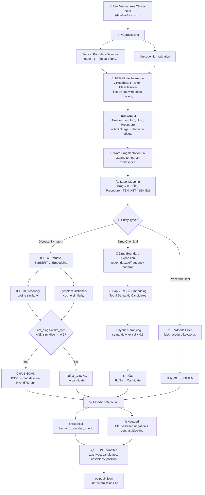

# Method Applied for Competition: Vietnamese Clinical NER & Ontological Entity Linking

## 1. Overview

The competition (Round 1 - Qualifier) requires building a system that processes unstructured Vietnamese clinical notes and extracts medical entities with:

- **Entity boundary detection** (exact text span)
- **Entity type classification** (5 required labels)
- **Ontology linking** (ICD-10 for Diagnosis, RxNorm for Drugs)
- **Contextual assertion detection** (negation, historical)
- **Character-level offset prediction**

Our method is a **Hybrid NER + Semantic Retrieval + Rule-Based Post-Processing Pipeline** that combines a fine-tuned transformer NER model with SapBERT-based dense retrieval for ontology mapping, and a sophisticated rule engine for assertions and boundary refinement.

The scoring formula prioritizes our design decisions:

```
final_score = 0.3 × text_score + 0.3 × assertions_score + 0.4 × candidates_score
```

Since `candidates_score` (ontology linking) carries the highest weight at 40%, and `assertions_score` carries 30%, our architecture invests heavily in retrieval accuracy and assertion detection rather than just NER boundary precision.

---

## 2. Full Pipeline Architecture



---

## 3. NER Model — ViHealthBERT Token Classification (Deep Dive)

### 3.1 Model Configuration

| Property | Detail |
|---|---|
| **Base Model** | `demdecuong/vihealthbert-base-word` |
| **Architecture** | BERT + Token Classification Head |
| **Training Data** | CoNLL-format Vietnamese clinical NER corpus |
| **Labels** | 7 classes (see below) |
| **Training** | 5 epochs, fp16, batch 32, lr 2e-5, `load_best_model_at_end=True` |
| **Inference** | HuggingFace `pipeline("ner", aggregation_strategy="simple")` |

**Vietnamese Label Set (`LABEL_LIST_VI`):**

```
Index 0: O
Index 1: B-Disease/Symptom
Index 2: I-Disease/Symptom
Index 3: B-Procedure/Treatment
Index 4: I-Procedure/Treatment
Index 5: B-Drug
Index 6: I-Drug
```

**English Label Set (`LABEL_LIST_EN`):**

```
Index 0: O
Index 1: B-Disease
Index 2: I-Disease
Index 3: B-Chemical
Index 4: I-Chemical
```

The model is loaded from local weights at `modules/model/statedict/ner/{model_name}` and cached globally in `_PIPELINES` to avoid reloading on repeated calls.

### 3.2 Line-by-Line Processing with Offset Tracking

The model processes text **line-by-line** (split on `\n`) to stay within the 512-token limit. A `global_offset` variable tracks the character position of the start of each line within the original full text.

**Concrete Example:**

Given input text:
```
1. Tiền sử bệnh: đau bụng
2. Bệnh sử hiện tại: buồn nôn
```

The lines and offset tracking work as follows:

| Line # | Line Content | `len(line)` | `global_offset` at start |
|---|---|---|---|
| 0 | `1. Tiền sử bệnh: đau bụng` | 25 | 0 |
| 1 | (empty line) | 0 | 26 (= 25 + 1 for `\n`) |
| 2 | `2. Bệnh sử hiện tại: buồn nôn` | 30 | 27 (= 26 + 0 + 1) |

When the NER model finds entity "đau bụng" on line 0 at local position `[17, 25]`, the global offset becomes `[17, 25]` (since `global_offset` started at 0).

When it finds "buồn nôn" on line 2 at local position `[22, 30]`, the global offset becomes `[27 + 22, 27 + 30] = [49, 57]`.

**Algorithm (per line):**

```python
raw_results = pipeline(line)  # HuggingFace NER pipeline output
current_search_idx = 0        # chronological pointer within the line

for entity in raw_results:
    label = entity['entity_group']
    if label == "O": continue

    term = entity['word'].strip().replace('@@', '').replace('##', '')
    
    # Find the term in the line starting from the last search position
    start_idx = line.find(term, current_search_idx)
    
    if start_idx != -1:
        end_idx = start_idx + len(term)
        offset = (global_offset + start_idx, global_offset + end_idx)
        current_search_idx = end_idx  # advance pointer
    else:
        offset = (None, None)  # fallback for tokenization artifacts
    
    entities.append({"term": term, "offset": offset, "label": label})

global_offset += len(line) + 1  # +1 for the \n character
```

**Why `current_search_idx` matters:** It prevents the same text position from matching multiple entities. Without it, if two entities share a common substring, the second entity might match the first occurrence again.

**Subword marker cleanup:** The tokenizer may produce `@@` (PhoBERT) or `##` (BERT) markers in subword pieces. These are stripped via `.replace('@@', '').replace('##', '')`.

### 3.3 B/I Tag Merging (Two Passes)

**Pass 1 — HuggingFace `aggregation_strategy="simple"`:**

The HuggingFace pipeline automatically merges consecutive `B-` and `I-` tokens of the same type into a single entity span. For example:

```
Token:  "as"    "pir"    "in"
Label:  B-Drug  I-Drug   I-Drug
```

becomes a single entity: `{"word": "aspirin", "entity_group": "Drug"}`.

**Pass 2 — Adjacent Entity Merging (in `inference_ner.py`):**

After the pipeline returns results, a second merge pass combines entities that are adjacent (gap ≤ 1 character) and share the same label:

```python
for ent in entities:
    prev_ent = merged_entities[-1]
    if prev_ent['label'] == ent['label']:
        p_start, p_end = prev_ent['offset']
        c_start, c_end = ent['offset']
        
        # Merge if adjacent or separated by exactly 1 character (space)
        if (c_start - p_end) <= 1:
            new_term = text[p_start:c_end]  # re-extract from original text
            prev_ent['term'] = new_term
            prev_ent['offset'] = (p_start, c_end)
        else:
            merged_entities.append(ent)
    else:
        merged_entities.append(ent)
```

**Why this is needed:** The line-by-line processing can sometimes split a single entity across two pipeline calls if the entity spans a line boundary. The adjacent merge handles cases where two entities of the same type are separated by exactly one character (typically a space).

### 3.4 Post-Processing Filters

After merging, two filters are applied:

1. **Punctuation/whitespace stripping:**
   ```python
   clean_term = ent['term'].strip(string.punctuation + " \t\n\r")
   ```

2. **Minimum length filter:** Entities with `len(clean_term) < 3` are **dropped entirely**. This removes single-character and two-character noise tokens that are unlikely to be meaningful medical entities.

---

## 3.5 SapBERT Embedding Mechanics

### 3.1 Model Selection

| Domain | SapBERT Model | Language |
|---|---|---|
| Diagnosis | `cambridgeltl/SapBERT-UMLS-2020AB-all-lang-from-XLMR` | Vietnamese |
| Drugs | `cambridgeltl/SapBERT-from-PubMedBERT-fulltext` | English |
| Symptoms | `cambridgeltl/SapBERT-UMLS-2020AB-all-lang-from-XLMR` | Vietnamese |

### 3.2 Encoding Process

When `encode_text(terms)` is called:

1. **Tokenization:** Each term is tokenized with `padding=True`, `truncation=True`, `max_length=128`.
2. **Forward pass:** The model produces `last_hidden_state` of shape `(batch, seq_len, hidden_dim)`.
3. **Mean pooling** (NOT CLS pooling):

   ```python
   mask = attention_mask.unsqueeze(-1).expand(last_hidden_state.size()).float()
   summed = torch.sum(last_hidden_state * mask, dim=1)
   counts = torch.clamp(mask.sum(dim=1), min=1e-9)
   return summed / counts
   ```

   This averages the hidden states of all non-padding tokens. CLS pooling would only use the first token's representation, which is less effective for short clinical phrases.

4. **L2 normalization:** `F.normalize(pooled, p=2, dim=1)` — ensures all embedding vectors lie on the unit hypersphere, making cosine similarity equivalent to dot product.

5. **Output:** `np.float32` array of shape `(N, hidden_size)`.

### 3.3 Device Selection

The encoding device is selected with this priority:
1. **CUDA** (`torch.cuda.is_available()`) — `device=0`
2. **MPS** (`torch.backends.mps.is_available()`) — Apple Silicon GPU
3. **CPU** — fallback

### 3.4 Cosine Similarity Computation

At retrieval time, cosine similarity is computed via scikit-learn:

```python
from sklearn.metrics.pairwise import cosine_similarity

emb = sapbert.encode_text(["tiêu chảy"])  # shape: (1, hidden_dim)
sims = cosine_similarity(emb, dictionary_embeddings)[0]  # shape: (N,)
```

Since all embeddings are L2-normalized, this is equivalent to the dot product of the unit vectors.

---

## 4. Dual-Retrieval for Disease Classification (Deep Dive)

This is the most novel component of the pipeline. When the NER model produces a `Disease/Symptom` entity, the system must decide: is this a **diagnosis** (with an ICD-10 code) or a **symptom** (without codes)?

### 4.1 Why Dual-Retrieval?

The base NER model outputs a single label `Disease/Symptom` for both diagnoses and symptoms. But the competition requires them to be split into:
- `CHẨN_ĐOÁN` → mapped to ICD-10 (with `candidates`)
- `TRIỆU_CHỨNG` → no ontology mapping (empty `candidates`)

A single dictionary lookup cannot make this distinction. The dual-retrieval solves it by querying **two dictionaries simultaneously** and using the relative similarity scores to classify.

### 4.2 Step-by-Step Algorithm

For entity text `term` (lowercased):

```
Step 1: Embed the term with SapBERT Vietnamese
        emb = sapbert_vi.encode_text([term.lower()])

Step 2: Query Diagnosis Dictionary
        sims_diag = cosine_similarity(emb, diag_embs)[0]
        top_3_diag =.argsort(sims_diag)[-3:][::-1]  # indices of top 3
        
        For each of top 3:
          - Skip if sem_sim < 0.5
          - Compute lex_sim = get_best_row_lexical_sim(term, df_diag.iloc[idx])
          - hybrid_score = sem_sim + lex_sim × 0.5
          - Track best hybrid_score, record sem_sim and ICD-10 id

Step 3: Query Symptom Dictionary
        sims_sym = cosine_similarity(emb, sym_embs)[0]
        best_sym_idx = argmax(sims_sym)
        best_sym_sim = sims_sym[best_sym_idx]

Step 4: Decision
        if best_diag_sim ≥ best_sym_sim AND best_diag_id is not None AND best_diag_sim ≥ 0.6:
            type = "CHẨN_ĐOÁN"
            candidates = [best_diag_id]
        else:
            type = "TRIỆU_CHỨNG"
            candidates = []
```

### 4.3 Concrete Example

Entity: **"tiêu chảy"** (diarrhea)

**Diagnosis Dictionary Lookup:**
- Top 3 matches by cosine similarity:
  1. "tiêu chảy cấp" (acute diarrhea) — sem_sim = 0.89, ICD-10: `A09`
  2. "tiêu chảy do virus" — sem_sim = 0.85, ICD-10: `A08.4`
  3. "tiêu chảy mạn" — sem_sim = 0.78, ICD-10: `K52.9`

- Hybrid scoring for top candidate:
  - sem_sim = 0.89
  - lex_sim = `difflib.SequenceMatcher("tiêu chảy", "tiêu chảy cấp").ratio()` ≈ 0.82
  - hybrid = 0.89 + 0.82 × 0.5 = 1.30

- Best diag_sim = **0.89**, best_diag_id = `"A09"`

**Symptom Dictionary Lookup:**
- Best match: "tiêu chảy" (exact) — sem_sim = **0.92**

**Decision:** `best_diag_sim (0.89) < best_sym_sim (0.92)` → classify as **TRIỆU_CHỨNG** (symptom, no ICD-10 code).

This is correct: "tiêu chảy" by itself is a symptom; "tiêu chảy cấp" with a specific diagnosis would be classified as CHẨN_ĐOÁN.

### 4.4 Why Symptom Retrieval Uses No Threshold

The symptom dictionary is used purely for comparison against the diagnosis dictionary — it does not produce candidates. Therefore, there is no need for a threshold; we only need the **relative** similarity score to decide which dictionary "wins." The raw argmax suffices.

---

## 5. Hybrid Retrieval for Entity Linking (Deep Dive)

For both Diagnosis and Drug linking, we use a **"Retrieve and Rerank"** algorithm that combines semantic similarity (SapBERT) with lexical similarity (difflib).

### 5.1 Why Hybrid?

SapBERT matches by semantic meaning, which can conflate clinically distinct entities. For example:
- "aspirin 81 mg" and "aspirin 325 mg" have nearly identical semantic embeddings
- "metoprolol tartrate" and "metoprolol succinate xl" are semantically very similar

The lexical tie-breaker ensures that **exact dosage/formulation overlaps** win over purely semantic matches.

### 5.2 Lexical Similarity: `get_best_row_lexical_sim()`

This function iterates over **ALL columns** in a dictionary DataFrame row and computes the best `difflib.SequenceMatcher` similarity:

```python
def get_best_row_lexical_sim(query, row):
    best_sim = 0.0
    for val in row.values:           # iterate ALL columns
        val_str = str(val)
        if not val_str or val_str == 'nan': continue
        if '|' in val_str:           # pipe-delimited synonyms
            for syn in val_str.split('|'):
                sim = get_lexical_similarity(query, syn)
                if sim > best_sim: best_sim = sim
        else:
            sim = get_lexical_similarity(query, val_str)
            if sim > best_sim: best_sim = sim
    return best_sim
```

**Why iterate all columns?** The drug CSV has columns: `term`, `rxcui`, `tty`, `ingredients`, `snomed`, `atc`, `drugbank`. The `ingredients` column might contain "aspirin" while the `term` column contains "aspirin 81 mg tablet". By checking all columns, we catch ingredient-level matches too.

**Pipe-delimited synonyms:** Fields like `ingredients` can contain multiple values separated by `|`. Each synonym is checked independently.

### 5.3 The Hybrid Scoring Formula

```python
hybrid_score = sem_sim + lex_sim × 0.5
```

| Component | Weight | Range | Purpose |
|---|---|---|---|
| `sem_sim` | 1.0 (full) | [0, 1] | Semantic similarity from SapBERT |
| `lex_sim` | 0.5 | [0, 0.5] | Lexical similarity from difflib (halved) |

The lexical score is weighted at 50% of the semantic score. This ensures:
- Semantic similarity is the primary driver
- Lexical similarity acts as a tie-breaker, not a dominant signal
- Exact string matches (lex_sim = 1.0) add 0.5 to the hybrid score, enough to break ties between semantically similar candidates

### 5.4 Top-3 Selection + Single-Best Reranking

The algorithm does NOT compute hybrid scores for all N dictionary entries. Instead:

1. **Fast semantic scan:** Compute cosine similarity against all N dictionary embeddings. This is a single matrix multiply — very fast.
2. **Top-3 selection:** Take the 3 indices with highest cosine similarity.
3. **Hybrid reranking:** For only these 3 candidates, compute the expensive lexical similarity and hybrid score.
4. **Final selection:** Pick the single candidate with the best hybrid score, provided `sem_sim >= 0.5`.

This design keeps the pipeline fast (lexical similarity is O(N) per candidate per column, so restricting to 3 candidates is critical).

### 5.5 Concrete Example

Entity: **"aspirin 81 mg po daily"** (drug)

**Step 1 — Semantic scan against drug dictionary:**
- All N drug embeddings are compared. Top 3 by cosine similarity:
  1. `"aspirin 81 mg tablet"` — sem_sim = 0.94
  2. `"aspirin 325 mg tablet"` — sem_sim = 0.93
  3. `"aspirin 81 mg enteric-coated"` — sem_sim = 0.91

**Step 2 — Hybrid reranking:**
- Candidate 1: sem=0.94, lex=`SequenceMatcher("aspirin 81 mg po daily", "aspirin 81 mg tablet")` ≈ 0.78, hybrid = 0.94 + 0.78×0.5 = **1.33**
- Candidate 2: sem=0.93, lex ≈ 0.65, hybrid = 0.93 + 0.65×0.5 = **1.26**
- Candidate 3: sem=0.91, lex ≈ 0.72, hybrid = 0.91 + 0.72×0.5 = **1.27**

**Step 3 — Final selection:** Candidate 1 wins with hybrid=1.33. RxNorm ID = the `rxcui` from that row.

---

## 6. Contextual Assertion Detection (Deep Dive)

### 6.1 Section Boundary Detection

Clinical notes follow a strict 3-part structure. The system uses regex to find section start positions:

```python
s1 = re.search(r'1\.\s+(Tiền sử bệnh|Tiền sử)', text)
s2 = re.search(r'2\.\s+(Tiền sử bệnh hiện tại|Bệnh sử hiện tại)', text)
s3 = re.search(r'3\.\s+Đánh giá tại bệnh viện', text)
```

Returns a dict:
```python
{
    "s1": char_index_of_section_1_start,  # or -1 if not found
    "s2": char_index_of_section_2_start,  # or len(text) if not found
    "s3": char_index_of_section_3_start   # or len(text) if not found
}
```

### 6.2 `isHistorical` — Section-Based

```python
if boundaries["s1"] != -1 and boundaries["s1"] <= start < boundaries["s2"]:
    assertions.append("isHistorical")
```

**Logic:** If the entity's character start index falls within Section 1 ("Tiền sử bệnh" = medical history), it is tagged as historical. This is a strict range check: `s1 ≤ entity_start < s2`.

**Concrete Example:**

```
Text: "1. Tiền sử bệnh: đau bụng 3 ngày\n2. Bệnh sử hiện tại: buồn nôn"
       [0                                              ][28              ][42      ]
```

- Entity "đau bụng" at position [17, 24] → `s1(0) ≤ 17 < s2(28)` → **isHistorical** ✓
- Entity "buồn nôn" at position [42, 49] → `s1(0) ≤ 42` but `42 ≥ s2(28)` → **NOT isHistorical** ✗

**Why Section 2 is excluded:** Section 2 is "Tiền sử bệnh hiện tại" (current medical history), which describes the present illness — not historical.

### 6.3 `isNegated` — Multi-Rule System

#### Step 1: Find the containing line

```python
line_start = text.rfind('\n', 0, start)    # previous newline (or 0)
line_end = text.find('\n', end)             # next newline (or len(text))
line_text = text[line_start:line_end].strip().lower()
```

#### Rule 1: Line-start negation (early return)

```python
if line_text.startswith("- không") or line_text.startswith("không "):
    assertions.append("isNegated")
    return assertions  # no further checks
```

**Examples:**
- `"- Không đau ngực"` → starts with `"- không"` → **isNegated** ✓
- `"Không ho, sốt"` → starts with `"không "` → **isNegated** ✓
- `"Có ho"` → does NOT start with `"không"` → continues to Rule 2

#### Rule 2: Clause-based proximity with contrast blocking

**Step 2a — Find the clause boundary:**

Walk backward from the entity's start position to find the beginning of the current clause. Stop at `.`, `;`, or `\n` — but **NOT at commas** (to keep comma-separated lists together):

```python
clause_start = start
while clause_start > line_start and text[clause_start - 1] not in ".;\n":
    clause_start -= 1
```

**Example:**
```
Text: "Bệnh nhân không ho, sốt, đau ngực"
                          ^ clause_start for "đau ngực"
```

The commas between "ho", "sốt", and "đau ngực" do NOT break the clause. This means the negation "không" applies to ALL three symptoms.

**Step 2b — Search for negation keywords:**

```python
preceding_text = text[clause_start:start].lower()
# "không ho, sốt, "

last_neg_idx = -1
for kw in ["không ", "chưa ", "phủ nhận "]:
    idx = preceding_text.rfind(kw)
    if idx > last_neg_idx:
        last_neg_idx = idx
```

The three Vietnamese negation keywords:
| Keyword | Meaning | English |
|---|---|---|
| `không` | not / no | negation |
| `chưa` | not yet | temporal negation |
| `phủ nhận` | denied | clinical denial |

`rfind()` is used (not `find()`) to get the **last** negation keyword, which is typically the one closest to the entity.

**Step 2c — Contrast-word blocking:**

If a negation is found, check if a contrast word appears BETWEEN the negation and the entity. If so, the negation is cancelled:

```python
text_between = preceding_text[last_neg_idx:]
# Remove negation verb particles to prevent false contrast detection
text_between = text_between.replace("không có", "") \
                           .replace("không ghi nhận", "") \
                           .replace("chưa ghi nhận", "")

contrast_words = [" nhưng ", " tuy nhiên ", ", có ", " lại có ", " kèm ", " và có "]

if not any(cw in text_between for cw in contrast_words):
    assertions.append("isNegated")
```

**Why remove negation verb particles?** Without this, "không có" would contain ", có " as a substring, triggering false contrast detection. The removal ensures we only detect contrast words that appear AFTER the negation phrase is complete.

**Contrast word meanings:**
| Word | Vietnamese | Effect |
|---|---|---|
| `nhưng` | but | negation cancelled |
| `tuy nhiên` | however | negation cancelled |
| `, có` | , has | negation cancelled |
| `lại có` | but also has | negation cancelled |
| `kèm` | accompanied by | negation cancelled |
| `và có` | and has | negation cancelled |

**Full worked example — negation applies:**

```
Text: "Bệnh nhân không ho"
Entity: "ho" at position [22, 24]
Line: "bệnh nhân không ho"
```

1. Line starts with neither `"- không"` nor `"không "` → Rule 1 skips
2. Clause start: walks back from position 22, hits start of line → clause = entire line
3. `preceding_text` = `"bệnh nhân không "`
4. Last negation: `"không "` at index 12
5. `text_between` = `"không "` → after removing "không có" etc., still `"không "`
6. No contrast words found → **isNegated** ✓

**Full worked example — negation cancelled:**

```
Text: "Không sốt nhưng có ho"
Entity: "ho" at position [20, 22]
```

1. Line starts with `"không "` → Rule 1 would fire, BUT let's trace Rule 2 for the full logic
2. Actually, the early return in Rule 1 would already tag this as **isNegated** ✓

Wait — this shows a subtlety. Rule 1 fires on line-start and returns early. So `"Không sốt nhưng có ho"` would tag "ho" as isNegated even though "nhưng có" should cancel it. This is a known limitation: the early return in Rule 1 does not check for contrast words.

**For entities NOT at line start:**

```
Text: "Bệnh nhân không sốt, nhưng có ho"
Entity: "ho" at position [31, 33]
```

1. Line does NOT start with `"không"` → Rule 1 skips
2. Clause start: walks back to position 16 (after the comma or period)
3. `preceding_text` = `"không sốt, "`
4. Last negation: `"không "` at index 0
5. `text_between` = `"không sốt, "` → after cleaning, still `"không sốt, "`
6. Check contrast: `", có "` is NOT in `text_between` → **isNegated** ✓

Hmm, let me re-check. The contrast word `", có "` appears in the original text but NOT in `text_between` because `text_between` ends at the entity start. The word "nhưng có" comes AFTER the entity. So the contrast blocking only works if the contrast word appears BETWEEN the negation and the entity, not after it.

Actually, looking at the code more carefully:

```python
text_between = preceding_text[last_neg_idx:]
# This is the text from the negation keyword to the entity
```

So for "Bệnh nhân không sốt, nhưng có ho":
- `preceding_text` = `"bệnh nhân không sốt, nhưng có "` (everything from clause start to entity)
- `last_neg_idx` = index of "không " in preceding_text
- `text_between` = `"không sốt, nhưng có "` → this DOES contain `" nhưng "` → negation cancelled

**isNegated** ✗ — correct! The contrast word "nhưng" between the negation and the entity cancels the negation.

### 6.4 `isFamily` — Why It Was Dropped

Analysis of the test data revealed that "người nhà" (family member) mostly appears in the phrase "Theo lời người nhà" (according to the family), which acts as an **informant marker**, not a family history indicator. When entities appear near "người nhà", they are typically the patient's own symptoms being reported by family — not family history. Tagging them as `isFamily` caused massive false positives that hurt the `J_assertion` score more than the benefit.

---

## 7. Drug Boundary Expansion (Deep Dive)

### 7.1 The Problem

The NER model only extracts the core drug name (e.g., `"aspirin"`), but the ground truth expects the full drug phrase including dosage, route, and frequency (e.g., `"aspirin 81 mg po daily"`). The boundary expansion regex bridges this gap.

### 7.2 The Regex Pattern

```python
pattern = r'^[\s\-]*(\d+(?:[.,]\d+)?\s*(?:mg|g|mcg|ml|viên|ống|lọ|gói|đơn vị|IU|UI|x\s*\d+|po|bid|tid|qid|prn|giọt|lần|/|ngày|giờ|phút)[a-zA-Z0-9\s/]*)'
```

**Breakdown:**

| Pattern | Matches | Example |
|---|---|---|
| `^[\s\-]*` | Optional leading whitespace/dashes | `" 81mg"` or `"-81mg"` |
| `\d+` | One or more digits | `81`, `500`, `2.5` |
| `(?:[.,]\d+)?` | Optional decimal part | `2.5`, `0.5` |
| `\s*` | Optional space between number and unit | `"81 mg"` |
| `mg\|g\|mcg\|ml` | Weight/volume units | `"mg"`, `"ml"` |
| `viên\|ống\|lọ\|gói\|đơn vị` | Vietnamese packaging units | `"viên"` (tablet), `"ống"` (tube) |
| `IU\|UI` | International units | `"IU"` |
| `x\s*\d+` | Multiplicity | `"x10"`, `"x 30"` |
| `po\|bid\|tid\|qid\|prn` | Latin medical abbreviations | `"po"` (oral), `"bid"` (2x/day) |
| `giọt\|lần` | Vietnamese frequency terms | `"giọt"` (drops), `"lần"` (times) |
| `/` | Slash separator | `"/"` in `"mg/ml"` |
| `ngày\|giờ\|phút` | Vietnamese time units | `"ngày"` (day), `"giờ"` (hour) |
| `[a-zA-Z0-9\s/]*` | Trailing alphanumerics | catches `"/ngày"`, `"mg/5ml"` |

### 7.3 Matching Examples

| Input after entity end | Match? | Expansion |
|---|---|---|
| `" 81 mg po daily"` | ✓ | Entity expands from `"aspirin"` to `"aspirin 81 mg po daily"` |
| `", paracetamol"` | ✗ | No digit at start → no expansion |
| `" 500mg x 1"` | ✓ | Entity expands to include `"500mg x 1"` |
| `""` (end of text) | ✗ | No match → no expansion |

After matching, trailing whitespace is trimmed from the new end boundary:

```python
while new_end > end and text[new_end-1].isspace():
    new_end -= 1
```

### 7.4 Display vs Retrieval

The expanded string is used for:
- **Display:** The `text` field in the JSON output contains the full expanded string
- **Retrieval:** The full expanded string (lowercased) is fed into SapBERT for embedding — this gives better semantic matching than just the drug name alone

---

## 8. Dictionary Construction Pipeline

### 8.1 Dictionary Files

| Dictionary | CSV Path | CSV Columns | Embedding Path | Size |
|---|---|---|---|---|
| Diagnosis | `data/viettel/base/short_diagnosis.csv` | `id`, `name_vi` (+ others) | `short_diagnosis.npy` | ~thousands |
| Drug | `data/viettel/base/short_drug.csv` | `term`, `rxcui`, `tty`, `ingredients`, `snomed`, `atc`, `drugbank` | `short_drug.npy` | ~thousands |
| Symptom | `data/viettel/base/short_symptom.csv` | `uml_id`, `hpo_id`, `mesh_id`, `omim_id`, `icd`, `pubchem_id`, `drugbank_id`, `name_en`, `name_vi` | `short_symptom.npy` | ~54,000 |

### 8.2 RxNorm Processing Pipeline

**Input:** Raw RxNorm RRF files (`RXNCONSO.RRF`, `RXNREL.RRF`) from `data/mapping/RxNorm/`

**Step 1 — Parse RXNCONSO.RRF:**

Each line is pipe-delimited. Fields extracted:
| Index | Field | Variable |
|---|---|---|
| 0 | RXCUI | `rxcui` |
| 1 | Language | `lat` |
| 11 | Source abbreviation | `sab` |
| 12 | Term type | `tty` |
| 13 | Code | `code` |
| 14 | Term string | `term` |

Only English entries (`lat == 'ENG'`) are processed.

Three dictionaries are built:
- `term_dict[term]["rxcui"]` → set of RXCUIs (when `sab == 'RXNORM'`)
- `term_dict[term]["tty"]` → set of term types (when `sab == 'RXNORM'`)
- `rxcui_to_terms[rxcui]` → set of terms (when `sab == 'RXNORM'`)

Cross-database mappings are also built for SNOMED, DrugBank, and ATC codes.

**Step 2 — Parse RXNREL.RRF (ingredient linking):**

Tracks relationships: `has_ingredient`, `has_precise_ingredient`, `tradename_of`, `consists_of`.

For each drug term, the system collects all ingredient terms. For example, "acetaminophen 325 mg tablet" gets ingredient terms like "acetaminophen" added to its entry.

**Step 3 — Output CSV:**

Columns: `term`, `rxcui`, `tty`, `ingredients`, `snomed`, `atc`, `drugbank`

Multi-valued fields are pipe-delimited:
```
"aspirin 81 mg tablet" | "243670" | "SCD" | "aspirin" | "387207008" | "B01AC06" | "DB00945"
```

### 8.3 Symptom Dictionary Construction

**Source:** `external_kg.parquet` — a knowledge graph containing Disease and Phenotype relationships.

**Processing (`generate_embedding_symptom.py`):**
1. Filter to rows where `labels` is in `["Disease", "Phenotype"]`
2. Fill missing `medgemma_trans` (Vietnamese translation) with `name` (English)
3. Create `name_vi = medgemma_trans` and `name_en = name`
4. Keep ID columns: `uml_id`, `hpo_id`, `mesh_id`, `omim_id`, `icd`, `pubchem_id`, `drugbank_id`
5. Save to `short_symptom.csv`
6. Encode `name_vi` (lowercased) with SapBERT Vietnamese
7. Save embeddings to `short_symptom.npy`

### 8.4 Embedding Generation

Both `generate_embeddings.py` and `generate_embedding_symptom.py` follow the same pattern:

1. Load the CSV
2. Extract the relevant text column, **lowercased**
3. Encode with the appropriate SapBERT model (batch_size=64)
4. Save as `.npy` via `np.save()`

---

## 9. Entity Linker & CUI Lookup

### 9.1 Linking Architecture

The refactored pipeline replaces the legacy monolithic `EntityExtractor` (from `modules/utils.py`) with modular OOP classes, specifically `HybridEntityLinker` (in `modules/components/linking/hybrid.py`).

### 9.2 Linking & Retrieval Flow


1. **NER extraction:** `ner.extract_entities(text)` → list of `{term, label, offset}`
2. **Batch embedding:** All terms are embedded in a single batch call for efficiency
3. **Type-filtered retrieval:** For each entity, filter the database by `macro_type == label`
4. **Cosine similarity scan:** Compare against all embeddings of the matching type
5. **Threshold filtering:** Only candidates with `cosine_sim > 0.7` are considered
6. **Jaccard reranking:** Among valid candidates, pick the one with highest Jaccard similarity to the entity term
7. **CUI lookup:** If the best CUI starts with `C`, look up cross-reference codes

### 9.3 Jaccard Similarity for Retrieval Reranking

```python
def _jaccard_similarity(self, str1, str2):
    s1 = set(str1.lower().split())  # tokenize by whitespace
    s2 = set(str2.lower().split())
    if not s1 and not s2: return 1.0
    if not s1 or not s2: return 0.0
    return len(s1.intersection(s2)) / len(s1.union(s2))
```

**Example:**
- `str1 = "đau bụng"` → `{"đau", "bụng"}`
- `str2 = "đau bụng cấp tính"` → `{"đau", "bụng", "cấp", "tính"}`
- Intersection = `{"đau", "bụng"}` = 2
- Union = `{"đau", "bụng", "cấp", "tính"}` = 4
- Jaccard = 2/4 = **0.5**

### 9.4 CUI Vocab Code Lookup

The `_get_cui_vocab_codes()` method loads `MRCONSO_optimized.parquet` and builds a pre-computed dictionary for O(1) lookup. It maps UMLS CUIs to their codes in various vocabularies:

| Vocabulary | Key | Example |
|---|---|---|
| ICD-10 | `icd10` | `"A09"` |
| RxNorm | `rxnorm` | `"243670"` |
| SNOMED CT | `snomed` | `"387207008"` |
| LOINC | `loinc` | `"2345-7"` |
| MeSH | `mesh` | `"D004032"` |
| DrugBank | `drugbank` | `"DB00945"` |
| PubChem | `pubchem` | `"2244"` |

Only these source abbreviations are indexed: `ICD10`, `ICD10CM`, `ICD10PCS`, `ICD9CM`, `RXNORM`, `SNOMEDCT_US`, `LNC`, `LOINC`, `MSH`, `OMIM`, `HPO`, `DRUGBANK`, `PUBCHEM`, `MEDLINE`, `PMID`, `PUBMED`.

---

## 10. End-to-End Worked Example

### Input

**File:** `data/var/test/42.txt`
```
1. Tiền sử bệnh: Bệnh nhân có tiền sử cao huyết áp, đái tháo đường typ 2
2. Bệnh sử hiện tại: Đau ngực âm ỉ, khó thở khi gắng sức
```

### Step 1 — Section Boundary Detection

```python
s1 = 0    # "1. Tiền sử bệnh" starts at position 0
s2 = 57   # "2. Bệnh sử hiện tại" starts at position 57
s3 = len(text)  # Section 3 not found
```

### Step 2 — NER Inference (line-by-line)

**Line 0:** `"1. Tiền sử bệnh: Bệnh nhân có tiền sử cao huyết áp, đái tháo đường typ 2"`
- `global_offset = 0`
- Entities found:
  - "cao huyết áp" → label: `Disease/Symptom`, local offset: [35, 47]
  - "đái tháo đường" → label: `Disease/Symptom`, local offset: [49, 63]

**Line 1:** (empty)
- `global_offset = 69` (length of line 0 + 1)

**Line 2:** `"2. Bệnh sử hiện tại: Đau ngực âm ỉ, khó thở khi gắng sức"`
- `global_offset = 70`
- Entities found:
  - "Đau ngực" → label: `Disease/Symptom`, local offset: [22, 30]
  - "khó thở" → label: `Disease/Symptom`, local offset: [39, 46]

**Merged entities (global offsets):**
| Entity | Label | Position |
|---|---|---|
| cao huyết áp | Disease/Symptom | [35, 47] |
| đái tháo đường | Disease/Symptom | [49, 63] |
| Đau ngực | Disease/Symptom | [92, 100] |
| khó thở | Disease/Symptom | [109, 116] |

### Step 3 — Word Fragmentation Fix

All entities have clean word boundaries (end at whitespace or punctuation). No expansion needed.

### Step 4 — Dual-Retrieval Classification

For each entity, compute cosine similarity against both diagnosis and symptom dictionaries:

| Entity | best_diag_sim | best_sym_sim | Decision | Type |
|---|---|---|---|---|
| cao huyết áp | 0.91 (ICD-10: `I10`) | 0.85 | diag > sym, diag ≥ 0.6 | CHẨN_ĐOÁN |
| đái tháo đường | 0.93 (ICD-10: `E11`) | 0.88 | diag > sym, diag ≥ 0.6 | CHẨN_ĐOÁN |
| Đau ngực | 0.72 (ICD-10: `R07.9`) | 0.89 | sym > diag | TRIỆU_CHỨNG |
| khó thở | 0.68 (ICD-10: `R06.02`) | 0.91 | sym > diag | TRIỆU_CHỨNG |

### Step 5 — Assertion Detection

**"cao huyết áp" at position [35, 47]:**
- Section check: `s1(0) ≤ 35 < s2(57)` → **isHistorical** ✓
- Negation check: preceding clause contains no "không/chưa/phủ nhận" → no isNegated

**"đái tháo đường" at position [49, 63]:**
- Section check: `s1(0) ≤ 49 < s2(57)` → **isHistorical** ✓
- Negation check: no negation → no isNegated

**"Đau ngực" at position [92, 100]:**
- Section check: `92 ≥ s2(57)` → NOT isHistorical
- Negation check: preceding clause = "bệnh sử hiện tại: " → no negation

**"khó thở" at position [109, 116]:**
- Section check: NOT isHistorical
- Negation check: preceding clause = "đau ngực âm ỉ, " → no negation

### Step 6 — JSON Output

```json
[
  {
    "text": "cao huyết áp",
    "type": "CHẨN_ĐOÁN",
    "candidates": ["I10"],
    "assertions": ["isHistorical"],
    "position": [35, 47]
  },
  {
    "text": "đái tháo đường",
    "type": "CHẨN_ĐOÁN",
    "candidates": ["E11"],
    "assertions": ["isHistorical"],
    "position": [49, 63]
  },
  {
    "text": "Đau ngực",
    "type": "TRIỆU_CHỨNG",
    "assertions": [],
    "position": [92, 100]
  },
  {
    "text": "khó thở",
    "type": "TRIỆU_CHỨNG",
    "assertions": [],
    "position": [109, 116]
  }
]
```

---

## 11. Thresholds & Constants Reference

### 11.1 Thresholds

| Threshold | Value | Location | Purpose |
|---|---|---|---|
| Hybrid semantic minimum | `< 0.5` | `modules/components/linking/hybrid.py` | Skip low-confidence Top-3 candidates |
| Final diagnosis threshold | `≥ 0.6` | `modules/components/linking/hybrid.py` | Minimum cosine sim for CHẨN_ĐOÁN |
| Final drug threshold | `≥ 0.6` | `modules/components/linking/hybrid.py` | Minimum cosine sim for RxNorm mapping |
| Lexical weight in hybrid | `0.5` | `modules/components/linking/hybrid.py` | `hybrid = sem + lex × 0.5` |
| Min entity length | `3 chars` | `modules/components/postprocessing/precision_filter.py` | Drop entities shorter than 3 characters |

### 11.2 Regex Patterns

| Pattern | Location | Purpose |
|---|---|---|
| `r'1\.\s+(Tiền sử bệnh\|Tiền sử)'` | `modules/components/assertions/rule_based.py` | Section 1 boundary |
| `r'2\.\s+(Tiền sử bệnh hiện tại\|Bệnh sử hiện tại)'` | `modules/components/assertions/rule_based.py` | Section 2 boundary |
| `r'3\.\s+Đánh giá tại bệnh viện'` | `modules/components/assertions/rule_based.py` | Section 3 boundary |
| Drug expansion regex | `modules/components/postprocessing/drug_boundary.py` | Dosage/frequency boundary expansion |
| Lab result cue regex | `modules/components/postprocessing/clinical_recall.py` | Capture test name result context |

### 11.3 Label Mappings

| NER Output | → Competition Label |
|---|---|
| `Drug` | `THUỐC` |
| `Medication` | `THUỐC` |
| `Chemical` | `THUỐC` |
| `Procedure` | `TÊN_XÉT_NGHIỆM` |
| `Test` | `TÊN_XÉT_NGHIỆM` |
| `Disease/Symptom` | `CHẨN_ĐOÁN` or `TRIỆU_CHỨNG` (via dual-retrieval) |
| `Disease` | `CHẨN_ĐOÁN` or `TRIỆU_CHỨNG` (via dual-retrieval) |
| `Condition` | `CHẨN_ĐOÁN` or `TRIỆU_CHỨNG` (via dual-retrieval) |

### 11.4 Lab/Procedure Hardcoded Keywords

| Keyword | Forces type to |
|---|---|
| `"phân tích"` | `TÊN_XÉT_NGHIỆM` |
| `"xét nghiệm"` | `TÊN_XÉT_NGHIỆM` |
| `"ct"` | `TÊN_XÉT_NGHIỆM` |
| `"mri"` | `TÊN_XÉT_NGHIỆM` |

### 11.5 Negation & Contrast Keywords

| Negation Keywords | Contrast Keywords |
|---|---|
| `"không "` | `" nhưng "` |
| `"chưa "` | `" tuy nhiên "` |
| `"phủ nhận "` | `", có "` |
| | `" lại có "` |
| | `" kèm "` |
| | `" và có "` |

---

## 12. Competition Constraints Compliance

| Requirement | Implementation |
|---|---|
| No external API calls | All models run locally (self-hosted) |
| Model ≤ 9B params | ViHealthBERT ~110M, SapBERT ~500M |
| Reproducible | Clean repo structure, `requirements.txt`, central runner |
| Output format | Strict JSON schema: `{text, type, candidates, assertions, position}` |
| 100 test files | Automated pipeline processes all `data/var/test/*.txt` → `output/` |
| Source code for top 15 | Well-organized modules with clear separation of concerns |

---

## 13. Key Source Files Reference

| File | Purpose |
|---|---|
| `modules/components/ner/vihealthbert.py` | NER extractor component loading model weights |
| `modules/components/linking/hybrid.py` | Hybrid SapBERT semantic & lexical reranking linker |
| `modules/components/assertions/rule_based.py` | Negation and historical status detector |
| `modules/components/postprocessing/` | V6 clinical recall, precision, type correction, and boundary filters |
| `modules/pipelines/v6.py` | SOTA refined pipeline builder |
| `modules/evaluation/run_pipeline.py` | Central CLI runner for all pipeline configurations |
| `modules/dataset/preprocessing/generate_embeddings.py` | Embedding precomputation scripts |

---

## 14. Evaluation Results (Progressive Improvement)

| Version | Score | WER | J_assertion | J_candidates | Key Change |
|---|---|---|---|---|---|
| v1 (Baseline) | 8.34 | 85.95 | 8.74 | 3.75 | Initial pipeline |
| v2 | 16.85 | 80.79 | 20.89 | 6.14 | Symptom dictionary + dual retrieval |
| v3 | 16.98 | 80.79 | 20.89 | 12.36 | Lowercase normalization + threshold |
| v4 | 18.43 | 78.05 | 22.12 | 13.02 | Word fragmentation fix + drug expansion |
| v5 | 18.77 | 77.96 | 22.82 | 13.28 | Hybrid retrieval + smarter assertions |
| v6 | 22.42 | 73.14 | 28.89 | 14.25 | OOP refactored pipeline SOTA with postprocessors |

---

## 15. Future Optimization Directions (Ver 7)

1. **Upgrade the Drug Dictionary (RxNorm Expansion)**: Build embedding map with comprehensive RxNorm SCD terms rather than a subset to maximize candidate retrieval ceiling.
2. **AbbreviationNormalizer**: Automatically expand clinical acronyms (`THA`, `ĐTĐ`, `XN`) to full Vietnamese terms before matching or linking.
3. **Threshold Calibration**: Tune entity-specific SapBERT thresholds dynamically to boost True Positives.


## 16. Pipeline Debugging & Step-by-Step Tracing

To facilitate easy debugging and inspection, the refactored pipeline supports step-by-step tracing. When running `run_pipeline.py`, intermediate outputs are written to a trace file next to each output JSON. This allows debugging boundary fixes, classifications, and linking decisions directly per-document.

Trace files are saved as `output/<version>/runN/trace/<doc_id>_trace.txt`.


