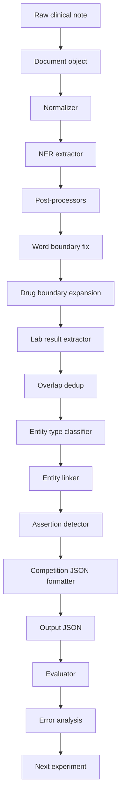

## User

[@method.md](file:///Volumes/HP_P900/Users/tungnguyen/Programming/Ontological-Reasoning-in-Medical-Knowledge-Retrieval/docs/tung/method.md) This is really incredible complex, how can i improve the metrics further?

## Assistant

<thinking>
**Evaluating metric improvement**

I need to address the user's question about how to improve metrics further. They provided an outline, but it seems I don’t need to reread the entire content. I could pull targeted improvements from the pipeline and look specifically at the outline from line 1009 onward. While they said not to reread, I might still check the relevant documents or code paths for more precise advice. I should focus on strategic metric improvements and simplifications instead.

**Suggesting metric improvements**

The user wants to improve metrics, and I can propose impactful interventions. I should mention evaluation decomposition, focusing on metrics like NER span F1 and accuracy checks. I need to identify any plateau in the current pipeline. Since it's complex, I could suggest calibrating thresholds by entity type, enhancing NER boundaries, and employing synonyms for augmentation. Additionally, I can bring up context-aware models and practical timelines. It might also be useful to ask for confusion matrices for insights. I’ll prioritize my suggestions carefully!

**Clarifying metric improvement request**

I think it's crucial to consider if the competition evaluates exact JSON spans, as improving retrieval is only effective if the NER spans are accurate. I want to ensure we're focusing on high ROI. I could review specific lines in the method document, but maybe that's not necessary if tools are already in place. The user likely wants advice on how to further improve metrics, rather than asking for code changes. I can definitely provide a thoughtful response!
</thinking>

Yes — at this point, adding more complexity may not improve metrics unless it targets the actual failure modes. Your pipeline already has:

- ViHealthBERT NER
- SapBERT retrieval
- lexical + embedding hybrid linking
- dual disease/symptom retrieval
- assertion detection
- drug boundary expansion
- dictionary construction
- post-processing rules

So the next gains should come from **error-driven optimization**, not more architecture.

## Highest-impact ways to improve metrics

### 1. Split your evaluation into 4 separate error buckets

Before changing anything, measure errors separately:

| Component | Metric to inspect | Why |
|---|---|---|
| NER span detection | exact span F1 | If span is wrong, linking cannot recover |
| Entity type classification | disease/drug/procedure/lab/etc. accuracy | Misclassification hurts candidate lookup |
| Entity linking | top-1/top-3 CUI accuracy | Retrieval may be good but reranking weak |
| Assertions | negated/historical/family accuracy | Rule systems often create hidden false positives |

You need to know where the score is leaking.

For each failed prediction, label it as one of:

```text
1. Missed entity
2. Wrong span boundary
3. Correct span, wrong type
4. Correct span/type, wrong CUI
5. Correct entity, wrong assertion
6. Duplicate/overlapping entity issue
7. Gold annotation ambiguity
```

This is probably the single most useful next step.

---

## 2. Improve span boundaries before improving linking

In clinical NER, **exact span matching is brutal**. Your document already has drug boundary expansion, but you can generalize this idea.

Common Vietnamese clinical span failures:

```text
"đái tháo đường type 2"       → model predicts "đái tháo đường"
"tăng huyết áp độ 2"          → predicts "tăng huyết áp"
"viêm phổi cộng đồng"         → predicts "viêm phổi"
"đau tức ngực trái"           → predicts "đau ngực"
"X-quang ngực thẳng"          → predicts "X-quang"
"bạch cầu tăng cao"           → predicts "bạch cầu"
```

Add boundary expansion rules for:

### Disease modifiers

```text
type 1, type 2
độ I, độ II, độ III, độ IV
mạn, mạn tính, cấp, cấp tính
ngoại trú, nội trú
cộng đồng
hai bên, trái, phải
```

### Symptom modifiers

```text
âm ỉ
dữ dội
từng cơn
liên tục
vùng thượng vị
hạ sườn phải
ngực trái
sau xương ức
khi gắng sức
```

### Lab/procedure modifiers

```text
máu
nước tiểu
ngực thẳng
ổ bụng
cản quang
sinh hóa máu
công thức máu
```

But be careful: boundary expansion can hurt precision. Add it only when the expanded phrase appears in your dictionary or improves retrieval confidence.

A good heuristic:

```text
Only expand if:
hybrid_score(expanded_text) >= hybrid_score(original_text) + margin
```

Example:

```text
NER: "đái tháo đường"
Expanded candidate: "đái tháo đường type 2"

Use expanded span only if retrieval confidence improves.
```

---

## 3. Add per-entity-type thresholds instead of global thresholds

Your method uses several thresholds. A common mistake is using one threshold across all entity types.

You should tune separately for:

```text
disease
symptom
drug
procedure
lab
body part
```

Because their retrieval behavior is different.

Example:

| Type | Suggested behavior |
|---|---|
| Disease | higher threshold, many close concepts |
| Symptom | lower threshold, often short/noisy mentions |
| Drug | lexical match is very important |
| Lab | dictionary/keyword matching may outperform embeddings |
| Procedure | lexical + abbreviation handling important |

Instead of:

```python
if score > 0.75:
    accept()
```

Use:

```python
thresholds = {
    "disease": 0.78,
    "symptom": 0.68,
    "drug": 0.82,
    "procedure": 0.72,
    "lab": 0.70,
}
```

Then grid search them on validation data.

This is usually a cheap way to gain score.

---

## 4. Tune hybrid retrieval weights per type

Your hybrid formula appears to combine lexical similarity and SapBERT cosine similarity. That is good, but the best weights should probably differ by entity type.

For example:

```text
drug       → lexical weight higher
disease    → embedding weight higher
symptom    → embedding + synonym expansion
lab        → lexical/keyword weight higher
procedure  → lexical + abbreviation handling
```

Instead of one formula like:

```text
score = 0.6 * embedding + 0.4 * lexical
```

try:

```python
weights = {
    "disease":   {"emb": 0.70, "lex": 0.30},
    "symptom":   {"emb": 0.65, "lex": 0.35},
    "drug":      {"emb": 0.35, "lex": 0.65},
    "procedure": {"emb": 0.45, "lex": 0.55},
    "lab":       {"emb": 0.30, "lex": 0.70},
}
```

Then optimize on validation set.

This can improve linking without touching the NER model.

---

## 5. Add abbreviation normalization

Clinical Vietnamese notes often contain abbreviations. SapBERT and lexical similarity may fail if the mention is short.

Add a normalization dictionary before retrieval:

```text
THA      → tăng huyết áp
ĐTĐ      → đái tháo đường
NMCT     → nhồi máu cơ tim
COPD     → bệnh phổi tắc nghẽn mạn tính
K        → ung thư
HC       → hội chứng
XN       → xét nghiệm
CTM      → công thức máu
XQ       → X-quang
SA       → siêu âm
HA       → huyết áp
BC       → bạch cầu
HC       → hồng cầu / hội chứng depending on context
```

For ambiguous abbreviations, use surrounding context.

Example:

```text
"HC tăng" near lab values → hồng cầu
"HC thận hư" → hội chứng
```

This is often a large source of hidden linking errors.

---

## 6. Use candidate reranking instead of only score fusion

Your current hybrid retrieval likely does:

```text
generate candidates → calculate lexical + embedding score → pick top
```

A stronger approach:

```text
Step 1: retrieve top 20 candidates using SapBERT + lexical
Step 2: rerank top 20 using a cross-encoder or LLM-style pair scorer
```

For example, train or use a lightweight classifier on pairs:

```text
Input: [mention] [SEP] [candidate_name] [SEP] [context sentence]
Output: match / not match
```

This helps with difficult pairs like:

```text
"đau ngực" → chest pain
"đau tức ngực" → chest tightness
"đau thượng vị" → epigastric pain
```

If training a reranker is too much, use heuristic reranking:

```python
final_score =
    0.45 * embedding_score
  + 0.30 * lexical_score
  + 0.15 * context_overlap_score
  + 0.10 * semantic_type_bonus
```

The **context overlap score** can be simple:

```text
mention sentence contains "sốt", "ho", "đờm" → respiratory disease candidates get bonus
mention sentence contains "đường huyết", "HbA1c" → diabetes candidates get bonus
```

---

## 7. Do validation-set grid search automatically

Do not manually tune thresholds. Write a script that tries combinations.

Tune:

```text
NER confidence threshold
SapBERT threshold
lexical/embedding weights
disease-vs-symptom decision threshold
negation window size
historical section boundaries
drug expansion margin
top-k candidate count
```

Example search space:

```python
embedding_weights = [0.5, 0.6, 0.7, 0.8]
lexical_weights = [0.2, 0.3, 0.4, 0.5]
thresholds = [0.60, 0.65, 0.70, 0.75, 0.80]
negation_windows = [4, 6, 8, 10]
```

Even a simple grid search can produce meaningful gains.

Important: optimize against the actual competition metric, not just local component accuracy.

---

## 8. Add a small NER ensemble

If allowed by the competition constraints, train 3–5 NER models with different seeds.

Then combine spans by voting:

```text
Accept span if predicted by at least 2 models
```

Or use soft voting:

```text
average token probabilities across models
```

This often improves NER F1, especially recall.

A good ensemble:

```text
Model 1: ViHealthBERT
Model 2: PhoBERT-base
Model 3: XLM-R
Model 4: ViHealthBERT with different seed
Model 5: ViHealthBERT with different max length/doc stride
```

If runtime matters, use only 2–3 models.

---

## 9. Use dictionary matching as NER recall booster

Your pipeline already has dictionaries for linking. You can also use them to recover missed entities.

After NER runs:

```text
1. Scan text using dictionary terms.
2. Add high-confidence exact/fuzzy matches.
3. Remove overlaps with stronger NER spans.
```

Best for:

```text
drugs
labs
procedures
common diseases
abbreviations
```

Use conservative rules:

```text
Add dictionary entity only if:
- exact normalized match, or
- abbreviation match, or
- long phrase fuzzy match >= 0.92
```

Avoid aggressive matching for very short terms like:

```text
sốt
ho
đau
u
K
HA
```

Short terms can explode false positives.

---

## 10. Improve assertion detection with local context classification

Your negation system is rule-based. That can work well, but clinical negation is tricky.

Current likely problems:

```text
"không ghi nhận sốt, ho, khó thở"
"chưa phát hiện tổn thương phổi"
"loại trừ viêm phổi"
"không đau ngực nhưng còn khó thở"
"tiền sử không ghi nhận THA"
"mẹ bị ĐTĐ"
```

Rules often fail around:

```text
nhưng
tuy nhiên
ngoại trừ
không những
không rõ
chưa loại trừ
theo dõi
nghi ngờ
```

A strong next step is a small assertion classifier:

```text
Input:
[entity mention] + surrounding sentence/window

Output:
present / negated / historical / family / uncertain
```

Even a simple model using ViHealthBERT sentence classification may beat complex hand rules.

If you keep rules, add an `uncertain`/speculative detector if the evaluation supports or indirectly expects it:

```text
nghi ngờ
theo dõi
chưa loại trừ
khả năng
có thể
?
```

---

## 11. Normalize Vietnamese text more aggressively

Before lexical matching and embeddings, normalize:

```text
lowercase
Unicode normalize NFC/NFKC
remove duplicate spaces
normalize punctuation
normalize hyphen variants
normalize Greek/Latin symbols
normalize units
standardize type/tuýp/type
standardize độ I/II/III/IV/1/2/3/4
```

Examples:

```text
type II → type 2
tuýp 2 → type 2
độ II → độ 2
ml/phút → ml/phut
X quang → X-quang
COVID 19 → COVID-19
```

This helps both lexical and embedding retrieval.

---

## 12. Improve dictionary quality

For entity linking, dictionary quality matters more than model complexity.

Add aliases from:

```text
Vietnamese clinical abbreviations
Vietnamese lay terms
spelling variants
English terms appearing in notes
accent/no-accent variants
common OCR/typing mistakes
```

Examples:

```text
tăng HA → tăng huyết áp
cao huyết áp → tăng huyết áp
tiểu đường → đái tháo đường
K phổi → ung thư phổi
sỏi thận → nephrolithiasis
viêm gan siêu vi B → viêm gan B
```

Also add **negative aliases** or blocklists for misleading terms.

Example:

```text
"âm tính" should not link as disease/symptom
"bình thường" should not become a clinical entity
"không rõ" should not become a symptom
```

---

## 13. Use context-aware disease vs symptom classification

Your dual retrieval disease/symptom classifier is clever, but symptom/disease boundaries are ambiguous.

Examples:

```text
"ho" → symptom
"viêm phổi" → disease
"đau thắt ngực" → can be symptom or disease concept
"suy hô hấp" → disease/condition
"tăng huyết áp" → disease or measurement finding
```

Improve this using context:

```text
If mention appears in "chẩn đoán", "bệnh kèm", "tiền sử" → disease bonus
If mention appears in "lý do vào viện", "triệu chứng", "than phiền" → symptom bonus
If followed by lab value/unit → lab/finding bonus
```

You already have section detection, so reuse it for type disambiguation.

---

## 14. Optimize output formatting and duplicate handling

Competition metrics often punish small JSON differences and duplicate entities.

Add a final canonicalization layer:

```text
sort entities by position
deduplicate same span/type/CUI
merge overlapping spans carefully
prefer longer span when same semantic type
prefer higher-confidence span when different type
ensure offset correctness after line-by-line processing
```

For overlaps:

```text
"đái tháo đường" inside "đái tháo đường type 2"
```

Prefer longer span if retrieval confidence is not worse.

But for:

```text
"đau" inside "đau ngực"
```

drop shorter symptom span.

---

# Practical priority order

If I were improving this system, I would do it in this order:

## Phase 1: Cheap, high ROI

1. Build an error analysis table.
2. Tune thresholds per entity type.
3. Tune hybrid retrieval weights per entity type.
4. Add abbreviation normalization.
5. Add final deduplication/overlap cleanup.

These are likely to improve metrics without major refactoring.

## Phase 2: Medium effort

6. Dictionary-based NER recall booster.
7. Retrieval confidence-based boundary expansion.
8. Context-aware disease/symptom classification.
9. Better assertion rules for speculative/contrast cases.

## Phase 3: Higher effort

10. NER ensemble.
11. Cross-encoder candidate reranker.
12. Assertion classifier.
13. Fine-tune SapBERT or metric-learning model on your competition dictionary pairs.

---

# Biggest recommendation

Do **not** make the pipeline more complex blindly.

Your next best improvement is probably:

```text
error analysis → per-type threshold tuning → abbreviation/dictionary fixes → boundary expansion by retrieval confidence
```

That combination usually gives more score than adding another model.

If you want, I can also help you design a concrete `v6` improvement plan for your current pipeline, including exactly what to implement first and how to evaluate each change.

## User

Can we first plan how to redesign the whole repo for iterative refinement, OOP, and keeping old code by inheritence or writing new class for new implementation?

## Assistant

<thinking>
**Planning repository inspection**

It seems I need to plan how to respond to the user's request for redesigning the entire repository. I should probably gather the structure and maybe read through some files to get a sense of the methods outlined. Inspecting the codebase will help me understand the actual structure better. I'll start with the root and maybe include a preamble before listing directories or using commands to find paths or grep for classes. Let's get to inspecting!
</thinking>

I’ll first map the current repository structure and identify the main pipeline/source files so the redesign plan is grounded in your actual codebase rather than generic advice.

**Tool Call: List the `Ontological-Reasoning-in-Medical-Knowledge-Retrieval` directory's contents**
Status: Completed

# Folders:
Ontological-Reasoning-in-Medical-Knowledge-Retrieval/v_dataset
Ontological-Reasoning-in-Medical-Knowledge-Retrieval/docs
Ontological-Reasoning-in-Medical-Knowledge-Retrieval/modules
Ontological-Reasoning-in-Medical-Knowledge-Retrieval/output

# Files:
Ontological-Reasoning-in-Medical-Knowledge-Retrieval/.gitignore
Ontological-Reasoning-in-Medical-Knowledge-Retrieval/README.md
Ontological-Reasoning-in-Medical-Knowledge-Retrieval/requirements.txt
Ontological-Reasoning-in-Medical-Knowledge-Retrieval/state.md


**Tool Call: 18 matches**
Status: Completed

file:///Volumes/HP_P900/Users/tungnguyen/Programming/Ontological-Reasoning-in-Medical-Knowledge-Retrieval/modules/dataset/dataset_processing/build_benchmark_dataset.py

file:///Volumes/HP_P900/Users/tungnguyen/Programming/Ontological-Reasoning-in-Medical-Knowledge-Retrieval/modules/dataset/dataset_processing/build_icd_dataset.py

file:///Volumes/HP_P900/Users/tungnguyen/Programming/Ontological-Reasoning-in-Medical-Knowledge-Retrieval/modules/dataset/dataset_processing/build_training_dataset.py

file:///Volumes/HP_P900/Users/tungnguyen/Programming/Ontological-Reasoning-in-Medical-Knowledge-Retrieval/modules/dataset/dataset_processing/map_labels_to_cui.py

file:///Volumes/HP_P900/Users/tungnguyen/Programming/Ontological-Reasoning-in-Medical-Knowledge-Retrieval/modules/dataset/dataset_processing/process_rxnorm.py

file:///Volumes/HP_P900/Users/tungnguyen/Programming/Ontological-Reasoning-in-Medical-Knowledge-Retrieval/modules/dataset/dataset_processing/unify_datasets.py

file:///Volumes/HP_P900/Users/tungnguyen/Programming/Ontological-Reasoning-in-Medical-Knowledge-Retrieval/modules/dataset/preprocessing/extract_entities.py

file:///Volumes/HP_P900/Users/tungnguyen/Programming/Ontological-Reasoning-in-Medical-Knowledge-Retrieval/modules/dataset/preprocessing/extract_tags.py

file:///Volumes/HP_P900/Users/tungnguyen/Programming/Ontological-Reasoning-in-Medical-Knowledge-Retrieval/modules/dataset/preprocessing/generate_embedding_symptom.py

file:///Volumes/HP_P900/Users/tungnguyen/Programming/Ontological-Reasoning-in-Medical-Knowledge-Retrieval/modules/dataset/preprocessing/generate_embeddings.py

file:///Volumes/HP_P900/Users/tungnguyen/Programming/Ontological-Reasoning-in-Medical-Knowledge-Retrieval/modules/dataset/preprocessing/process_eval_datasets.py

file:///Volumes/HP_P900/Users/tungnguyen/Programming/Ontological-Reasoning-in-Medical-Knowledge-Retrieval/modules/evaluation/evaluate_ner_retrieve.py

file:///Volumes/HP_P900/Users/tungnguyen/Programming/Ontological-Reasoning-in-Medical-Knowledge-Retrieval/modules/evaluation/test_sample_pipeline.py

file:///Volumes/HP_P900/Users/tungnguyen/Programming/Ontological-Reasoning-in-Medical-Knowledge-Retrieval/modules/model/embedding_models.py

file:///Volumes/HP_P900/Users/tungnguyen/Programming/Ontological-Reasoning-in-Medical-Knowledge-Retrieval/modules/model/inference/inference_ner.py

file:///Volumes/HP_P900/Users/tungnguyen/Programming/Ontological-Reasoning-in-Medical-Knowledge-Retrieval/modules/model/training/finetune_qwen.py

file:///Volumes/HP_P900/Users/tungnguyen/Programming/Ontological-Reasoning-in-Medical-Knowledge-Retrieval/modules/model/training/train_ner.py

file:///Volumes/HP_P900/Users/tungnguyen/Programming/Ontological-Reasoning-in-Medical-Knowledge-Retrieval/modules/utils.py

**Tool Call: 1 match**
Status: Completed

file:///Volumes/HP_P900/Users/tungnguyen/Programming/Ontological-Reasoning-in-Medical-Knowledge-Retrieval/README.md

**Tool Call: 5 matches**
Status: Completed

file:///Volumes/HP_P900/Users/tungnguyen/Programming/Ontological-Reasoning-in-Medical-Knowledge-Retrieval/README.md

file:///Volumes/HP_P900/Users/tungnguyen/Programming/Ontological-Reasoning-in-Medical-Knowledge-Retrieval/docs/tung/explanation.md

file:///Volumes/HP_P900/Users/tungnguyen/Programming/Ontological-Reasoning-in-Medical-Knowledge-Retrieval/docs/tung/method.md

file:///Volumes/HP_P900/Users/tungnguyen/Programming/Ontological-Reasoning-in-Medical-Knowledge-Retrieval/docs/tung/round1_task_detailed_explanation.md

file:///Volumes/HP_P900/Users/tungnguyen/Programming/Ontological-Reasoning-in-Medical-Knowledge-Retrieval/state.md

## Assistant

I found a compact Python repo centered under `modules/`. Next I’ll inspect the main inference/evaluation/model files to identify where to introduce interfaces, versioned implementations, and inheritance without breaking the current pipeline.

**Tool Call: Read file `README.md`**
Status: Completed

````Ontological-Reasoning-in-Medical-Knowledge-Retrieval/README.md
     1	# Vietnamese Clinical NER & Entity Linking Pipeline
     2	
     3	This repository is dedicated to processing unstructured Vietnamese clinical notes to extract medical entities, map them to international standard ontologies (ICD-10 for Diagnosis, RxNorm for Drugs), and identify contextual assertions (e.g., negation, family history).
     4	
     5	## Core Architecture Overview
     6	
     7	The system strictly adheres to extracting 5 core labels:
     8	1. `CHẨN_ĐOÁN` (Diagnosis) -> Mapped to ICD-10
     9	2. `THUỐC` (Medication/Drug) -> Mapped to RxNorm
    10	3. `TÊN_XÉT_NGHIỆM` (Procedure/Test Name)
    11	4. `TRIỆU_CHỨNG` (Symptom/Phenotype)
    12	5. `KẾT_QUẢ_XÉT_NGHIỆM` (Test/Lab Result)
    13	
    14	The pipeline utilizes a BERT-based NER model to locate entity boundaries within the text and relies on SapBERT (English & Vietnamese variants) to perform zero-shot cosine similarity mapping against massive standardized dictionaries for entity linking.
    15	
    16	---
    17	
    18	## Repository Structure
    19	
    20	```text
    21	VAR/
    22	├── .env.example             # Template for environment variables
    23	├── README.md                # This file
    24	├── requirements.txt         # Python dependencies
    25	├── state.md                 # Master project state & requirements definition
    26	├── data/                    # Clinical notes and ontology databases
    27	│   ├── var/test/            # 100 sample text files containing raw clinical notes
    28	│   └── viettel/             # Dictionaries and datasets for mapping
    29	│       ├── base/            # Extracted CSV and optimized .npy embedding dictionaries
    30	│       ├── combine/         # Processed mapping dictionaries (e.g., RxNorm)
    31	│       └── mapping/         # Raw source data for ontologies (RxNorm RRF files)
    32	├── modules/                 # Core python codebase
    33	│   ├── utils.py             # Main EntityExtractor class tying the pipeline together
    34	│   ├── dataset/             # Scripts for preprocessing and running tests
    35	│   │   ├── dataset_processing/  # Script to parse raw RxNorm RRFs -> short_drug.csv
    36	│   │   ├── evaluation/          # The test pipeline (test_sample_pipeline.py)
    37	│   │   └── preprocessing/       # Embeddings generator (generate_embeddings.py)
    38	│   └── model/               # Inference algorithms and local model weights
    39	│       ├── inference/       # NER inference class (inference_ner.py)
    40	│       └── statedict/       # Hugging Face tokenizers/weights for NER & SapBERT
    41	└── output/                  # Generated JSON outputs from test evaluation
    42	```
    43	
    44	---
    45	
    46	## Getting Started
    47	
    48	### 0. Read first 
    49	Check the current state in state.md
    50	
    51	### 1. Clone the Repository
    52	
    53	```bash
    54	git clone https://github.com/GinHikat/Ontological-Reasoning-in-Medical-Knowledge-Retrieval.git
    55	cd Ontological-Reasoning-in-Medical-Knowledge-Retrieval/VAR
    56	```
    57	
    58	### 2. Set Up Environment Variables
    59	
    60	Copy the example `.env` file and customize the variables to match your system paths and credentials:
    61	
    62	```bash
    63	cp .env.example .env
    64	```
    65	
    66	Ensure you provide the correct paths to the raw data files, specifically:
    67	- Ensure the `RXNORM_RRF_PATH` is correctly configured in your environment if required for rebuilding base mappings.
    68	
    69	### 3. Install Python Dependencies
    70	
    71	For hyper-fast, reliable installation, it is recommended to use [`uv`](https://github.com/astral-sh/uv):
    72	
    73	```bash
    74	# Install uv locally
    75	pip install uv
    76	
    77	# Sync environment dependencies
    78	uv pip install -r requirements.txt
    79	```
    80	
    81	*Or standard pip:*
    82	
    83	```bash
    84	pip install -r requirements.txt
    85	```
    86	
    87	---
    88	
    89	## How to Run the System
    90	
    91	### Step 1: Build the Dictionary Base
    92	Download the mapping data from Huggingface for this project, place it in the v_dataset folder. Place the statedict folder to its correct path in modules/model
    93	
    94	```bash
    95	mkdir v_dataset
    96	cd v_dataset
    97	
    98	git clone https://huggingface.co/datasets/zinzinmit/v_dataset .
    99	
   100	# Move statedict folder to its correct path
   101	move statedict ../modules/model/
   102	
   103	# or this in Linux 
   104	mv statedict ../modules/model/
   105	```
   106	
   107	### Step 2: Run the Evaluation Pipeline
   108	You can run the end-to-end evaluation script to iterate through all 100 sample `.txt` files in `v_dataset/var/test/`, extract their entities, calculate their ontological IDs, and save the results cleanly.
   109	```bash
   110	python modules/evaluation/test_sample_pipeline.py
   111	```
   112	The output will be saved sequentially as `.json` files in the `VAR/output/` directory matching the exact specifications requested in `state.md`.
   113	
   114	---
   115	
   116	## Using the `EntityExtractor` Class in Code
   117	
   118	The `EntityExtractor` class in `modules/utils.py` acts as the base utility for the system. Note that it returns a raw Pandas DataFrame.
   119	
   120	```python
   121	from VAR.modules.utils import EntityExtractor
   122	
   123	# Initialize the extractor
   124	extractor = EntityExtractor(mode="ner + retrieval")
   125	
   126	clinical_note = "Bệnh nhân bị u ác đại tràng, uống paracetamol."
   127	
   128	# Extract raw entities (returns a pandas DataFrame)
   129	df_results = extractor.extract(clinical_note)
   130	
   131	print(df_results.head())
   132	```
   133	
   134	**Note on strict JSON formatting:**
   135	The strict JSON schema (with `type`, `candidates`, `assertions`, and `position`) requested in `state.md` is specifically assembled and formatted by the `test_sample_pipeline.py` script, which maps the raw extracted terms to the optimized `.npy` dictionaries and outputs the final `.json` files.

````


**Tool Call: Read file `state.md`**
Status: Completed

````Ontological-Reasoning-in-Medical-Knowledge-Retrieval/state.md
     1	# Master Project State & Specification: Vietnamese Clinical NER
     2	
     3	This document serves as the single source of truth for the project's requirements, current state, and the execution plan. Any AI agent reading this should be able to fully understand the project constraints and goals without further user explanation.
     4	
     5	## 1. Project Goal & Core Requirements
     6	The objective is to process raw Vietnamese clinical notes (unstructured text) and extract specific medical entities, map them to international ontologies, and identify contextual assertions.
     7	
     8	### 1.1 The 5 Required Entity Labels
     9	The pipeline MUST output exactly these 5 labels (no broad English categories are allowed in the final output):
    10	1.  **`CHẨN_ĐOÁN`** (Diagnosis)
    11	2.  **`THUỐC`** (Medication/Drug)
    12	3.  **`TÊN_XÉT_NGHIỆM`** (Procedure/Test Name)
    13	4.  **`TRIỆU_CHỨNG`** (Symptom/Phenotype)
    14	5.  **`KẾT_QUẢ_XÉT_NGHIỆM`** (Test/Lab Result)
    15	
    16	### 1.2 Ontology Standardization (Strict Requirements)
    17	Extracted entities for specific labels MUST be mapped to their standardized IDs (returned in the `candidates` array):
    18	*   **`CHẨN_ĐOÁN`** ➡️ MUST be mapped to **ICD-10**. 
    19	    *   *Reference File:* `v_dataset\viettel\combine\diagnosis_10.csv`
    20	*   **`THUỐC`** ➡️ MUST be mapped to **RxNorm**.
    21	    *   *Raw Data Source:* `F:\Din\Study\Education\Projects\Thesis\data\mapping\mapping\RxNorm`
    22	    *   *Task:* A `drug_rxnorm.csv` term-ID mapping file must be created to facilitate this.
    23	
    24	### 1.3 Contextual Assertions (Modifiers)
    25	We must detect contextual states for the entities.
    26	*   **Valid Flags:** `isNegated`, `isFamily`, `isHistorical`
    27	*   **Applicable Labels:** These assertions are ONLY evaluated for `CHẨN_ĐOÁN`, `THUỐC`, and `TRIỆU_CHỨNG`.
    28	*   *If an entity has no modifiers, its assertions list must be empty `[]`.*
    29	
    30	---
    31	
    32	## 2. Target Output & Submission Format
    33	The final pipeline must produce predictions for the final test set.
    34	
    35	*   **Test Set Location:** `VAR\v_dataset\var` (contains `1.txt`, `2.txt`, etc.)
    36	*   **Output Location:** Must be saved in an `output/` directory.
    37	*   **File Structure:** 1-to-1 mapping. `output/1.json` corresponds to the predictions for `VAR\v_dataset\var\1.txt`.
    38	
    39	### 2.1 JSON Schema Requirement
    40	Each `.json` file must contain a JSON array of dictionaries. Each dictionary represents one extracted entity and MUST match this exact schema:
    41	
    42	```json
    43	[
    44	  {
    45	    "text": "amlodipine 10 mg po daily",
    46	    "type": "THUỐC",
    47	    "candidates": ["308135"],
    48	    "assertions": ["isHistorical"],
    49	    "position": [58, 83]
    50	  },
    51	  {
    52	    "text": "ho",
    53	    "type": "TRIỆU_CHỨNG",
    54	    "candidates": [],
    55	    "assertions": [],
    56	    "position": [196, 198]
    57	  }
    58	]
    59	```
    60	**Schema Details:**
    61	*   `text` (String): The exact matched substring from the raw text.
    62	*   `type` (String): One of the 5 required labels.
    63	*   `candidates` (List[String]): The mapped Ontology ID (e.g., RxNorm ID or ICD-10 code). Empty array `[]` if no mapping is found or required.
    64	*   `assertions` (List[String]): The contextual flags. Empty array `[]` if none apply.
    65	*   `position` (List[Int]): Exactly two integers `[start, end]` representing the **character-level** index mapped to the original `.txt` string.
    66	
    67	---
    68	
    69	## 3. Current Execution Plan
    70	
    71	To reach the target output format, the execution is divided into three phases:
    72	
    73	### Phase 1: NER Post-Processing & Knowledge Graph Mapping
    74	We will NOT retrain the base Vietnamese NER model (which currently outputs `Disease/Symptom`, `Procedure`, `Drug`). Instead, we will apply post-processing:
    75	*   **`Disease/Symptom` ➡️ `CHẨN_ĐOÁN`** (Derived from ICD-10).
    76	*   **`Drug` ➡️ `THUỐC`**.
    77	*   **`Procedure` ➡️ `TÊN_XÉT_NGHIỆM`**.
    78	*   **Missing Labels Extraction:**
    79	    *   **`TRIỆU_CHỨNG`:** Extract by querying the Knowledge Graph (`v_dataset\viettel\mapping\external_kg.parquet`) for `Disease` or `Phenotype` relationships.
    80	    *   **`KẾT_QUẢ_XÉT_NGHIỆM`:** We will evaluate translating the English `MIMIC-IV Radiology Note` dataset to train a specialized extractor for diagnostic and lab results.
    81	
    82	### Phase 2: Contextual Assertion Detection
    83	*   **Strategy:** Explore the candidate dataset [PeterPaker123/mimic-iv-clinical-ner](https://huggingface.co/datasets/PeterPaker123/mimic-iv-clinical-ner) on HuggingFace.
    84	*   **Action:** Evaluate translating this English dataset into Vietnamese to fine-tune a localized assertion classifier, or utilize zero-shot cross-lingual transfer methods.
    85	
    86	### Phase 3: Dictionary Standardization & Term-ID Mapping (Immediate Next Step)
    87	*   **Action:** Inspect the raw RxNorm dataset available at `F:\Din\Study\Education\Projects\Thesis\data\mapping\mapping\RxNorm`.
    88	*   **Goal:** Write a script to process `rxnorm_terms.csv` (and any related `rrf` files) to create a structured `term-ID` CSV file (`drug_rxnorm.csv`). This file must be formatted similarly to `diagnosis_10.csv` to serve as the unified dictionary lookup for resolving `THUỐC` candidates.
    89	
    90	---
    91	
    92	## 4. What has been done
    93	
    94	We have implemented the initial end-to-end evaluation script (`modules/evaluation/test_sample_pipeline.py`). For a given input sentence (chunked by the test script), the pipeline currently follows these steps:
    95	
    96	1.  **NER Extraction:** The text is passed through the base NER model, which extracts entities using its original, pre-trained classes (`Disease`, `Drug`, and `Procedure`).
    97	2.  **Label Mapping:** These original classes are explicitly mapped to our standardized target labels:
    98	    *   `Disease` (and variants) ➡️ `CHẨN_ĐOÁN`
    99	    *   `Drug` (and variants) ➡️ `THUỐC`
   100	    *   `Procedure` (and variants) ➡️ `TÊN_XÉT_NGHIỆM`
   101	    > [!WARNING]
   102	    > **Missing Classes:** Currently, **2 required classes are missing entirely** (`TRIỆU_CHỨNG` and `KẾT_QUẢ_XÉT_NGHIỆM`) because the base model does not predict them.
   103	3.  **Knowledge Graph Retrieval:** For the mapped entities, we run dense retrieval (SapBERT) against our mapping datasets to fetch standard IDs:
   104	    *   **Diagnoses (`CHẨN_ĐOÁN`):** Queried against `v_dataset/viettel/base/short_diagnosis.csv` to retrieve the **ICD-10 ID**.
   105	    *   **Drugs (`THUỐC`):** Queried against `v_dataset/viettel/base/short_drug.csv` to retrieve the **RxNorm ID**.
   106	4.  **Target Output Formatter:** Predictions are formatted into the exact JSON schema and saved in the `output/` directory. Assertions are defaulted to an empty list `[]`.
   107	
   108	### Current Accomplishments & Limitations
   109	
   110	> [!NOTE]
   111	> **Accomplishment:** We successfully established an end-to-end inference and evaluation pipeline that reads raw inputs, extracts core medical entities, retrieves standard dictionary IDs, and structures the final output. This gives us our baseline evaluation score.
   112	
   113	> [!IMPORTANT]
   114	> **Limitations to Address & Future Optimizations:**
   115	> 0.  **NER Extraction is the Bottleneck:** A deep dive into the outputs shows that the Ontology mapping logic (SapBERT) is highly accurate. The primary cause for the poor `J_candidates` and `WER` scores is the base NER model itself: it frequently chops off words (e.g., "khó th"), completely misses obvious entities (e.g., "buồn nôn", "ecg"), and misclassifies types (e.g., classifying "phân tích nước tiểu" as a Disease).
   116	> 1.  **Missing Entity Types:** The system cannot detect Lab Results (`KẾT_QUẢ_XÉT_NGHIỆM`). (Symptoms are now handled via dual-retrieval).
   117	> 2.  **Missing Contextual Assertions:** All modifiers (`isNegated`, `isFamily`, `isHistorical`) default to empty arrays.
   118	>     *   *Optimization Idea - Structure-based `isHistorical`:* Test notes follow a strict 3-part structure ("1. Tiền sử bệnh", "2. Tiền sử bệnh hiện tại", "3. Đánh giá tại bệnh viện"). We can track these section headers to automatically flag entities under "Tiền sử bệnh" as `isHistorical`. (Note: We cannot rely on sections to classify `CHẨN_ĐOÁN` vs `TRIỆU_CHỨNG`, as they can appear in any section).
   119	>     *   *Optimization Idea - Regex-based `isNegated`:* Split sentences into clauses using commas. If the clause containing the extracted entity has words like "không" or "chưa" nearby, assign the `isNegated` flag.
   120	> 3.  **Incomplete Drug Extraction Boundaries:** The base NER model only extracts the core drug name (e.g., "aspirin"), missing the dosage and frequency context.
   121	>     *   *Optimization Idea - Regex Boundary Expansion:* Build a regex to find numbers or units of measurement (e.g., "325mg x 1") around the extracted drug in its clause. Mark that as the boundary and expand the final extracted `text` to include the full phrase (e.g., "aspirin 325mg x 1"). However, continue using *only* the core extracted drug term for SapBERT retrieval to avoid noise.
   122	> 4.  **ID Retrieval Accuracy:** `J_candidates` can still be further optimized.
   123	
   124	## 5. Change Log
   125	
   126	### Modification Ver 2
   127	1. **Symptom Dictionary Generation:** Created `generate_embedding_symptom.py` to extract Disease and Phenotype relationships from `external_kg.parquet` and build a massive ~54,000 term Symptom dictionary with embeddings.
   128	2. **Dual-Retrieval Logic:** Rebuilt the `test_sample_pipeline.py` inference flow so that when the base NER model predicts a disease-related entity, we cross-reference it against both the Diagnosis dictionary and the Symptom dictionary. We dynamically classify it as `CHẨN_ĐOÁN` or `TRIỆU_CHỨNG` based on the highest cosine similarity score.
   129	3. **Optimized JSON Format:** Stripped out the `candidates` key from the JSON outputs for `TRIỆU_CHỨNG` (and other irrelevant types) to adhere closer to the gold standard evaluation format.
   130	
   131	### Modification Ver 3
   132	1. **Lowercase Standardization:** Converted the entire matching architecture to be case-insensitive by `.lower()`ing all texts exactly prior to SapBERT embedding (for both the dictionary preprocessing scripts and the live inference pipeline), completely resolving the case mismatch errors.
   133	2. **Similarity Thresholding:** Added a strict minimum cosine similarity cutoff of `0.7` for both `CHẨN_ĐOÁN` and `THUỐC` mapping. If the SapBERT score is below this, we drop the candidate ID instead of accidentally mapping a low-confidence false positive.
   134	
   135	### Modification Ver 4
   136	1. **Word Fragmentation Expansion:** Implemented a post-processing boundary fix for the base NER outputs. If an extracted entity boundary falls in the middle of a word (e.g., "khó th"), the script automatically expands the offset backwards and forwards to the nearest whitespace or punctuation to capture the complete word ("khó thở").
   137	2. **Lab Test & Procedure Filtering:** Added hardcoded keyword matching for common lab/procedure stopwords (e.g., "phân tích", "xét nghiệm", "ct", "mri"). If these appear in the extracted entity, it is immediately routed to `TÊN_XÉT_NGHIỆM` instead of performing expensive (and inaccurate) SapBERT lookups for diseases.
   138	3. **Drug Boundary Expansion:** Added regex matching to safely expand extracted drug boundaries to include trailing dosages and frequencies (e.g., "325mg x 1") in the final output string, while keeping the core drug term isolated for precise SapBERT ontology mapping.
   139	4. **Training Data Word-Segmentation Fix:** Discovered the base NER model was trained on underscore-segmented text (e.g., "tiêu_chảy"), which caused fragmented outputs when inferencing on raw space-separated text. Executed a script to clean the `.conll` files, splitting underscored tokens into individual words and updating their BIO tags to prepare for a clean model retraining.
   140	
   141	### Modification Ver 5
   142	1. **Smarter Contextual Assertions:**
   143	    *   **Strict `isHistorical`:** Dynamically tracked section boundaries to guarantee that `isHistorical` is only applied if the entity falls exactly within Section 1 (*Tiền sử bệnh*). It stops immediately at Section 2 to avoid false positives.
   144	    *   **Advanced `isNegated`:** Replaced naive regex with a multi-rule system:
   145	        *   Catches exact bullet-point negations (e.g., "- Không đau ngực").
   146	        *   Catches comma-separated lists correctly (e.g., "Không ho, sốt, đau ngực" negates all three).
   147	        *   Implements contrast-blocking (e.g., "Không sốt nhưng có ho" safely aborts the negation for "ho" because of "nhưng có").
   148	    *   **Dropped `isFamily`:** Analysis revealed that "người nhà" mostly acts as an informant ("Theo lời người nhà"), causing massive false positives. We completely stripped `isFamily` to protect the score.
   149	2. **Semantic-Lexical Hybrid Retrieval:**
   150	    *   Upgraded the retrieval architecture to finally hit long Semantic Clinical Drug IDs (SCD) instead of falling back to short Ingredient IDs.
   151	    *   Modified the pipeline to feed the **full expanded string** (e.g., "Chlorpheniramine 10ml") into SapBERT instead of just the core drug name.
   152	    *   Implemented a "Retrieve and Rerank" algorithm: SapBERT instantly grabs the **Top 3** semantic matches. A `difflib` string similarity algorithm then acts as a tie-breaker, assigning a combined hybrid score to ensure exact dosage overlaps (e.g., matching "10ml" exactly) win out over purely semantic matches.
   153	
   154	### Modification Ver 6 (Planned)
   155	1. **Lab Results (`KẾT_QUẢ_XÉT_NGHIỆM`) Post-Processor:** The base NER model currently misses 100% of Lab Results. Plan: Write a smart regex module to scan the text for common lab tests (Glucose, WBC, AST, etc.) or nearby `TÊN_XÉT_NGHIỆM` tags, and strictly extract their adjoining numerical values to plug this massive hole in our overall recall.
   156	2. **Upgrade the Drug Dictionary (RxNorm Expansion):** Our local `short_drug.csv` only contains a subset of IDs, causing mathematically impossible matches (e.g., the test set wants `360047` but our dictionary only has `1360047`). Plan: Download or compile a larger, comprehensive RxNorm dictionary with full Semantic Clinical Drug (SCD) nodes to unlock a higher ceiling for `J_candidates`.
   157	3. **Simulate Threshold Relaxing:** Currently, SapBERT drops any mapping below a strict `0.7` cosine similarity cutoff. Plan: Experiment with dropping this to `0.6` in combination with the new hybrid lexical tie-breaker, evaluating if the boost in True Positives outweighs the potential noise from False Positives.
   158	
   159	---
   160	
   161	**Evaluation Results (1st Run - Baseline):**
   162	*   **Score (Điểm):** 8.33930
   163	*   **WER:** 85.948
   164	*   **J_assertion:** 8.7434
   165	*   **J_candidates:** 3.7516
   166	*   **Records Scored:** 100
   167	
   168	**Evaluation Results (2nd Run - Symptom Split & Formatting):**
   169	*   **Score (Điểm):** 16.84840
   170	*   **WER:** 80.785
   171	*   **J_assertion:** 20.8896
   172	*   **J_candidates:** 6.1360
   173	*   **Records Scored:** 100
   174	
   175	**Evaluation Results (3rd Run - Threshold & Lowercase):**
   176	*   **Score (Điểm):** 16.97530
   177	*   **WER:** 80.785
   178	*   **J_assertion:** 20.8896
   179	*   **J_candidates:** 12.3597
   180	*   **Records Scored:** 100
   181	
   182	**Evaluation Results (4th Run - ViHealthBERT + Chunking Fix + Drug Expansion):**
   183	*   **Score (Điểm):** 18.42670 
   184	*   **WER:** 78.0532           
   185	*   **J_assertion:** 22.1193  
   186	*   **J_candidates:** 13.0171  
   187	*   **Records Scored:** 100
   188	
   189	**Evaluation Results (5th Run - Mod Ver 5: Hybrid Retrieval & Smarter Assertions):**
   190	*   **Score (Điểm):** 18.76750
   191	*   **WER:** 77.9624
   192	*   **J_assertion:** 22.8200
   193	*   **J_candidates:** 13.2756
   194	*   **Records Scored:** 100
````


**Tool Call: Read file `modules/model/inference/inference_ner.py`**
Status: Completed

```Ontological-Reasoning-in-Medical-Knowledge-Retrieval/modules/model/inference/inference_ner.py
     1	import argparse
     2	import os
     3	import torch
     4	from transformers import AutoTokenizer, AutoModelForTokenClassification, pipeline
     5	
     6	TOKENIZER_MAP = {
     7	    "vihealthbert": "vihealthbert",
     8	    "vipubmed-deberta": "vipubmed-deberta-base",
     9	    "phobert": "phobert",
    10	    "xlm-roberta": "xlm-roberta-base"
    11	}
    12	
    13	LABEL_LIST_VI = [
    14	    "O",
    15	    "B-Disease/Symptom", "I-Disease/Symptom",
    16	    "B-Procedure/Treatment", "I-Procedure/Treatment",
    17	    "B-Drug", "I-Drug"
    18	]
    19	
    20	LABEL_LIST_EN = [
    21	    "O",
    22	    "B-Disease", "I-Disease",
    23	    "B-Chemical", "I-Chemical"
    24	]
    25	
    26	# Cache to prevent reloading models if function is called repeatedly
    27	_PIPELINES = {}
    28	
    29	class NER:
    30	    def __init__(self, mode='vietnamese', model_name='phobert'):
    31	        self.mode = mode.lower()
    32	        self.model_name = model_name.lower()
    33	        
    34	        if self.mode == 'english' and self.model_name not in ['sapbert', 'pubmedbert', 'biobert']:
    35	            raise ValueError("For English mode, model_name must be one of: 'sapbert', 'pubmedbert', 'biobert'")
    36	
    37	    def extract_entities(self, text: str) -> list:
    38	        """
    39	        Extracts medical entities from text using the specified fine-tuned model.
    40	        """
    41	        global _PIPELINES
    42	        
    43	        pipeline_key = f"{self.mode}_{self.model_name}"
    44	    
    45	        if pipeline_key not in _PIPELINES:
    46	            base_dir = os.path.dirname(os.path.abspath(__file__))
    47	            statedict_dir = os.path.join(base_dir, "..", "statedict", "ner")
    48	            if self.mode == 'vietnamese':
    49	                model_path = os.path.join(statedict_dir, self.model_name)
    50	                label_list = LABEL_LIST_VI
    51	            else:
    52	                model_path = os.path.join(statedict_dir, "eng", f"{self.model_name}")
    53	                label_list = LABEL_LIST_EN
    54	        
    55	            if not os.path.exists(model_path):
    56	                raise FileNotFoundError(f"Model weights not found at: {model_path}")
    57	
    58	            # Load Tokenizer & Model from the local folder
    59	            tokenizer = AutoTokenizer.from_pretrained(model_path)
    60	            id2label = {i: label for i, label in enumerate(label_list)}
    61	            label2id = {label: i for i, label in enumerate(label_list)}
    62	
    63	            model = AutoModelForTokenClassification.from_pretrained(
    64	                model_path,
    65	                num_labels=len(label_list),
    66	                id2label=id2label,
    67	                label2id=label2id,
    68	                ignore_mismatched_sizes=True
    69	            )
    70	        
    71	            device = 0 if torch.cuda.is_available() else -1
    72	        
    73	            # aggregation_strategy="simple" automatically merges subwords (B/I tags)
    74	            _PIPELINES[pipeline_key] = pipeline(
    75	                "ner", 
    76	                model=model, 
    77	                tokenizer=tokenizer, 
    78	                device=device,
    79	                aggregation_strategy="simple" 
    80	            )
    81	        
    82	        # Process text line-by-line to avoid exceeding max token length (512)
    83	        lines = text.split('\n')
    84	        entities = []
    85	        global_offset = 0
    86	        
    87	        for line in lines:
    88	            if not line.strip():
    89	                global_offset += len(line) + 1 # +1 for the \n
    90	                continue
    91	                
    92	            raw_results = _PIPELINES[pipeline_key](line)
    93	            
    94	            # Chronological pointer to search through the current line
    95	            current_search_idx = 0
    96	        
    97	            for entity in raw_results:
    98	                label = entity['entity_group']
    99	                if label == "O":
   100	                    continue
   101	                
   102	                term = entity['word'].strip().replace('@@', '').replace('##', '')
   103	                
   104	                start_idx = line.find(term, current_search_idx)
   105	                
   106	                if start_idx != -1:
   107	                    end_idx = start_idx + len(term)
   108	                    offset = (global_offset + start_idx, global_offset + end_idx)
   109	                    current_search_idx = end_idx  # Move pointer forward
   110	                else:
   111	                    # Fallback if subword merging aggressively changed the string
   112	                    offset = (None, None)
   113	                
   114	                entities.append({
   115	                    "term": term,
   116	                    "offset": offset,
   117	                    "label": label
   118	                })
   119	            
   120	            global_offset += len(line) + 1 # +1 for the \n
   121	            
   122	        merged_entities = []
   123	        for ent in entities:
   124	            if not merged_entities:
   125	                merged_entities.append(ent)
   126	                continue
   127	                
   128	            prev_ent = merged_entities[-1]
   129	            if prev_ent['label'] == ent['label']:
   130	                p_start, p_end = prev_ent['offset']
   131	                c_start, c_end = ent['offset']
   132	                
   133	                # Check if subsequent place (adjacent or separated by a single space)
   134	                if p_end is not None and c_start is not None and (c_start - p_end) <= 1:
   135	                    if p_start is not None and c_end is not None:
   136	                        new_term = text[p_start:c_end]
   137	                    else:
   138	                        sep = " " if (c_start - p_end) == 1 else ""
   139	                        new_term = prev_ent['term'] + sep + ent['term']
   140	                        
   141	                    prev_ent['term'] = new_term
   142	                    prev_ent['offset'] = (p_start, c_end)
   143	                else:
   144	                    merged_entities.append(ent)
   145	            else:
   146	                merged_entities.append(ent)
   147	                
   148	        import string
   149	        
   150	        # Post-processing: Clean up terms and remove short entities
   151	        final_entities = []
   152	        for ent in merged_entities:
   153	            clean_term = ent['term'].strip(string.punctuation + " \t\n\r")
   154	            if len(clean_term) >= 3:
   155	                ent['term'] = clean_term
   156	                final_entities.append(ent)
   157	        
   158	        return final_entities

```


**Tool Call: Read file `modules/model/embedding_models.py`**
Status: Completed

```Ontological-Reasoning-in-Medical-Knowledge-Retrieval/modules/model/embedding_models.py
     1	import numpy as np
     2	import torch
     3	import torch.nn.functional as F
     4	from tqdm import tqdm
     5	from transformers import AutoModel, AutoTokenizer
     6	
     7	
     8	class EmbeddingModels:
     9	    """Thin wrapper around Hugging Face encoder models used for SapBERT retrieval."""
    10	
    11	    def __init__(self, model_choice: str):
    12	        self.model_choice = model_choice
    13	        self.tokenizer = AutoTokenizer.from_pretrained(model_choice)
    14	        self.model = AutoModel.from_pretrained(model_choice)
    15	        self.device = self._select_device()
    16	        self.model.to(self.device)
    17	        self.model.eval()
    18	
    19	    @staticmethod
    20	    def _select_device() -> torch.device:
    21	        if torch.cuda.is_available():
    22	            return torch.device("cuda")
    23	        if hasattr(torch.backends, "mps") and torch.backends.mps.is_available():
    24	            return torch.device("mps")
    25	        return torch.device("cpu")
    26	
    27	    @staticmethod
    28	    def _mean_pool(
    29	        last_hidden_state: torch.Tensor, attention_mask: torch.Tensor
    30	    ) -> torch.Tensor:
    31	        mask = attention_mask.unsqueeze(-1).expand(last_hidden_state.size()).float()
    32	        summed = torch.sum(last_hidden_state * mask, dim=1)
    33	        counts = torch.clamp(mask.sum(dim=1), min=1e-9)
    34	        return summed / counts
    35	
    36	    def encode_text(
    37	        self, texts, batch_size: int = 32, show_progress: bool = False
    38	    ) -> np.ndarray:
    39	        if isinstance(texts, str):
    40	            texts = [texts]
    41	        texts = list(texts)
    42	        if not texts:
    43	            return np.empty((0, self.model.config.hidden_size), dtype=np.float32)
    44	
    45	        embeddings = []
    46	        iterator = range(0, len(texts), batch_size)
    47	        if show_progress:
    48	            iterator = tqdm(
    49	                iterator,
    50	                total=(len(texts) + batch_size - 1) // batch_size,
    51	                desc="Encoding",
    52	            )
    53	
    54	        with torch.no_grad():
    55	            for start in iterator:
    56	                batch = texts[start : start + batch_size]
    57	                encoded = self.tokenizer(
    58	                    batch,
    59	                    padding=True,
    60	                    truncation=True,
    61	                    max_length=128,
    62	                    return_tensors="pt",
    63	                )
    64	                encoded = {key: value.to(self.device) for key, value in encoded.items()}
    65	                outputs = self.model(**encoded)
    66	                pooled = self._mean_pool(
    67	                    outputs.last_hidden_state, encoded["attention_mask"]
    68	                )
    69	                pooled = F.normalize(pooled, p=2, dim=1)
    70	                embeddings.append(pooled.cpu().numpy())
    71	
    72	        return np.vstack(embeddings).astype(np.float32)

```


**Tool Call: Read file `modules/evaluation/evaluate_ner_retrieve.py`**
Status: Completed

````Ontological-Reasoning-in-Medical-Knowledge-Retrieval/modules/evaluation/evaluate_ner_retrieve.py
     1	import json
     2	import os
     3	import sys
     4	
     5	import torch
     6	
     7	# Dynamically add the project root to sys.path so python can find the 'modules' package
     8	project_root = os.path.abspath(os.path.join(os.path.dirname(__file__), "..", ".."))
     9	if project_root not in sys.path:
    10	    sys.path.insert(0, project_root)
    11	
    12	import argparse
    13	
    14	import numpy as np
    15	import pandas as pd
    16	from sklearn.metrics.pairwise import cosine_similarity
    17	from tqdm import tqdm
    18	from transformers import AutoModelForCausalLM, AutoTokenizer
    19	
    20	from modules.model.embedding_models import EmbeddingModels
    21	from modules.model.inference.inference_ner import NER
    22	
    23	
    24	def main():
    25	    parser = argparse.ArgumentParser(
    26	        description="End-to-End Evaluation against Gold Standard SapBERT CUIs"
    27	    )
    28	    parser.add_argument(
    29	        "--extractor",
    30	        type=str,
    31	        choices=["qwen", "ner"],
    32	        default="ner",
    33	        help="Which model type to use for extraction.",
    34	    )
    35	    parser.add_argument(
    36	        "--qwen_model",
    37	        type=str,
    38	        default="PeterPaker123/Qwen2.5-7B-Vietnamese-Medical-NER-GRPO",
    39	        help="HuggingFace Hub ID for Qwen model (or LoRA adapter)",
    40	    )
    41	    parser.add_argument(
    42	        "--base_model",
    43	        type=str,
    44	        default="",
    45	        help="HuggingFace Hub ID for base model if using a LoRA adapter",
    46	    )
    47	    parser.add_argument(
    48	        "--ner_model",
    49	        type=str,
    50	        default="vihealthbert",
    51	        help="Local NER model folder name (e.g. vihealthbert, vipubmed-deberta)",
    52	    )
    53	    args = parser.parse_args()
    54	
    55	    input_file = "v_dataset/viettel/vietnamese_ner/gold_standard_benchmark.jsonl"
    56	    output_file = "v_dataset/viettel/vietnamese_ner/ner_predictions.jsonl"
    57	    THRESHOLD = 0.80
    58	
    59	    # Check if we are running in the correct directory
    60	    if not os.path.exists(input_file):
    61	        print(f"Error: Could not find '{input_file}'.")
    62	        print(
    63	            "Please run this script from the root of the 'Patient-EHR-Graph-Representation-for-Multi-task-Learning' directory."
    64	        )
    65	        return
    66	
    67	    if args.extractor == "qwen":
    68	        tokenizer_id = args.base_model if args.base_model else args.qwen_model
    69	        print(f"Loading tokenizer from {tokenizer_id}...")
    70	        tokenizer = AutoTokenizer.from_pretrained(tokenizer_id)
    71	        tokenizer.chat_template = "{{ '<|im_start|>system\\nYou are a helpful assistant.<|im_end|>\\n' }}{{'<|im_start|>' + message['role'] + '\\n' + message['content'] + '<|im_end|>' + '\\n'}}{{ '<|im_start|>assistant\\n' }}"
    72	
    73	        print(f"Loading model {args.qwen_model}...")
    74	        if args.base_model:
    75	            print(f"Loading base model {args.base_model} and applying LoRA...")
    76	            from peft import PeftModel
    77	
    78	            base_model = AutoModelForCausalLM.from_pretrained(
    79	                args.base_model, device_map="auto", torch_dtype=torch.bfloat16
    80	            )
    81	            model = PeftModel.from_pretrained(base_model, args.qwen_model)
    82	        else:
    83	            model = AutoModelForCausalLM.from_pretrained(
    84	                args.qwen_model, device_map="auto", torch_dtype=torch.bfloat16
    85	            )
    86	    else:
    87	        print(f"Loading local NER model '{args.ner_model}'...")
    88	        ner_extractor = NER(args.ner_model)
    89	
    90	    # Load SapBERT for entity linking
    91	    print("Loading SapBERT model for entity linking...")
    92	    sapbert_model_name = "cambridgeltl/SapBERT-UMLS-2020AB-all-lang-from-XLMR"
    93	    embedder = EmbeddingModels(model_choice=sapbert_model_name)
    94	
    95	    # Load mapped entities with their SapBERT embeddings for quick cosine similarity matching
    96	    print("Loading pre-computed SapBERT embeddings database...")
    97	    base_df = pd.read_pickle("v_dataset/viettel/mapping/mapped_entities_embedded.pkl")
    98	    # We only care about rows that have a valid CUI
    99	    base_df = base_df.dropna(subset=["mapped_cui"]).reset_index(drop=True)
   100	    base_embeddings = np.vstack(base_df["embedding"].values)
   101	
   102	    # Label mapping dictionary (from Qwen NER output) - expanded to catch variations
   103	    label_mapping = {
   104	        "SYMPTOM_AND_DISEASE": "Disease/Symptom",
   105	        "SYMPTOM": "Disease/Symptom",
   106	        "DISEASE": "Disease/Symptom",
   107	        "CONDITION": "Disease/Symptom",
   108	        "DRUG": "Drug",
   109	        "MEDICATION": "Drug",
   110	        "MEDICAL_PROCEDURE": "Procedure/Treatment",
   111	        "PROCEDURE": "Procedure/Treatment",
   112	        "TREATMENT": "Procedure/Treatment",
   113	        "TEST": "Procedure/Treatment",
   114	        "LAB": "Procedure/Treatment",
   115	        # "DIAGNOSTIC": "Procedure/Treatment"
   116	    }
   117	
   118	    # UMLS Semantic Type to Macro Class Mapping
   119	    umls_to_three_classes = {
   120	        "Clinical Attribute": "Disease/Symptom",
   121	        "Disease or Syndrome": "Disease/Symptom",
   122	        "Finding": "Disease/Symptom",
   123	        "Injury or Poisoning": "Disease/Symptom",
   124	        "Mental or Behavioral Dysfunction": "Disease/Symptom",
   125	        "Neoplastic Process": "Disease/Symptom",
   126	        "Pathologic Function": "Disease/Symptom",
   127	        "Physiologic Function": "Disease/Symptom",
   128	        "Sign or Symptom": "Disease/Symptom",
   129	        "Amino Acid, Peptide, or Protein": "Drug",
   130	        "Biologically Active Substance": "Drug",
   131	        "Clinical Drug": "Drug",
   132	        "Immunologic Factor": "Drug",
   133	        "Indicator, Reagent, or Diagnostic Aid": "Drug",
   134	        "Nucleic Acid, Nucleoside, or Nucleotide": "Drug",
   135	        "Organic Chemical": "Drug",
   136	        "Pharmacologic Substance": "Drug",
   137	        "Vitamin": "Drug",
   138	        "Diagnostic Procedure": "Procedure/Treatment",
   139	        "Health Care Activity": "Procedure/Treatment",
   140	        "Laboratory Procedure": "Procedure/Treatment",
   141	        "Laboratory or Test Result": "Procedure/Treatment",
   142	        "Medical Device": "Procedure/Treatment",
   143	        "Therapeutic or Preventive Procedure": "Procedure/Treatment",
   144	    }
   145	
   146	    base_df["macro_type"] = base_df["mapped_type"].map(umls_to_three_classes)
   147	
   148	    with open(input_file, "r", encoding="utf-8") as f:
   149	        lines = f.readlines()
   150	
   151	    print(f"Loaded {len(lines)} examples from {input_file}")
   152	
   153	    # Global tracking for TP, FP, FN
   154	    metrics = {
   155	        "Disease/Symptom": {"tp": 0, "fp": 0, "fn": 0},
   156	        "Procedure/Treatment": {"tp": 0, "fp": 0, "fn": 0},
   157	        "Drug": {"tp": 0, "fp": 0, "fn": 0},
   158	    }
   159	
   160	    # System prompt if using Qwen for NER
   161	    system_prompt = (
   162	        "You are an expert clinical annotator. Your task is to extract medical entities from Vietnamese clinical text.\n"
   163	        "The entity types to extract are STRICTLY limited to the following three:\n"
   164	        "- SYMPTOM_AND_DISEASE: Clinical diagnoses, symptoms, signs of illness, diseases, or medical conditions (e.g., 'viêm phổi', 'đau đầu', 'tăng huyết áp').\n"
   165	        "- MEDICAL_PROCEDURE: Medical procedures, surgeries, therapies, tests, imaging, or diagnostic methods (e.g., 'chụp X-quang', 'xét nghiệm máu', 'nội soi', 'phẫu thuật').\n"
   166	        "- DRUG: Names of medicines, drugs, active ingredients, vitamins, or supplements (e.g., 'paracetamol', 'vitamin C', 'thuốc kháng sinh').\n"
   167	        "\nCRITICAL RULES FOR EXTRACTION:\n"
   168	        "1. PREVENT OVER-EXTRACTION: Extract only the most complete, primary medical concept. Do NOT extract granular attributes, causes, or locations independently.\n"
   169	        "2. NO OVERLAPPING: Do NOT extract nested overlapping entities. If 'viêm kết mạc cấp' is extracted, do not also extract 'viêm kết mạc'. Keep only the longest, most complete one.\n"
   170	        "3. NO ATTRIBUTES: Avoid extracting descriptive words like 'do vi khuẩn' (due to bacteria) or 'mức độ nhẹ' (mild) as standalone entities.\n"
   171	        "4. EXACT TEXT: Extract precise, concise clinical terms exactly as they appear in the original text.\n"
   172	        "5. EXAMPLE: For 'bệnh nhân bị viêm kết mạc cấp do vi khuẩn', extract ONLY 'viêm kết mạc cấp'. Do NOT extract 'viêm kết mạc do vi khuẩn' or 'do vi khuẩn'.\n"
   173	        "\nOUTPUT FORMAT:\n"
   174	        'Return the result STRICTLY as a JSON list containing dictionaries with "entity" and "type" keys. '
   175	        'Ensure the "type" is exactly one of: SYMPTOM_AND_DISEASE, MEDICAL_PROCEDURE, DRUG.\n'
   176	        "If no relevant entities are found, return an empty list []"
   177	    )
   178	
   179	    results = []
   180	
   181	    for line in tqdm(lines, desc="Extracting Entities"):
   182	        data = json.loads(line)
   183	        text = data.get("text", "")
   184	
   185	        # Extract entities using Qwen
   186	        if args.extractor == "qwen":
   187	            prompt = [
   188	                {"role": "system", "content": system_prompt},
   189	                {"role": "user", "content": f"Text: {text}"},
   190	            ]
   191	
   192	            inputs = tokenizer.apply_chat_template(
   193	                prompt,
   194	                return_tensors="pt",
   195	                add_generation_prompt=True,
   196	                return_dict=True,
   197	            ).to(model.device)
   198	
   199	            with torch.no_grad():
   200	                outputs = model.generate(
   201	                    **inputs,
   202	                    max_new_tokens=256,
   203	                    do_sample=False,
   204	                    temperature=None,
   205	                    top_p=None,
   206	                    top_k=None,
   207	                )
   208	
   209	            response = tokenizer.decode(
   210	                outputs[0][inputs["input_ids"].shape[-1] :], skip_special_tokens=True
   211	            )
   212	
   213	            predicted_entities = []
   214	            try:
   215	                import re
   216	
   217	                # Search for anything between ```json and ```, handling multi-line properly
   218	                json_match = re.search(
   219	                    r"```json\s*(.*?)\s*```", response, re.DOTALL | re.IGNORECASE
   220	                )
   221	                if json_match:
   222	                    json_str = json_match.group(1).strip()
   223	                    predicted_entities = json.loads(json_str)
   224	                else:
   225	                    # Fallback if it just outputs raw JSON without markdown tags
   226	                    predicted_entities = json.loads(response.strip())
   227	            except json.JSONDecodeError:
   228	                pass
   229	        else:
   230	            # NER extraction
   231	            ner_results = ner_extractor.extract_entities(text)
   232	            predicted_entities = [
   233	                {"entity": e["term"], "type": e["label"]} for e in ner_results
   234	            ]
   235	
   236	        # Perform Entity Linking
   237	        linked_entities = {"Disease/Symptom": [], "Procedure/Treatment": [], "Drug": []}
   238	
   239	        if predicted_entities:
   240	            # Batch embed all extracted entities
   241	            extracted_texts = [ent.get("entity", "") for ent in predicted_entities]
   242	            extracted_embeddings = embedder.encode_text(
   243	                extracted_texts, batch_size=32, show_progress=False
   244	            )
   245	
   246	            for idx, ent in enumerate(predicted_entities):
   247	                raw_type = str(ent.get("type", "")).strip().upper()
   248	                # If we used NER, the label is already the macro class "Disease/Symptom" etc.
   249	                if args.extractor == "ner":
   250	                    mapped_type = ent.get("type", "")
   251	                else:
   252	                    mapped_type = label_mapping.get(raw_type)
   253	
   254	                # Skip unmapped or demographic entities
   255	                if not mapped_type:
   256	                    continue
   257	
   258	                emb = extracted_embeddings[idx : idx + 1]
   259	
   260	                # Filter base_df by the macro_type (derived from mapped_type)
   261	                mask = base_df["macro_type"] == mapped_type
   262	                if not mask.any():
   263	                    continue
   264	
   265	                type_df = base_df[mask]
   266	                type_embeddings = np.vstack(type_df["embedding"].values)
   267	
   268	                # Calculate cosine similarity
   269	                sims = cosine_similarity(emb, type_embeddings)[0]
   270	                max_idx = np.argmax(sims)
   271	                max_sim = sims[max_idx]
   272	
   273	                if max_sim > THRESHOLD:
   274	                    cui = type_df.iloc[max_idx]["mapped_cui"]
   275	                    if pd.notna(cui) and cui != "":
   276	                        linked_entities[mapped_type].append(str(cui))
   277	
   278	        # Deduplicate the CUIs for each type
   279	        linked_entities["Disease/Symptom"] = list(
   280	            set(linked_entities["Disease/Symptom"])
   281	        )
   282	        linked_entities["Procedure/Treatment"] = list(
   283	            set(linked_entities["Procedure/Treatment"])
   284	        )
   285	        linked_entities["Drug"] = list(set(linked_entities["Drug"]))
   286	
   287	        # Compare Sets and Update Metrics
   288	        gold_entities = data.get("gold_entities", {})
   289	        gold_sets = {
   290	            "Disease/Symptom": set(gold_entities.get("Disease/Symptom", [])),
   291	            "Procedure/Treatment": set(gold_entities.get("Procedure/Treatment", [])),
   292	            "Drug": set(gold_entities.get("Drug", [])),
   293	        }
   294	
   295	        pred_sets = {
   296	            "Disease/Symptom": set(linked_entities["Disease/Symptom"]),
   297	            "Procedure/Treatment": set(linked_entities["Procedure/Treatment"]),
   298	            "Drug": set(linked_entities["Drug"]),
   299	        }
   300	
   301	        for cls in ["Disease/Symptom", "Procedure/Treatment", "Drug"]:
   302	            gold = gold_sets[cls]
   303	            pred = pred_sets[cls]
   304	
   305	            tp = len(gold.intersection(pred))
   306	            fp = len(pred - gold)
   307	            fn = len(gold - pred)
   308	
   309	            metrics[cls]["tp"] += tp
   310	            metrics[cls]["fp"] += fp
   311	            metrics[cls]["fn"] += fn
   312	
   313	        data["predicted_entities"] = predicted_entities
   314	        data["linked_entities"] = linked_entities
   315	        results.append(data)
   316	
   317	    print("\n" + "=" * 50)
   318	    print("QWEN2.5 + SAPBERT EVALUATION RESULTS")
   319	    print("=" * 50)
   320	
   321	    total_tp = 0
   322	    total_fp = 0
   323	    total_fn = 0
   324	
   325	    for cls in ["Disease/Symptom", "Procedure/Treatment", "Drug"]:
   326	        tp = metrics[cls]["tp"]
   327	        fp = metrics[cls]["fp"]
   328	        fn = metrics[cls]["fn"]
   329	
   330	        total_tp += tp
   331	        total_fp += fp
   332	        total_fn += fn
   333	
   334	        precision = tp / (tp + fp) if (tp + fp) > 0 else 0.0
   335	        recall = tp / (tp + fn) if (tp + fn) > 0 else 0.0
   336	        f1 = (
   337	            2 * (precision * recall) / (precision + recall)
   338	            if (precision + recall) > 0
   339	            else 0.0
   340	        )
   341	
   342	        print(f"\n[{cls}]")
   343	        print(f"  Precision: {precision:.4f}  (TP: {tp}, FP: {fp})")
   344	        print(f"  Recall:    {recall:.4f}  (FN: {fn})")
   345	        print(f"  F1-Score:  {f1:.4f}")
   346	
   347	    print("\n" + "-" * 50)
   348	    macro_p = total_tp / (total_tp + total_fp) if (total_tp + total_fp) > 0 else 0.0
   349	    macro_r = total_tp / (total_tp + total_fn) if (total_tp + total_fn) > 0 else 0.0
   350	    macro_f1 = (
   351	        2 * (macro_p * macro_r) / (macro_p + macro_r)
   352	        if (macro_p + macro_r) > 0
   353	        else 0.0
   354	    )
   355	
   356	    print(f"OVERALL MACRO (All Classes):")
   357	    print(f"  Precision: {macro_p:.4f}")
   358	    print(f"  Recall:    {macro_r:.4f}")
   359	    print(f"  F1-Score:  {macro_f1:.4f}")
   360	    print("=" * 50 + "\n")
   361	
   362	    print(f"Saving predictions to {output_file}...")
   363	    with open(output_file, "w", encoding="utf-8") as f:
   364	        for res in results:
   365	            f.write(json.dumps(res, ensure_ascii=False) + "\n")
   366	
   367	    print("Done!")
   368	
   369	
   370	if __name__ == "__main__":
   371	    main()

````


**Tool Call: Read file `modules/utils.py`**
Status: Completed

```
SUCCESS: File outline retrieved. This file is too large to read all at once, so the outline below shows the file's structure with line numbers.

IMPORTANT: Do NOT retry this call without line numbers - you will get the same outline.
Instead, use the line numbers below to read specific sections by calling this tool again with start_line and end_line parameters.

# File outline for /Volumes/HP_P900/Users/tungnguyen/Programming/Ontological-Reasoning-in-Medical-Knowledge-Retrieval/modules/utils.py

def detect [L15-16]
class EntityExtractor [L94-691]
 def __init__ [L95-131]
 def _detect_lang [L133-142]
 def _get_ner_instance [L144-153]
 def _get_sapbert_instance [L155-165]
 def _get_mapped_db [L167-191]
  def parse_emb [L179-181]
 def _get_external_kg [L193-206]
 def _get_mlb_classes [L208-236]
 def _get_doc_classifier [L238-329]
 def _get_cui_vocab_codes [L331-399]
 def extract [L401-416]
 def _run_quickumls [L418-496]
  def get_first_occurrence [L471-476]
 def _run_ner_only [L498-501]
 def _jaccard_similarity [L503-510]
 def _run_ner_retrieval [L512-588]
 def _run_doc_class [L590-691]

Showing symbols 1-19 (total symbols: 19)


NEXT STEPS: To read a specific symbol's implementation, call read_file with the same path plus start_line and end_line from the outline above.
For example, to read a function shown as [L100-150], use start_line: 100 and end_line: 150.
```


## Assistant

I’ll inspect the `EntityExtractor` sections that currently tie model loading, retrieval, and modes together, since that is likely the main refactor target.

**Tool Call: Read file `modules/utils.py` (lines 1-220)**
Status: Completed

```Ontological-Reasoning-in-Medical-Knowledge-Retrieval/modules/utils.py
     1	import json
     2	import os
     3	import re
     4	import sys
     5	from typing import Any, Dict, List, Tuple
     6	
     7	import numpy as np
     8	import pandas as pd
     9	import torch
    10	
    11	try:
    12	    from langdetect import detect
    13	except ImportError:
    14	
    15	    def detect(text):
    16	        return "en" if re.search(r"[a-zA-Z]", text) else "vi"
    17	
    18	
    19	current_dir = os.path.dirname(os.path.abspath(__file__))
    20	project_root = os.path.abspath(os.path.join(current_dir, ".."))
    21	if project_root not in sys.path:
    22	    sys.path.append(project_root)
    23	
    24	UMLS_STY_TO_CATEGORY = {
    25	    "Disease or Syndrome": "Disease",
    26	    "Neoplastic Process": "Disease",
    27	    "Pathologic Function": "Disease",
    28	    "Mental or Behavioral Dysfunction": "Disease",
    29	    "Cell or Molecular Dysfunction": "Disease",
    30	    "Experimental Model of Disease": "Disease",
    31	    "Congenital Abnormality": "Diagnosis",
    32	    "Acquired Abnormality": "Diagnosis",
    33	    "Anatomical Abnormality": "Diagnosis",
    34	    "Injury or Poisoning": "Diagnosis",
    35	    "Sign or Symptom": "Phenotype",
    36	    "Finding": "Phenotype",
    37	    "Clinical Attribute": "Phenotype",
    38	    "Organism Attribute": "Phenotype",
    39	    "Physiologic Function": "Phenotype",
    40	    "Organism Function": "Phenotype",
    41	    "Organ or Tissue Function": "Phenotype",
    42	    "Cell Function": "Phenotype",
    43	    "Biologic Function": "Phenotype",
    44	    "Anatomical Structure": "Body Parts",
    45	    "Body Location or Region": "Body Parts",
    46	    "Body Part, Organ, or Organ Component": "Body Parts",
    47	    "Body Space or Junction": "Body Parts",
    48	    "Body Substance": "Body Parts",
    49	    "Body System": "Body Parts",
    50	    "Cell": "Body Parts",
    51	    "Cell Component": "Body Parts",
    52	    "Tissue": "Body Parts",
    53	    "Embryonic Structure": "Body Parts",
    54	    "Fully Formed Anatomical Structure": "Body Parts",
    55	    "Clinical Drug": "Drugs",
    56	    "Pharmacologic Substance": "Drugs",
    57	    "Antibiotic": "Drugs",
    58	    "Biologically Active Substance": "Drugs",
    59	    "Hormone": "Drugs",
    60	    "Vitamin": "Drugs",
    61	    "Immunologic Factor": "Drugs",
    62	    "Organic Chemical": "Drugs",
    63	    "Chemical": "Chemicals",
    64	    "Chemical Viewed Functionally": "Chemicals",
    65	    "Chemical Viewed Structurally": "Chemicals",
    66	    "Inorganic Chemical": "Chemicals",
    67	    "Element, Ion, or Isotope": "Chemicals",
    68	    "Enzyme": "Chemicals",
    69	    "Amino Acid, Peptide, or Protein": "Chemicals",
    70	    "Nucleic Acid, Nucleoside, or Nucleotide": "Chemicals",
    71	    "Gene or Genome": "Chemicals",
    72	    "Molecular Sequence": "Chemicals",
    73	    "Nucleotide Sequence": "Chemicals",
    74	    "Amino Acid Sequence": "Chemicals",
    75	    "Carbohydrate Sequence": "Chemicals",
    76	    "Receptor": "Chemicals",
    77	    "Substance": "Chemicals",
    78	    "Hazardous or Poisonous Substance": "Chemicals",
    79	    "Indicator, Reagent, or Diagnostic Aid": "Chemicals",
    80	    "Therapeutic or Preventive Procedure": "Procedures",
    81	    "Diagnostic Procedure": "Procedures",
    82	    "Health Care Activity": "Procedures",
    83	    "Research Activity": "Procedures",
    84	    "Molecular Biology Research Technique": "Procedures",
    85	    "Educational Activity": "Procedures",
    86	    "Laboratory Procedure": "Labs",
    87	    "Laboratory or Test Result": "Labs",
    88	    "Medical Device": "Devices",
    89	    "Drug Delivery Device": "Devices",
    90	    "Research Device": "Devices",
    91	}
    92	
    93	
    94	class EntityExtractor:
    95	    def __init__(
    96	        self,
    97	        mode: str,
    98	        ner_model: str = "vihealthbert",
    99	        retrieval_model: str = "cambridgeltl/SapBERT-UMLS-2020AB-all-lang-from-XLMR",
   100	    ):
   101	        """
   102	        EntityExtractor utility for unified medical entity extraction. Supports 4 different extraction modes
   103	
   104	        Args:
   105	            mode (str): The extraction strategy to use. Supported modes are:
   106	                - 'quickumls': Spacy-based string matching with UMLS synonyms.
   107	                - 'ner only': Uses a fine-tuned Named Entity Recognition model to extract text spans.
   108	                - 'ner + retrieval': Uses NER to find spans, then SapBERT to map them to canonical CUIs.
   109	                - 'doc_class': Document-level classification to identify implicit conditions.
   110	            ner_model (str): Name or path of the NER model to load (e.g., 'phobert', 'vihealthbert').
   111	            retrieval_model (str): Default SapBERT retrieval model to use for Vietnamese entity mapping.
   112	        """
   113	        self.mode = mode.lower()
   114	        self.ner_model = ner_model
   115	
   116	        self.retrieval_model_vi = "cambridgeltl/SapBERT-UMLS-2020AB-all-lang-from-XLMR"
   117	        self.retrieval_model_en = "cambridgeltl/SapBERT-from-PubMedBERT-fulltext"
   118	
   119	        # Caches for lazy loading
   120	        self._ner_instance = None
   121	        self._sapbert_vi = None
   122	        self._sapbert_en = None
   123	        self._doc_classifier_vi = None
   124	        self._doc_classifier_en = None
   125	        self._vihealthbert_tokenizer = None
   126	        self._longformer_tokenizer = None
   127	
   128	        self._mlb_classes = None
   129	        self._base_df_cache = None
   130	        self._external_kg_cache = None
   131	        self._mrconso_cache = None
   132	
   133	    def _detect_lang(self, text: str) -> str:
   134	        # Clinical text often confuses langdetect because of Latin/medical terms.
   135	        # A robust way is to check for specific Vietnamese diacritics.
   136	        vi_chars = re.compile(
   137	            r"[àáãạảăắằẵặẳâấầẫậẩđèéẽẹẻêếềễệểìíĩịỉòóõọỏôốồỗộổơớờỡợởùúũụủưứừữựửỳýỹỵỷ]",
   138	            re.IGNORECASE,
   139	        )
   140	        if vi_chars.search(text):
   141	            return "vi"
   142	        return "en"
   143	
   144	    def _get_ner_instance(self, lang="vi"):
   145	        ner_lang_mode = "english" if lang == "en" else "vietnamese"
   146	        if (
   147	            self._ner_instance is None
   148	            or getattr(self._ner_instance, "mode", "") != ner_lang_mode
   149	        ):
   150	            from .model.inference.inference_ner import NER
   151	
   152	            self._ner_instance = NER(mode=ner_lang_mode, model_name=self.ner_model)
   153	        return self._ner_instance
   154	
   155	    def _get_sapbert_instance(self, lang="vi"):
   156	        from modules.model.embedding_models import EmbeddingModels
   157	
   158	        if lang == "en":
   159	            if self._sapbert_en is None:
   160	                self._sapbert_en = EmbeddingModels(model_choice=self.retrieval_model_en)
   161	            return self._sapbert_en
   162	        else:
   163	            if self._sapbert_vi is None:
   164	                self._sapbert_vi = EmbeddingModels(model_choice=self.retrieval_model_vi)
   165	            return self._sapbert_vi
   166	
   167	    def _get_mapped_db(self):
   168	        if self._base_df_cache is None:
   169	            map_path = os.path.join(
   170	                project_root,
   171	                "v_dataset",
   172	                "viettel",
   173	                "mapping",
   174	                "mapped_entities_embedded.csv",
   175	            )
   176	            try:
   177	                df = pd.read_csv(map_path)
   178	
   179	                def parse_emb(x):
   180	                    floats = re.findall(r"-?\d+\.\d+(?:e-?\d+)?", str(x))
   181	                    return np.array([float(f) for f in floats], dtype=np.float32)
   182	
   183	                df["embedding"] = df["embedding"].apply(parse_emb)
   184	                df["macro_type"] = df.get(
   185	                    "original_type", df.get("mapped_type", "Other")
   186	                )
   187	                self._base_df_cache = df
   188	            except Exception as e:
   189	                print(f"Error loading CSV base entities: {e}")
   190	                self._base_df_cache = pd.DataFrame()
   191	        return self._base_df_cache
   192	
   193	    def _get_external_kg(self):
   194	        if self._external_kg_cache is None:
   195	            try:
   196	                ekg_path = os.path.join(
   197	                    project_root, "v_dataset", "viettel", "mapping", "external_kg.parquet"
   198	                )
   199	                df_ekg = pd.read_parquet(ekg_path)
   200	                self._external_kg_cache = df_ekg[
   201	                    df_ekg["labels"].isin(["Diagnosis", "Disease", "Phenotype"])
   202	                ]
   203	            except Exception as e:
   204	                print(f"Error loading external_kg.parquet: {e}")
   205	                self._external_kg_cache = pd.DataFrame()
   206	        return self._external_kg_cache
   207	
   208	    def _get_mlb_classes(self, lang="vi"):
   209	        if lang == "en":
   210	            if getattr(self, "_mlb_classes_en", None) is None:
   211	                classes_file = os.path.join(
   212	                    project_root,
   213	                    "modules",
   214	                    "extend",
   215	                    "model",
   216	                    "statedict",
   217	                    "dl_en",
   218	                    "classes_en.json",
   219	                )
   220	                with open(classes_file, "r", encoding="utf-8") as f:

```


**Tool Call: Read file `modules/utils.py` (lines 220-420)**
Status: Completed

```Ontological-Reasoning-in-Medical-Knowledge-Retrieval/modules/utils.py
   220	                with open(classes_file, "r", encoding="utf-8") as f:
   221	                    self._mlb_classes_en = json.load(f)
   222	            return self._mlb_classes_en
   223	        else:
   224	            if getattr(self, "_mlb_classes_vi", None) is None:
   225	                classes_file = os.path.join(
   226	                    project_root,
   227	                    "modules",
   228	                    "extend",
   229	                    "model",
   230	                    "statedict",
   231	                    "dl_vi",
   232	                    "classes.json",
   233	                )
   234	                with open(classes_file, "r", encoding="utf-8") as f:
   235	                    self._mlb_classes_vi = json.load(f)
   236	            return self._mlb_classes_vi
   237	
   238	    def _get_doc_classifier(self, lang="vi"):
   239	        classes = self._get_mlb_classes(lang)
   240	        model_dir = os.path.join(
   241	            project_root,
   242	            "modules",
   243	            "extend",
   244	            "model",
   245	            "statedict",
   246	            "dl_vi",
   247	            "final_model",
   248	        )
   249	        from safetensors.torch import load_file
   250	        from transformers import AutoTokenizer
   251	
   252	        if lang == "en":
   253	            if self._doc_classifier_en is None:
   254	                # English model: PLMICDModel (trained with LAAT head)
   255	                from modules.extend.model.training.plmicd_model import PLMICDModel
   256	
   257	                model_name = "yikuan8/Clinical-Longformer"
   258	                self._doc_classifier_en = PLMICDModel(
   259	                    num_labels=len(classes), model_name=model_name
   260	                )
   261	
   262	                # Load custom weights if available for EN
   263	                en_model_path = os.path.join(
   264	                    project_root,
   265	                    "modules",
   266	                    "extend",
   267	                    "model",
   268	                    "statedict",
   269	                    "dl_en",
   270	                    "model_state.pt",
   271	                )
   272	                if os.path.exists(en_model_path):
   273	                    import torch
   274	
   275	                    state_dict = torch.load(en_model_path, map_location="cpu")
   276	                    # Strip _orig_mod. from keys (e.g. from torch.compile)
   277	                    state_dict = {
   278	                        k.replace("_orig_mod.", "").replace("module.", ""): v
   279	                        for k, v in state_dict.items()
   280	                    }
   281	
   282	                    # Handle shape mismatches (e.g. 202 vs 575 classes)
   283	                    current_state = self._doc_classifier_en.state_dict()
   284	                    for k in list(state_dict.keys()):
   285	                        if (
   286	                            k in current_state
   287	                            and state_dict[k].shape != current_state[k].shape
   288	                        ):
   289	                            if len(state_dict[k].shape) == 1:
   290	                                new_tensor = current_state[k].clone()
   291	                                min_size = min(
   292	                                    new_tensor.shape[0], state_dict[k].shape[0]
   293	                                )
   294	                                new_tensor[:min_size] = state_dict[k][:min_size]
   295	                                state_dict[k] = new_tensor
   296	                            elif len(state_dict[k].shape) == 2:
   297	                                new_tensor = current_state[k].clone()
   298	                                min_dim0 = min(
   299	                                    new_tensor.shape[0], state_dict[k].shape[0]
   300	                                )
   301	                                min_dim1 = min(
   302	                                    new_tensor.shape[1], state_dict[k].shape[1]
   303	                                )
   304	                                new_tensor[:min_dim0, :min_dim1] = state_dict[k][
   305	                                    :min_dim0, :min_dim1
   306	                                ]
   307	                                state_dict[k] = new_tensor
   308	
   309	                    self._doc_classifier_en.load_state_dict(state_dict, strict=False)
   310	
   311	                self._doc_classifier_en.eval()
   312	                self._longformer_tokenizer = AutoTokenizer.from_pretrained(model_name)
   313	            return self._doc_classifier_en, self._longformer_tokenizer
   314	        else:
   315	            if self._doc_classifier_vi is None:
   316	                # Vietnamese model: PLMICDModel
   317	                from modules.extend.model.training.plmicd_model import PLMICDModel
   318	
   319	                self._doc_classifier_vi = PLMICDModel(
   320	                    num_labels=len(classes), model_name="vihealthbert"
   321	                )
   322	                state_dict = load_file(os.path.join(model_dir, "model.safetensors"))
   323	                state_dict = {
   324	                    k.replace("module.", ""): v for k, v in state_dict.items()
   325	                }
   326	                self._doc_classifier_vi.load_state_dict(state_dict, strict=False)
   327	                self._doc_classifier_vi.eval()
   328	                self._vihealthbert_tokenizer = AutoTokenizer.from_pretrained(model_dir)
   329	            return self._doc_classifier_vi, self._vihealthbert_tokenizer
   330	
   331	    def _get_cui_vocab_codes(self, cui: str) -> dict:
   332	        if self._mrconso_cache is None:
   333	            optimized_path = os.path.join(
   334	                project_root, "v_dataset", "UML", "MRCONSO_optimized.parquet"
   335	            )
   336	            if os.path.exists(optimized_path):
   337	                df = pd.read_parquet(optimized_path)
   338	
   339	                # Pre-compute dictionary for O(1) lookups instead of O(N) pandas filtering
   340	                vocab_dict = {}
   341	                # Filter for relevant vocabularies first
   342	                target_sabs = {
   343	                    "ICD10",
   344	                    "ICD10CM",
   345	                    "ICD10PCS",
   346	                    "ICD9CM",
   347	                    "RXNORM",
   348	                    "SNOMEDCT_US",
   349	                    "LNC",
   350	                    "LOINC",
   351	                    "MSH",
   352	                    "OMIM",
   353	                    "HPO",
   354	                    "DRUGBANK",
   355	                    "PUBCHEM",
   356	                    "MEDLINE",
   357	                    "PMID",
   358	                    "PUBMED",
   359	                }
   360	                df_filtered = df[df["SAB"].isin(target_sabs)]
   361	
   362	                for row in df_filtered.itertuples(index=False):
   363	                    row_cui = row.CUI
   364	                    if row_cui not in vocab_dict:
   365	                        vocab_dict[row_cui] = {}
   366	
   367	                    sab = row.SAB
   368	                    code = row.CODE
   369	                    if sab in ("ICD10", "ICD10CM", "ICD10PCS"):
   370	                        vocab_dict[row_cui]["icd10"] = code
   371	                    elif sab == "ICD9CM":
   372	                        vocab_dict[row_cui]["icd9"] = code
   373	                    elif sab == "RXNORM":
   374	                        vocab_dict[row_cui]["rxnorm"] = code
   375	                    elif sab == "SNOMEDCT_US":
   376	                        vocab_dict[row_cui]["snomed"] = code
   377	                    elif sab in ("LNC", "LOINC"):
   378	                        vocab_dict[row_cui]["loinc"] = code
   379	                    elif sab == "MSH":
   380	                        vocab_dict[row_cui]["mesh"] = code
   381	                    elif sab == "OMIM":
   382	                        vocab_dict[row_cui]["omim"] = code
   383	                    elif sab == "HPO":
   384	                        vocab_dict[row_cui]["hpo"] = code
   385	                    elif sab == "DRUGBANK":
   386	                        vocab_dict[row_cui]["drugbank"] = code
   387	                    elif sab == "PUBCHEM":
   388	                        vocab_dict[row_cui]["pubchem"] = code
   389	                    elif sab in ("MEDLINE", "PMID", "PUBMED"):
   390	                        vocab_dict[row_cui]["pubmed"] = code
   391	
   392	                self._mrconso_cache = vocab_dict
   393	            else:
   394	                self._mrconso_cache = {}
   395	
   396	        if not cui:
   397	            return {}
   398	
   399	        return self._mrconso_cache.get(cui, {})
   400	
   401	    def extract(self, text: str, lang: str = "", **kwargs) -> pd.DataFrame:
   402	        if len(lang) < 1:
   403	            lang = self._detect_lang(text)
   404	
   405	        if self.mode == "quickumls":
   406	            res = self._run_quickumls(text)
   407	        elif self.mode == "ner only":
   408	            res = self._run_ner_only(text, lang)
   409	        elif self.mode == "ner + retrieval":
   410	            res = self._run_ner_retrieval(text, lang)
   411	        elif self.mode == "doc_class":
   412	            res = self._run_doc_class(text, lang, **kwargs)
   413	        else:
   414	            raise ValueError(f"Unknown mode: {self.mode}")
   415	
   416	        return pd.DataFrame(res)
   417	
   418	    def _run_quickumls(self, text: str) -> List[Dict[str, Any]]:
   419	        import spacy
   420	        from modules.dataset_preprocessing.external.uml import spacy_quickumls

```


**Tool Call: Read file `modules/utils.py` (lines 420-700)**
Status: Completed

```Ontological-Reasoning-in-Medical-Knowledge-Retrieval/modules/utils.py
   420	        from modules.dataset_preprocessing.external.uml import spacy_quickumls
   421	
   422	        try:
   423	            nlp = spacy.blank("en")
   424	            nlp.add_pipe("sentencizer")
   425	            doc = nlp(text)
   426	            sentences = [sent.text.strip() for sent in doc.sents if sent.text.strip()]
   427	        except Exception:
   428	            sentences = [s.strip() for s in text.split(".") if s.strip()]
   429	
   430	        results = []
   431	        for sent in sentences:
   432	            df_sent = spacy_quickumls(sent)
   433	            if not df_sent.empty:
   434	                for _, row in df_sent.iterrows():
   435	                    cui = row.get("cui")
   436	                    codes = self._get_cui_vocab_codes(cui) if cui else {}
   437	                    extracted_text = row.get("text", row.get("ngram", ""))
   438	                    canonical_term = row.get("term", "")
   439	                    sty_name = row.get("type", "Unknown")
   440	                    category = UMLS_STY_TO_CATEGORY.get(sty_name, sty_name)
   441	
   442	                    results.append(
   443	                        {
   444	                            "term": extracted_text,
   445	                            "canonical_name": canonical_term,
   446	                            "offset": (None, None),
   447	                            "label": sty_name,
   448	                            "category": category,
   449	                            "cui": cui,
   450	                            "similarity": row.get("similarity", 1.0),
   451	                            "codes": codes,
   452	                        }
   453	                    )
   454	
   455	        # Deduplicate by term keeping the highest similarity
   456	        dedup_map = {}
   457	        for res in results:
   458	            t = res["term"]
   459	            if not t:
   460	                continue
   461	            if t not in dedup_map:
   462	                dedup_map[t] = res
   463	            else:
   464	                if res["similarity"] > dedup_map[t]["similarity"]:
   465	                    dedup_map[t] = res
   466	        results = list(dedup_map.values())
   467	
   468	        # Fix offsets
   469	        import re
   470	
   471	        def get_first_occurrence(res):
   472	            term = res["term"]
   473	            if not term:
   474	                return float("inf")
   475	            match = re.search(re.escape(term), text, re.IGNORECASE)
   476	            return match.start() if match else float("inf")
   477	
   478	        results.sort(key=get_first_occurrence)
   479	
   480	        current_idx = 0
   481	        for res in results:
   482	            term = res["term"]
   483	            if not term:
   484	                continue
   485	
   486	            match_obj = re.search(re.escape(term), text[current_idx:], re.IGNORECASE)
   487	            if match_obj:
   488	                start_idx = current_idx + match_obj.start()
   489	                end_idx = current_idx + match_obj.end()
   490	                res["offset"] = (start_idx, end_idx)
   491	                res["term"] = text[start_idx:end_idx]  # Exact original case from text
   492	                current_idx = end_idx
   493	
   494	        # Sort by similarity descending as requested
   495	        results.sort(key=lambda x: x["similarity"], reverse=True)
   496	        return results
   497	
   498	    def _run_ner_only(self, text: str, lang: str) -> List[Dict[str, Any]]:
   499	        ner = self._get_ner_instance(lang)
   500	        ner_results = ner.extract_entities(text)
   501	        return ner_results
   502	
   503	    def _jaccard_similarity(self, str1: str, str2: str) -> float:
   504	        s1 = set(str(str1).lower().split())
   505	        s2 = set(str(str2).lower().split())
   506	        if not s1 and not s2:
   507	            return 1.0
   508	        if not s1 or not s2:
   509	            return 0.0
   510	        return len(s1.intersection(s2)) / len(s1.union(s2))
   511	
   512	    def _run_ner_retrieval(self, text: str, lang: str) -> List[Dict[str, Any]]:
   513	        from sklearn.metrics.pairwise import cosine_similarity
   514	
   515	        ner = self._get_ner_instance(lang)
   516	        ner_results = ner.extract_entities(text)
   517	
   518	        if not ner_results:
   519	            return []
   520	
   521	        embedder = self._get_sapbert_instance(lang)
   522	        base_df = self._get_mapped_db()
   523	
   524	        extracted_texts = [ent["term"] for ent in ner_results]
   525	        extracted_embeddings = embedder.encode_text(
   526	            extracted_texts, batch_size=32, show_progress=False
   527	        )
   528	
   529	        results = []
   530	        for idx, ent in enumerate(ner_results):
   531	            term = ent["term"]
   532	            label = ent["label"]
   533	            offset = ent["offset"]
   534	
   535	            emb = extracted_embeddings[idx : idx + 1]
   536	            mask = base_df["macro_type"] == label
   537	
   538	            cui = None
   539	            similarity = 1.0
   540	            canonical_name = term
   541	
   542	            if mask.any():
   543	                type_df = base_df[mask]
   544	                type_embeddings = np.vstack(type_df["embedding"].values)
   545	                sims = cosine_similarity(emb, type_embeddings)[0]
   546	
   547	                valid_indices = np.where(sims > 0.7)[0]
   548	
   549	                if len(valid_indices) > 0:
   550	                    best_idx = valid_indices[0]
   551	                    best_score = -1.0
   552	
   553	                    for v_idx in valid_indices:
   554	                        candidate_entity = str(type_df.iloc[v_idx]["entity"])
   555	                        jaccard_sim = self._jaccard_similarity(term, candidate_entity)
   556	
   557	                        if jaccard_sim > best_score:
   558	                            best_score = jaccard_sim
   559	                            best_idx = v_idx
   560	
   561	                    cui_val = type_df.iloc[best_idx]["mapped_cui"]
   562	                    if pd.notna(cui_val) and cui_val != "":
   563	                        cui = str(cui_val)
   564	                    else:
   565	                        cui = None
   566	
   567	                    similarity = float(sims[best_idx])
   568	                    canonical_name = str(type_df.iloc[best_idx]["entity"])
   569	
   570	            codes = (
   571	                self._get_cui_vocab_codes(cui)
   572	                if cui and cui.startswith("C") and not cui.startswith("C_")
   573	                else {}
   574	            )
   575	
   576	            results.append(
   577	                {
   578	                    "term": term,
   579	                    "canonical_name": canonical_name,
   580	                    "offset": offset,
   581	                    "label": label,
   582	                    "cui": cui,
   583	                    "similarity": similarity,
   584	                    "codes": codes,
   585	                }
   586	            )
   587	
   588	        return results
   589	
   590	    def _run_doc_class(
   591	        self, text: str, lang: str, threshold: float = 0.5, dl_model: str = "auto"
   592	    ) -> List[Dict[str, Any]]:
   593	        # Override lang based on the chosen dl_model architecture
   594	        if dl_model == "short":
   595	            lang = "vi"
   596	        elif dl_model == "long":
   597	            lang = "en"
   598	
   599	        model, tokenizer = self._get_doc_classifier(lang)
   600	        classes = self._get_mlb_classes(lang)
   601	        ekg_df = self._get_external_kg()
   602	
   603	        encodings = tokenizer(
   604	            text,
   605	            padding="max_length",
   606	            truncation=True,
   607	            max_length=256,
   608	            return_tensors="pt",
   609	        )
   610	        # Compute predictions
   611	        with torch.no_grad():
   612	            if lang == "en":
   613	                # PLMICDModel returns SequenceClassifierOutput with logits
   614	                outputs = model(
   615	                    input_ids=encodings["input_ids"],
   616	                    attention_mask=encodings["attention_mask"],
   617	                )
   618	            else:
   619	                # AutoModelForSequenceClassification returns SequenceClassifierOutput
   620	                outputs = model(**encodings)
   621	
   622	            probs = torch.sigmoid(outputs.logits).squeeze().numpy()
   623	
   624	        if probs.ndim == 0:
   625	            probs = [probs.item()]
   626	
   627	        results = []
   628	        for idx, prob in enumerate(probs):
   629	            if prob >= threshold:
   630	                cui_class = classes[idx]
   631	                codes = self._get_cui_vocab_codes(cui_class)
   632	                canonical_name = cui_class
   633	
   634	                # Fetch translation
   635	                if not ekg_df.empty:
   636	                    match = ekg_df[ekg_df["uml_id"] == cui_class]
   637	                    if not match.empty:
   638	                        row = match.iloc[0]
   639	                        cols_to_check = (
   640	                            ["name", "medgemma_trans", "qwen_trans", "map_trans"]
   641	                            if lang == "en"
   642	                            else ["medgemma_trans", "qwen_trans", "map_trans", "name"]
   643	                        )
   644	                        for col in cols_to_check:
   645	                            val = row.get(col)
   646	                            if pd.notna(val) and val:
   647	                                canonical_name = str(val)
   648	                                break
   649	
   650	                if canonical_name == cui_class:
   651	                    base_df = self._get_mapped_db()
   652	                    match_base = base_df[base_df["mapped_cui"] == cui_class]
   653	                    if not match_base.empty:
   654	                        canonical_name = match_base.iloc[0]["entity"]
   655	
   656	                # Lexical matching for offset
   657	                start_idx = None
   658	                end_idx = None
   659	                extracted_text = canonical_name
   660	
   661	                potential_terms = [canonical_name]
   662	                if not ekg_df.empty:
   663	                    match = ekg_df[ekg_df["uml_id"] == cui_class]
   664	                    if not match.empty:
   665	                        r = match.iloc[0]
   666	                        for c in ["medgemma_trans", "qwen_trans", "map_trans", "name"]:
   667	                            val = r.get(c)
   668	                            if pd.notna(val) and val:
   669	                                potential_terms.append(str(val))
   670	
   671	                for term in potential_terms:
   672	                    match_obj = re.search(re.escape(term), text, re.IGNORECASE)
   673	                    if match_obj:
   674	                        start_idx = match_obj.start()
   675	                        end_idx = match_obj.end()
   676	                        extracted_text = text[start_idx:end_idx]
   677	                        break
   678	
   679	                results.append(
   680	                    {
   681	                        "term": extracted_text,
   682	                        "canonical_name": canonical_name,
   683	                        "offset": (start_idx, end_idx),
   684	                        "label": "Diagnosis",
   685	                        "cui": cui_class,
   686	                        "similarity": float(prob),
   687	                        "codes": codes,
   688	                    }
   689	                )
   690	
   691	        return results

```


**Tool Call: Read file `modules/evaluation/test_sample_pipeline.py`**
Status: Completed

```Ontological-Reasoning-in-Medical-Knowledge-Retrieval/modules/evaluation/test_sample_pipeline.py
     1	import os
     2	import sys
     3	import json
     4	import numpy as np
     5	import pandas as pd
     6	from pathlib import Path
     7	from sklearn.metrics.pairwise import cosine_similarity
     8	from tqdm import tqdm
     9	import difflib
    10	
    11	def get_lexical_similarity(str1, str2):
    12	    if not str1 or not str2: return 0.0
    13	    return difflib.SequenceMatcher(None, str1.lower(), str2.lower()).ratio()
    14	
    15	def get_best_row_lexical_sim(query, row):
    16	    best_sim = 0.0
    17	    for val in row.values:
    18	        val_str = str(val)
    19	        if not val_str or val_str == 'nan': continue
    20	        if '|' in val_str:
    21	            for syn in val_str.split('|'):
    22	                sim = get_lexical_similarity(query, syn)
    23	                if sim > best_sim: best_sim = sim
    24	        else:
    25	            sim = get_lexical_similarity(query, val_str)
    26	            if sim > best_sim: best_sim = sim
    27	    return best_sim
    28	
    29	# Setup paths
    30	script_dir = Path(__file__).resolve().parent
    31	var_dir = script_dir.parents[1] # VAR/
    32	project_root = var_dir.parent   # Thesis/
    33	sys.path.append(str(var_dir))
    34	
    35	from modules.utils import EntityExtractor
    36	
    37	def load_dictionaries():
    38	    """Load the pre-computed dictionaries and their embeddings."""
    39	    diag_csv = var_dir / "v_dataset" / "viettel" / "base" / "short_diagnosis.csv"
    40	    drug_csv = var_dir / "v_dataset" / "viettel" / "base" / "short_drug.csv"
    41	    sym_csv = var_dir / "v_dataset" / "viettel" / "base" / "short_symptom.csv"
    42	    
    43	    diag_npy = var_dir / "v_dataset" / "viettel" / "base" / "short_diagnosis.npy"
    44	    drug_npy = var_dir / "v_dataset" / "viettel" / "base" / "short_drug.npy"
    45	    sym_npy = var_dir / "v_dataset" / "viettel" / "base" / "short_symptom.npy"
    46	    
    47	    df_diag = pd.read_csv(diag_csv) if diag_csv.exists() else pd.DataFrame()
    48	    df_drug = pd.read_csv(drug_csv) if drug_csv.exists() else pd.DataFrame()
    49	    df_sym = pd.read_csv(sym_csv) if sym_csv.exists() else pd.DataFrame()
    50	    
    51	    diag_embs = np.load(diag_npy) if diag_npy.exists() else np.array([])
    52	    drug_embs = np.load(drug_npy) if drug_npy.exists() else np.array([])
    53	    sym_embs = np.load(sym_npy) if sym_npy.exists() else np.array([])
    54	        
    55	    return df_diag, diag_embs, df_drug, drug_embs, df_sym, sym_embs
    56	
    57	import re
    58	def get_section_boundaries(text):
    59	    """Returns the start character indices of the 3 main sections."""
    60	    s1_match = re.search(r'1\.\s+(Tiền sử bệnh|Tiền sử)', text)
    61	    s2_match = re.search(r'2\.\s+(Tiền sử bệnh hiện tại|Bệnh sử hiện tại)', text)
    62	    s3_match = re.search(r'3\.\s+Đánh giá tại bệnh viện', text)
    63	    
    64	    return {
    65	        "s1": s1_match.start() if s1_match else -1,
    66	        "s2": s2_match.start() if s2_match else len(text),
    67	        "s3": s3_match.start() if s3_match else len(text)
    68	    }
    69	
    70	def check_assertions(text, start, end, boundaries):
    71	    assertions = []
    72	    
    73	    # isHistorical: Check if inside Section 1
    74	    if boundaries["s1"] != -1 and boundaries["s1"] <= start < boundaries["s2"]:
    75	        assertions.append("isHistorical")
    76	        
    77	    line_start = text.rfind('\n', 0, start)
    78	    line_start = 0 if line_start == -1 else line_start + 1
    79	    line_end = text.find('\n', end)
    80	    line_end = len(text) if line_end == -1 else line_end
    81	    
    82	    line_text = text[line_start:line_end].strip().lower()
    83	    
    84	    # Rule 1: Line starts with negation
    85	    if line_text.startswith("- không") or line_text.startswith("không "):
    86	        assertions.append("isNegated")
    87	        return assertions
    88	        
    89	    # Rule 2: Clause-based proximity with contrast word blocking
    90	    clause_start = start
    91	    # Split on periods or semicolons, but NOT commas (to keep lists together)
    92	    while clause_start > line_start and text[clause_start - 1] not in ".;\n":
    93	        clause_start -= 1
    94	        
    95	    preceding_text = text[clause_start:start].lower()
    96	    
    97	    last_neg_idx = -1
    98	    for kw in ["không ", "chưa ", "phủ nhận "]:
    99	        idx = preceding_text.rfind(kw)
   100	        if idx > last_neg_idx:
   101	            last_neg_idx = idx
   102	            
   103	    if last_neg_idx != -1:
   104	        text_between = preceding_text[last_neg_idx:]
   105	        
   106	        # Remove the negation verbs themselves so their sub-words don't trigger contrast filters
   107	        text_between = text_between.replace("không có", "").replace("không ghi nhận", "").replace("chưa ghi nhận", "")
   108	        
   109	        # If any contrast word appears AFTER the negation but BEFORE the entity, it cancels the negation
   110	        contrast_words = [" nhưng ", " tuy nhiên ", ", có ", " lại có ", " kèm ", " và có "]
   111	        if not any(cw in text_between for cw in contrast_words):
   112	            assertions.append("isNegated")
   113	            
   114	    return assertions
   115	
   116	def expand_drug_boundary(text, start, end):
   117	    """Expand the end boundary to include dosage/frequency if immediately following."""
   118	    pattern = r'^[\s\-]*(\d+(?:[.,]\d+)?\s*(?:mg|g|mcg|ml|viên|ống|lọ|gói|đơn vị|IU|UI|x\s*\d+|po|bid|tid|qid|prn|giọt|lần|/|ngày|giờ|phút)[a-zA-Z0-9\s/]*)'
   119	    match = re.match(pattern, text[end:], flags=re.IGNORECASE)
   120	    if match:
   121	        new_end = end + match.end()
   122	        while new_end > end and text[new_end-1].isspace():
   123	            new_end -= 1
   124	        return start, new_end
   125	    return start, end
   126	
   127	def run_pipeline(samples: int = None):
   128	    print("Loading models and dictionaries...")
   129	    df_diag, diag_embs, df_drug, drug_embs, df_sym, sym_embs = load_dictionaries()
   130	    
   131	    extractor = EntityExtractor(mode='ner + retrieval')
   132	    ner_model = extractor._get_ner_instance(lang="vi")
   133	    
   134	    # We use Vietnamese SapBERT for Diagnosis and English SapBERT for Drugs
   135	    sapbert_vi = extractor._get_sapbert_instance(lang="vi")
   136	    sapbert_en = extractor._get_sapbert_instance(lang="en")
   137	    
   138	    test_dir = var_dir / "v_dataset" / "var" / "test"
   139	    output_dir = var_dir / "output"
   140	    output_dir.mkdir(parents=True, exist_ok=True)
   141	    
   142	    # Mapping raw NER labels to final categories
   143	    LABEL_MAP = {
   144	        "Drug": "THUỐC",
   145	        "Medication": "THUỐC",
   146	        "Chemical": "THUỐC",
   147	        "Procedure": "TÊN_XÉT_NGHIỆM",
   148	        "Test": "TÊN_XÉT_NGHIỆM"
   149	    }
   150	
   151	    test_files = list(test_dir.glob("*.txt"))
   152	    if samples:
   153	        test_files = test_files[:samples]
   154	        
   155	    print(f"Found {len(test_files)} test files to process.")
   156	    
   157	    for file_path in tqdm(test_files, desc="Processing Test Files"):
   158	        with open(file_path, 'r', encoding='utf-8') as f:
   159	            text = f.read()
   160	            
   161	        boundaries = get_section_boundaries(text)
   162	        
   163	        # 1. Perform NER
   164	        # extract_entities returns list of dicts: {'term': ..., 'label': ..., 'offset': [start, end]}
   165	        ner_results = ner_model.extract_entities(text)
   166	        
   167	        final_entities = []
   168	        for ent in ner_results:
   169	            raw_label = ent.get("label", "")
   170	            mapped_type = LABEL_MAP.get(raw_label)
   171	            is_disease = raw_label in ["Disease", "Disease/Symptom", "Condition"]
   172	            
   173	            # If the label is not one of the target ones, skip it
   174	            if not mapped_type and not is_disease:
   175	                continue
   176	                
   177	            term = ent.get("term", "")
   178	            offset = ent.get("offset", [0, 0])
   179	            
   180	            # 1.5 Fix Word Fragmentation
   181	            start, end = offset
   182	            if start is None or end is None:
   183	                continue
   184	                
   185	            import string
   186	            seps = set(string.whitespace + string.punctuation)
   187	            
   188	            # Expand backwards if not at a word boundary
   189	            while start > 0 and text[start - 1] not in seps:
   190	                start -= 1
   191	                
   192	            # Expand forwards if not at a word boundary
   193	            while end < len(text) and text[end] not in seps:
   194	                end += 1
   195	                
   196	            offset = [start, end]
   197	            term = text[start:end]
   198	            
   199	            # 1.5.5 Common Stopwords for Lab Tests / Procedures
   200	            test_keywords = ["phân tích", "xét nghiệm"]
   201	            term_lower = term.lower()
   202	            if any(kw in term_lower for kw in test_keywords) or term_lower in ["ct", "mri"]:
   203	                mapped_type = "TÊN_XÉT_NGHIỆM"
   204	                is_disease = False  # Prevent it from going into the Symptom/Diagnosis lookup
   205	                
   206	            # 1.6 Expand Drug Boundaries & Check Assertions
   207	            display_term = term
   208	            if mapped_type == "THUỐC":
   209	                exp_start, exp_end = expand_drug_boundary(text, start, end)
   210	                offset = [exp_start, exp_end]
   211	                display_term = text[exp_start:exp_end]
   212	                
   213	            assertions = check_assertions(text, start, end, boundaries)
   214	            
   215	            candidates = []
   216	            
   217	            # 2. Compute Embeddings and Retrieval
   218	            if is_disease:
   219	                # Embed with SapBERT Vietnamese
   220	                emb = sapbert_vi.encode_text([term.lower()], show_progress=False)
   221	                
   222	                best_diag_sim = -1
   223	                best_diag_id = None
   224	                best_sym_sim = -1
   225	                
   226	                if emb.size > 0:
   227	                    if not df_diag.empty and diag_embs.size > 0:
   228	                        sims = cosine_similarity(emb, diag_embs)[0]
   229	                        top_3_idx = np.argsort(sims)[-3:][::-1]
   230	                        
   231	                        best_hybrid_score = -1
   232	                        for idx in top_3_idx:
   233	                            sem_sim = sims[idx]
   234	                            if sem_sim < 0.5: continue
   235	                            lex_sim = get_best_row_lexical_sim(term, df_diag.iloc[idx])
   236	                            hybrid_score = sem_sim + lex_sim * 0.5 # Give 50% weight to lexical match
   237	                            
   238	                            if hybrid_score > best_hybrid_score:
   239	                                best_hybrid_score = hybrid_score
   240	                                best_diag_sim = sem_sim
   241	                                best_diag_id = str(df_diag.iloc[idx]['id'])
   242	                        
   243	                    if not df_sym.empty and sym_embs.size > 0:
   244	                        sims = cosine_similarity(emb, sym_embs)[0]
   245	                        best_idx = np.argmax(sims)
   246	                        best_sym_sim = sims[best_idx]
   247	                        
   248	                if best_diag_sim >= best_sym_sim and best_diag_id is not None and best_diag_sim >= 0.6:
   249	                    mapped_type = "CHẨN_ĐOÁN"
   250	                    candidates = [best_diag_id]
   251	                else:
   252	                    mapped_type = "TRIỆU_CHỨNG"
   253	                    candidates = []
   254	                    
   255	            elif mapped_type == "THUỐC" and not df_drug.empty and drug_embs.size > 0:
   256	                # Embed with SapBERT English
   257	                emb = sapbert_en.encode_text([display_term.lower()], show_progress=False)
   258	                if emb.size > 0:
   259	                    sims = cosine_similarity(emb, drug_embs)[0]
   260	                    top_3_idx = np.argsort(sims)[-3:][::-1]
   261	                    
   262	                    best_hybrid_score = -1
   263	                    best_id = None
   264	                    best_sem_sim = -1
   265	                    
   266	                    for idx in top_3_idx:
   267	                        sem_sim = sims[idx]
   268	                        if sem_sim < 0.5: continue
   269	                        lex_sim = get_best_row_lexical_sim(display_term, df_drug.iloc[idx])
   270	                        hybrid_score = sem_sim + lex_sim * 0.5
   271	                        
   272	                        if hybrid_score > best_hybrid_score:
   273	                            best_hybrid_score = hybrid_score
   274	                            best_sem_sim = sem_sim
   275	                            best_id = str(df_drug.iloc[idx]['rxcui'])
   276	                            
   277	                    if best_id and best_sem_sim >= 0.6:
   278	                        candidates = [best_id]
   279	            
   280	            # 3. Format Entity Output
   281	            entity_output = {
   282	                "text": display_term,
   283	                "type": mapped_type,
   284	                "assertions": assertions,
   285	                "position": offset
   286	            }
   287	            
   288	            # Candidates key is only present for Drug and Diagnosis
   289	            if mapped_type in ["CHẨN_ĐOÁN", "THUỐC"]:
   290	                entity_output["candidates"] = candidates
   291	                
   292	            final_entities.append(entity_output)
   293	            
   294	        # Save JSON output
   295	        out_json_path = output_dir / f"{file_path.stem}.json"
   296	        with open(out_json_path, 'w', encoding='utf-8') as f:
   297	            json.dump(final_entities, f, ensure_ascii=False, indent=4)
   298	
   299	if __name__ == "__main__":
   300	    run_pipeline()

```


## Assistant

<thinking>
**Planning redesign proposals**

I need to respond to the user regarding their request for a plan redesign. We can propose a robust architecture, inspect the datasets, and consider documenting the plan. The user mentioned that we should focus on the overall plan instead of just edits. It would be helpful to emphasize OOP principles like inheritance and the benefits of composition over deep inheritance. I’ll define essential dataclasses such as ClinicalEntity, Candidate, and set up components like TextNormalizer and NERExtractor, ensuring compatibility with legacy code. Iterative refinement is key!

**Outlining the OOP plan**

I need to explain my rationale regarding OOP and inheritance. I'll focus on using an abstract base class for contracts, employing subclasses for new implementations, and applying a new class strategy to address algorithm changes. It's crucial to keep legacy code immutable, perhaps by using thin wrappers and avoiding direct inheritance.

I could propose a phased approach: starting with backups and moving through dataclasses, adapters, the pipeline orchestrator, versioned configs, evaluators, and finally experiments. Including a Mermaid diagram could help visualize the process, and I'll prepare a to-do list to address the current monolithic structure.

**Crafting the plan details**

I need to clarify that there are "no changes made yet" and that we’re not committing anything at this moment. It’s also important to emphasize that no validation has taken place yet. I’ll craft the plan with moderate detail, aiming for a balance that the user appreciates. 

I'll make sure to explain the goals thoroughly, starting with “first milestone: zero-regression refactor.” This will keep the focus clear and help ensure we're all on the same page.
</thinking>

Yes. I would redesign the repo around **versioned, swappable pipeline components** so you can improve one part at a time without destroying working code.

The key idea:

> Keep current code as `legacy`, wrap it behind clean interfaces, then build new `v6`, `v7`, etc. implementations as replaceable classes.

I would **not** deeply inherit from the current `EntityExtractor` or `test_sample_pipeline.py`, because they are currently monolithic and mix loading, NER, retrieval, post-processing, assertion logic, formatting, and evaluation in one place. Instead, preserve them and build a cleaner OOP layer around them.

---

# 1. Current repo problem

From the files I inspected:

- `modules/utils.py`
  - contains a large `EntityExtractor` class with many modes:
    - `quickumls`
    - `ner only`
    - `ner + retrieval`
    - `doc_class`
  - handles model loading, SapBERT loading, retrieval DB loading, CUI lookup, and mode routing.

- `modules/evaluation/test_sample_pipeline.py`
  - contains most of the competition-specific logic:
    - dictionary loading
    - section boundary detection
    - assertion rules
    - drug boundary expansion
    - disease vs symptom dual retrieval
    - hybrid retrieval scoring
    - JSON formatting
    - output writing

So the main issue is:

```text
model logic + retrieval logic + competition rules + evaluation IO
are currently coupled together.
```

This makes iterative improvement hard because changing one metric component risks breaking the whole system.

---

# 2. Recommended redesign principle

Use **composition first**, inheritance second.

## Use inheritance for stable contracts

Good inheritance:

```python
class BaseNERExtractor(ABC):
    @abstractmethod
    def extract(self, document: Document) -> list[EntityMention]:
        ...
```

Then:

```python
class ViHealthBertNERExtractor(BaseNERExtractor):
    ...

class QwenNERExtractor(BaseNERExtractor):
    ...

class DictionaryNERRecallBooster(BaseNERExtractor):
    ...
```

## Use composition for pipeline versions

Instead of:

```python
class V6Pipeline(V5Pipeline):
    ...
```

Prefer:

```python
pipeline = ClinicalPipeline(
    ner=ViHealthBertNERExtractor(...),
    postprocessors=[
        WordBoundaryPostProcessor(),
        DrugBoundaryPostProcessor(),
        LabResultPostProcessor(),
    ],
    classifier=DiseaseSymptomClassifier(...),
    linker=HybridEntityLinker(...),
    assertion_detector=RuleBasedAssertionDetector(...),
    formatter=CompetitionFormatter(),
)
```

This lets you swap one component without modifying the whole pipeline.

---

# 3. Proposed target architecture

I would restructure toward this:

```text
modules/
├── legacy/
│   ├── utils_legacy.py
│   └── test_sample_pipeline_legacy.py
│
├── core/
│   ├── schemas.py
│   ├── constants.py
│   ├── config.py
│   └── registry.py
│
├── components/
│   ├── ner/
│   │   ├── base.py
│   │   ├── vihealthbert.py
│   │   ├── qwen.py
│   │   └── dictionary_booster.py
│   │
│   ├── normalization/
│   │   ├── base.py
│   │   ├── vietnamese.py
│   │   └── abbreviations.py
│   │
│   ├── postprocessing/
│   │   ├── base.py
│   │   ├── word_boundary.py
│   │   ├── drug_boundary.py
│   │   ├── disease_boundary.py
│   │   ├── lab_result.py
│   │   └── overlap_dedup.py
│   │
│   ├── linking/
│   │   ├── base.py
│   │   ├── dictionaries.py
│   │   ├── sapbert.py
│   │   ├── lexical.py
│   │   ├── hybrid.py
│   │   └── reranker.py
│   │
│   ├── classification/
│   │   ├── base.py
│   │   └── disease_symptom.py
│   │
│   ├── assertions/
│   │   ├── base.py
│   │   ├── sections.py
│   │   ├── negation_rules.py
│   │   └── rule_based.py
│   │
│   └── formatting/
│       ├── base.py
│       └── competition_json.py
│
├── pipelines/
│   ├── base.py
│   ├── legacy_adapter.py
│   ├── v5.py
│   ├── v6.py
│   └── factory.py
│
├── evaluation/
│   ├── run_pipeline.py
│   ├── evaluate_outputs.py
│   ├── error_analysis.py
│   └── grid_search.py
│
└── model/
    ├── embedding_models.py
    ├── inference/
    │   └── inference_ner.py
    └── training/
```

---

# 4. Core data objects

The most important improvement is to introduce typed objects instead of passing loose dictionaries everywhere.

Create `modules/core/schemas.py`.

Example:

```python
from dataclasses import dataclass, field
from typing import Optional


@dataclass
class Document:
    doc_id: str
    text: str


@dataclass
class Span:
    start: int
    end: int

    def extract(self, text: str) -> str:
        return text[self.start:self.end]


@dataclass
class EntityMention:
    text: str
    label: str
    span: Span
    confidence: float = 1.0
    source: str = "unknown"
    metadata: dict = field(default_factory=dict)


@dataclass
class LinkedCandidate:
    candidate_id: str
    canonical_name: str
    score: float
    source: str
    metadata: dict = field(default_factory=dict)


@dataclass
class FinalEntity:
    text: str
    type: str
    span: Span
    candidates: list[str] = field(default_factory=list)
    assertions: list[str] = field(default_factory=list)
    metadata: dict = field(default_factory=dict)
```

This gives every component the same input/output contract.

---

# 5. Pipeline interface

Create a stable pipeline contract:

```python
from abc import ABC, abstractmethod


class BasePipeline(ABC):
    @abstractmethod
    def process_document(self, document: Document) -> list[FinalEntity]:
        ...

    def process_text(self, text: str, doc_id: str = "") -> list[FinalEntity]:
        return self.process_document(Document(doc_id=doc_id, text=text))
```

Then the new competition pipeline is just an orchestration class:

```python
class ClinicalEntityLinkingPipeline(BasePipeline):
    def __init__(
        self,
        ner,
        normalizer,
        postprocessors,
        classifier,
        linker,
        assertion_detector,
        formatter=None,
    ):
        self.ner = ner
        self.normalizer = normalizer
        self.postprocessors = postprocessors
        self.classifier = classifier
        self.linker = linker
        self.assertion_detector = assertion_detector
        self.formatter = formatter

    def process_document(self, document: Document) -> list[FinalEntity]:
        normalized_doc = self.normalizer.normalize(document)

        mentions = self.ner.extract(normalized_doc)

        for postprocessor in self.postprocessors:
            mentions = postprocessor.apply(normalized_doc, mentions)

        typed_mentions = self.classifier.classify(normalized_doc, mentions)

        linked_entities = self.linker.link(normalized_doc, typed_mentions)

        final_entities = self.assertion_detector.apply(normalized_doc, linked_entities)

        return final_entities
```

This makes refinement easy.

---

# 6. Keep old code safely

I recommend this migration strategy:

## Step 1: Freeze legacy behavior

Move or copy current working files:

```text
modules/legacy/utils_legacy.py
modules/legacy/test_sample_pipeline_legacy.py
```

Do **not** modify them except for import-path fixes.

This gives you a rollback point.

## Step 2: Add a legacy adapter

Create:

```text
modules/pipelines/legacy_adapter.py
```

Example:

```python
class LegacyV5PipelineAdapter(BasePipeline):
    """
    Wraps the existing v5-style implementation so it can be compared
    against newer pipelines using the same evaluation runner.
    """

    def process_document(self, document: Document) -> list[FinalEntity]:
        # call legacy logic internally
        # convert legacy dict output into FinalEntity objects
        ...
```

This is better than making new code inherit from the old monolith.

## Why adapter instead of inheritance?

Because current legacy code is not a clean base class. It mixes too many concerns.

Bad:

```python
class V6EntityExtractor(EntityExtractor):
    # Override 10 private methods
    ...
```

This will become fragile quickly.

Better:

```python
class V6Pipeline(BasePipeline):
    # Compose clean components
    ...
```

---

# 7. Versioned pipelines

Use explicit pipeline versions.

```text
modules/pipelines/
├── v5.py
├── v6.py
├── v7.py
└── factory.py
```

Example:

```python
def build_v5_pipeline() -> BasePipeline:
    return LegacyV5PipelineAdapter()


def build_v6_pipeline() -> BasePipeline:
    return ClinicalEntityLinkingPipeline(
        normalizer=VietnameseClinicalNormalizer(),
        ner=ViHealthBertNERExtractor(model_name="vihealthbert"),
        postprocessors=[
            WordBoundaryPostProcessor(),
            DrugBoundaryPostProcessor(),
            LabResultPostProcessor(),
            OverlapDedupPostProcessor(),
        ],
        classifier=DualDiseaseSymptomClassifier(),
        linker=HybridEntityLinker(),
        assertion_detector=RuleBasedAssertionDetector(),
    )
```

Then run with:

```bash
python modules/evaluation/run_pipeline.py --pipeline v5
python modules/evaluation/run_pipeline.py --pipeline v6
```

This supports direct A/B testing.

---

# 8. Config-driven experiments

Eventually you want configs like:

```text
configs/
├── v5_legacy.yaml
├── v6_lab_results.yaml
├── v6_threshold_060.yaml
├── v6_threshold_065.yaml
└── v7_reranker.yaml
```

Example config:

```yaml
pipeline: v6

ner:
  type: vihealthbert
  model_name: vihealthbert

linking:
  diagnosis_threshold: 0.60
  drug_threshold: 0.60
  symptom_threshold: 0.50
  top_k: 3
  hybrid:
    semantic_weight: 1.0
    lexical_weight: 0.5

postprocessing:
  word_boundary: true
  drug_boundary: true
  lab_result: true
  overlap_dedup: true

assertions:
  historical_sections: true
  negation_rules: true
  family_rules: false
```

This lets you tune metrics without editing source code every time.

---

# 9. Evaluation redesign

Right now `test_sample_pipeline.py` both runs the pipeline and contains pipeline logic. Split that into:

```text
modules/evaluation/run_pipeline.py
modules/evaluation/evaluate_outputs.py
modules/evaluation/error_analysis.py
modules/evaluation/grid_search.py
```

## `run_pipeline.py`

Responsible only for:

```text
load input txt files
build selected pipeline
run pipeline
save JSON
```

## `evaluate_outputs.py`

Responsible only for:

```text
compare output against gold
print WER, J_assertion, J_candidates, final score
```

## `error_analysis.py`

Responsible for producing a table like:

```text
doc_id | gold_text | pred_text | error_type | component | notes
```

## `grid_search.py`

Responsible for testing many thresholds/configs.

This is critical for iterative refinement.

---

# 10. Component design

## 10.1 NER components

```python
class BaseNERExtractor(ABC):
    @abstractmethod
    def extract(self, document: Document) -> list[EntityMention]:
        ...
```

Implementations:

```text
ViHealthBertNERExtractor
QwenNERExtractor
DictionaryNERRecallBooster
EnsembleNERExtractor
```

Example future ensemble:

```python
class EnsembleNERExtractor(BaseNERExtractor):
    def __init__(self, extractors, voting_threshold=2):
        self.extractors = extractors
        self.voting_threshold = voting_threshold
```

---

## 10.2 Post-processing components

```python
class BasePostProcessor(ABC):
    @abstractmethod
    def apply(
        self,
        document: Document,
        mentions: list[EntityMention],
    ) -> list[EntityMention]:
        ...
```

Implementations:

```text
WordBoundaryPostProcessor
DrugBoundaryPostProcessor
DiseaseBoundaryPostProcessor
ProcedureBoundaryPostProcessor
LabResultPostProcessor
OverlapDedupPostProcessor
```

Your current logic from `test_sample_pipeline.py` would move here:

| Current function/logic | New class |
|---|---|
| word fragmentation fix | `WordBoundaryPostProcessor` |
| `expand_drug_boundary()` | `DrugBoundaryPostProcessor` |
| future lab result regex | `LabResultPostProcessor` |
| final duplicate cleanup | `OverlapDedupPostProcessor` |

---

## 10.3 Entity type classification

Disease/symptom split should become its own class.

```python
class BaseEntityClassifier(ABC):
    @abstractmethod
    def classify(
        self,
        document: Document,
        mentions: list[EntityMention],
    ) -> list[EntityMention]:
        ...
```

Implementations:

```text
RuleBasedLabelMapper
DualDiseaseSymptomClassifier
ContextAwareDiseaseSymptomClassifier
```

Current logic:

```python
if best_diag_sim >= best_sym_sim:
    mapped_type = "CHẨN_ĐOÁN"
else:
    mapped_type = "TRIỆU_CHỨNG"
```

should move into:

```python
DualDiseaseSymptomClassifier
```

Later, you can replace it with:

```python
ContextAwareDiseaseSymptomClassifier
```

without touching NER or linking.

---

## 10.4 Linking components

```python
class BaseEntityLinker(ABC):
    @abstractmethod
    def link(
        self,
        document: Document,
        mentions: list[EntityMention],
    ) -> list[FinalEntity]:
        ...
```

Implementations:

```text
SapBertEntityLinker
LexicalEntityLinker
HybridEntityLinker
PerTypeThresholdHybridLinker
RerankingEntityLinker
```

Current `SapBERT + lexical tie-breaker` should become:

```python
HybridEntityLinker
```

Then `v7` can use:

```python
RerankingEntityLinker
```

---

## 10.5 Assertion detection

```python
class BaseAssertionDetector(ABC):
    @abstractmethod
    def apply(
        self,
        document: Document,
        entities: list[FinalEntity],
    ) -> list[FinalEntity]:
        ...
```

Implementations:

```text
RuleBasedAssertionDetector
SectionHistoricalDetector
NegationRuleDetector
NoFamilyAssertionDetector
ModelBasedAssertionDetector
```

Your current functions:

```python
get_section_boundaries()
check_assertions()
```

should become classes.

---

# 11. Suggested inheritance policy

Here is the rule I would use.

## Use inheritance when the new version is the same component type

Good:

```python
class PerTypeThresholdHybridLinker(HybridEntityLinker):
    ...
```

because it is still a hybrid linker.

Good:

```python
class ContextAwareDiseaseSymptomClassifier(DualDiseaseSymptomClassifier):
    ...
```

because it extends the same classifier idea.

## Do not inherit from old full pipeline scripts

Avoid:

```python
class V6Pipeline(TestSamplePipeline):
    ...
```

or:

```python
class V6EntityExtractor(EntityExtractor):
    ...
```

because the legacy classes are too broad.

## Prefer new classes for major algorithm changes

Good:

```python
class CrossEncoderReranker(BaseCandidateReranker):
    ...
```

instead of forcing it into `HybridEntityLinker`.

---

# 12. Migration plan

## Phase 0 — Snapshot current behavior

Before refactoring, generate current outputs:

```bash
python modules/evaluation/test_sample_pipeline.py
```

Save them as a regression baseline:

```text
output_v5_baseline/
```

This lets you verify the refactor does not accidentally change behavior.

---

## Phase 1 — Create schemas and interfaces

Add:

```text
modules/core/schemas.py
modules/components/*/base.py
modules/pipelines/base.py
```

No behavior changes yet.

Goal:

```text
Clean contracts exist.
Legacy code untouched.
```

---

## Phase 2 — Wrap current code as legacy pipeline

Create:

```text
modules/pipelines/legacy_adapter.py
```

Goal:

```bash
python modules/evaluation/run_pipeline.py --pipeline legacy_v5
```

should produce the same output as current:

```bash
python modules/evaluation/test_sample_pipeline.py
```

This is the most important step.

---

## Phase 3 — Extract current functions into components

Move logic out of `test_sample_pipeline.py` gradually:

```text
get_section_boundaries()
check_assertions()
expand_drug_boundary()
get_lexical_similarity()
get_best_row_lexical_sim()
load_dictionaries()
```

into proper components.

Target:

```text
v5_refactored output == v5_legacy output
```

No metric improvement yet. Just structure.

---

## Phase 4 — Build `v6` as a new pipeline config

Add one improvement at a time:

```text
v6_0 = v5_refactored
v6_1 = + lab result extractor
v6_2 = + per-type thresholds
v6_3 = + abbreviation normalizer
v6_4 = + better overlap dedup
v6_5 = + boundary expansion by retrieval confidence
```

Each version should be measurable.

---

## Phase 5 — Add experiment runner

Add:

```bash
python modules/evaluation/grid_search.py --config configs/v6_grid.yaml
```

Output:

```text
experiments/
├── 2026-07-07_v6_threshold_search/
│   ├── config.yaml
│   ├── metrics.json
│   ├── output/
│   └── errors.csv
```

This gives you true iterative refinement.

---

# 13. Recommended final control flow



---

# 14. Concrete versioning approach

Use names like this:

| Version | Meaning |
|---|---|
| `legacy_v5` | current code wrapped as-is |
| `v5_refactored` | same behavior, clean architecture |
| `v6_lab_results` | adds `KẾT_QUẢ_XÉT_NGHIỆM` extraction |
| `v6_thresholds` | adds per-type threshold tuning |
| `v6_abbrev` | adds abbreviation normalization |
| `v7_ensemble` | adds NER ensemble |
| `v8_reranker` | adds candidate reranker |

This avoids the dangerous pattern of constantly editing one script.

---

# 15. My recommended first implementation target

I would start with this minimal refactor:

```text
1. Create `modules/core/schemas.py`
2. Create base component interfaces.
3. Create `modules/pipelines/base.py`
4. Create `modules/pipelines/v5_refactored.py`
5. Move logic from `test_sample_pipeline.py` into reusable classes.
6. Keep `test_sample_pipeline.py` as a thin compatibility wrapper.
```

After that, improving metrics becomes much easier.

---

# 16. Summary recommendation

Use this strategy:

```text
Do not inherit from the old monolithic code.
Preserve it as legacy.
Create clean abstract base classes.
Build new pipeline versions by composing components.
Use inheritance only within small component families.
Make every experiment config-driven and measurable.
```

The most important architectural goal is:

> Every metric improvement should be a small replaceable component, not another patch inside one giant script.
