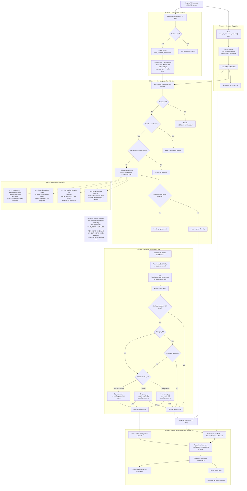

```mermaid
flowchart TD
    INPUT["Original Vietnamese clinical document"]

    %% =========================
    %% PHASE 1: BASE V7
    %% =========================
    subgraph V7["Phase 1 — Newest v7 pipeline"]
        V7RUN["Run build_v7_structured_pipeline() once"]
        V7FINAL["Final v7 entities<br/>text + position + type<br/>candidates + assertions"]
        FREEZE["Freeze final v7 entities"]
        SNAPSHOT["Save base_v7_snapshot"]

        V7RUN --> V7FINAL --> FREEZE
        FREEZE --> SNAPSHOT
    end

    INPUT --> V7RUN

    %% =========================
    %% PHASE 2: LOAD LLM CACHE
    %% =========================
    subgraph CACHE["Phase 2 — Reuse v9 LLM cache"]
        HASH["Calculate document SHA-256"]
        LOAD["Load cached final_accepted_candidates"]
        VALIDATE["Validate each LLM proposal<br/>• exact text-offset match<br/>• allowed type<br/>• proposer type = verifier type"]
        CACHEMISS{"Cache exists?"}

        HASH --> CACHEMISS
        CACHEMISS -- "No" --> ERROR["Fail or return frozen v7"]
        CACHEMISS -- "Yes" --> LOAD --> VALIDATE
    end

    INPUT --> HASH

    %% =========================
    %% PHASE 3: OVERLAP ANALYSIS
    %% =========================
    subgraph CONFLICT["Phase 3 — One-to-one conflict detection"]
        OVERLAP["Find overlap with frozen v7 entities"]
        HASOVERLAP{"Overlaps v7?"}
        ONEOVERLAP{"Exactly one v7 entity?"}
        DUPLICATE{"Same span and same type?"}
        CLASSIFY["Classify replacement<br/>using deterministic Categories A–D"]
        HIGHCONF{"High-confidence rule matched?"}

        VALIDATE --> OVERLAP --> HASOVERLAP

        HASOVERLAP -- "No" --> NOADD["Reject<br/>v10 has no additive path"]
        HASOVERLAP -- "Yes" --> ONEOVERLAP

        ONEOVERLAP -- "No" --> MULTIREJECT["Reject multi-entity overlap"]
        ONEOVERLAP -- "Yes" --> DUPLICATE

        DUPLICATE -- "Yes" --> SKIP["Skip exact duplicate"]
        DUPLICATE -- "No" --> CLASSIFY --> HIGHCONF

        HIGHCONF -- "No" --> CONFLICTREJECT["Keep original v7 entity"]
        HIGHCONF -- "Yes" --> PENDING["Pending replacement"]
    end

    FREEZE --> OVERLAP

    %% =========================
    %% CATEGORIES
    %% =========================
    subgraph RULES["Current replacement categories"]
        A["A — Drug boundary cleanup<br/>LLM span inside v7 drug<br/>Example: atenololtrong → atenolol"]

        B["B — Trim leading negation cue<br/>Example:<br/>Không đau ngực → đau ngực<br/>then require isNegated"]

        C["C — Expand diagnosis span<br/>v7 diagnosis/symptom inside<br/>a more complete LLM diagnosis"]

        D["D — Symptom → diagnosis correction<br/>only with boundary evidence<br/>Exact-span type-only flips disabled"]
    end

    CLASSIFY -.-> A
    CLASSIFY -.-> B
    CLASSIFY -.-> C
    CLASSIFY -.-> D

    %% =========================
    %% PHASE 4: LINK + ASSERT
    %% =========================
    subgraph REPROCESS["Phase 4 — Process replacement only"]
        NEWMENTION["Create replacement EntityMention"]
        LINK["Run HybridEntityLinker<br/>on replacement only"]
        ASSERT["Run RuleBasedAssertionDetector<br/>on replacement only"]
        POSTGATE["Post-link validation"]

        TYPECHECK{"Final type matches LLM type?"}
        CATEGORYB{"Category B?"}
        NEGATED{"isNegated detected?"}

        LINKABLE{"Replacement type?"}
        ICDGATE["Diagnosis gate<br/>• non-empty ICD<br/>• lexical consistency"]
        RXGATE["Drug gate<br/>• exactly one RxCUI<br/>• lexical consistency"]
        SYMGATE["Symptom gate<br/>no ontology candidate required"]

        NEWMENTION --> LINK --> ASSERT --> POSTGATE --> TYPECHECK

        TYPECHECK -- "No" --> REJECTPOST["Reject replacement"]
        TYPECHECK -- "Yes" --> CATEGORYB

        CATEGORYB -- "Yes" --> NEGATED
        NEGATED -- "No" --> REJECTPOST
        NEGATED -- "Yes" --> LINKABLE
        CATEGORYB -- "No" --> LINKABLE

        LINKABLE -- "CHẨN_ĐOÁN" --> ICDGATE
        LINKABLE -- "THUỐC" --> RXGATE
        LINKABLE -- "TRIỆU_CHỨNG" --> SYMGATE

        ICDGATE -- "Fail" --> REJECTPOST
        RXGATE -- "Fail" --> REJECTPOST

        ICDGATE -- "Pass" --> ACCEPT
        RXGATE -- "Pass" --> ACCEPT
        SYMGATE --> ACCEPT["Accept replacement"]
    end

    PENDING --> NEWMENTION

    %% =========================
    %% PHASE 5: MERGE
    %% =========================
    subgraph MERGE["Phase 5 — Final replacement-only output"]
        REMOVE["Remove the one replaced v7 entity"]
        SURVIVORS["Keep every unaffected frozen v7 entity unchanged"]
        SAFETY["Reject if replacement overlaps another surviving v7 entity"]
        COMBINE["Survivors + accepted replacements"]
        SORT["Deterministic sort"]
        OUTPUT["Final v10 submission JSON"]
        TRACE["Write conflict diagnostics and traces"]

        ACCEPT --> REMOVE
        FREEZE --> SURVIVORS

        REMOVE --> SAFETY
        SURVIVORS --> SAFETY

        SAFETY --> COMBINE --> SORT --> OUTPUT
        COMBINE --> TRACE
    end

    REJECTPOST --> KEEPOLD["Keep original frozen v7 entity"]
    CONFLICTREJECT --> KEEPOLD
    KEEPOLD --> SURVIVORS

    %% =========================
    %% IMPORTANT LIMITATION
    %% =========================
    LIMIT["Important current limitation:<br/>v10 conflict replacements allow only<br/>TRIỆU_CHỨNG, CHẨN_ĐOÁN and THUỐC.<br/><br/>TÊN_XÉT_NGHIỆM and<br/>KẾT_QUẢ_XÉT_NGHIỆM are never<br/>introduced or corrected by v10."]

    RULES -.-> LIMIT
```