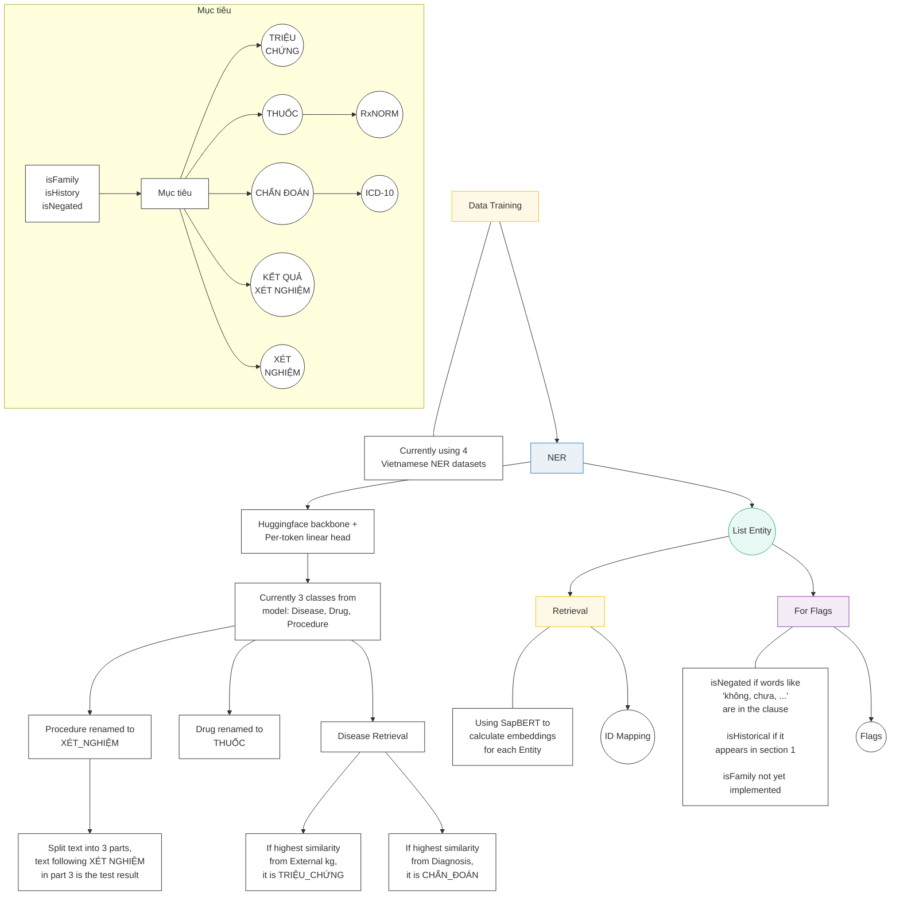

# Master Project State & Specification: Vietnamese Clinical NER

This document serves as the single source of truth for the project's requirements, current state, and the execution plan. Any AI agent reading this should be able to fully understand the project constraints and goals without further user explanation.

## System Architecture & Pipeline Overview
The following flowchart illustrates the current end-to-end processing pipeline, from data training and NER extraction to entity retrieval and flag assignments, based on the system diagram:



## 1. Project Goal & Core Requirements
The objective is to process raw Vietnamese clinical notes (unstructured text) and extract specific medical entities, map them to international ontologies, and identify contextual assertions.

### 1.1 The 5 Required Entity Labels
The pipeline MUST output exactly these 5 labels (no broad English categories are allowed in the final output):
1.  **`CHẨN_ĐOÁN`** (Diagnosis)
2.  **`THUỐC`** (Medication/Drug)
3.  **`TÊN_XÉT_NGHIỆM`** (Procedure/Test Name)
4.  **`TRIỆU_CHỨNG`** (Symptom/Phenotype)
5.  **`KẾT_QUẢ_XÉT_NGHIỆM`** (Test/Lab Result)

### 1.2 Ontology Standardization (Strict Requirements)
Extracted entities for specific labels MUST be mapped to their standardized IDs (returned in the `candidates` array):
*   **`CHẨN_ĐOÁN`** ➡️ MUST be mapped to **ICD-10**. 
    *   *Reference File:* `data\viettel\combine\diagnosis_10.csv`
*   **`THUỐC`** ➡️ MUST be mapped to **RxNorm**.
    *   *Raw Data Source:* `F:\Din\Study\Education\Projects\Thesis\data\mapping\mapping\RxNorm`
    *   *Task:* A `drug_rxnorm.csv` term-ID mapping file must be created to facilitate this.

### 1.3 Contextual Assertions (Modifiers)
We must detect contextual states for the entities.
*   **Valid Flags:** `isNegated`, `isFamily`, `isHistorical`
*   **Applicable Labels:** These assertions are ONLY evaluated for `CHẨN_ĐOÁN`, `THUỐC`, and `TRIỆU_CHỨNG`.
*   *If an entity has no modifiers, its assertions list must be empty `[]`.*

---

## 2. Target Output & Submission Format
The final pipeline must produce predictions for the final test set.

*   **Test Set Location:** `VAR\data\var` (contains `1.txt`, `2.txt`, etc.)
*   **Output Location:** Must be saved in an `output/` directory.
*   **File Structure:** 1-to-1 mapping. `output/1.json` corresponds to the predictions for `VAR\data\var\1.txt`.

### 2.1 JSON Schema Requirement
Each `.json` file must contain a JSON array of dictionaries. Each dictionary represents one extracted entity and MUST match this exact schema:

```json
[
  {
    "text": "amlodipine 10 mg po daily",
    "type": "THUỐC",
    "candidates": ["308135"],
    "assertions": ["isHistorical"],
    "position": [58, 83]
  },
  {
    "text": "ho",
    "type": "TRIỆU_CHỨNG",
    "candidates": [],
    "assertions": [],
    "position": [196, 198]
  }
]
```
**Schema Details:**
*   `text` (String): The exact matched substring from the raw text.
*   `type` (String): One of the 5 required labels.
*   `candidates` (List[String]): The mapped Ontology ID (e.g., RxNorm ID or ICD-10 code). Empty array `[]` if no mapping is found or required.
*   `assertions` (List[String]): The contextual flags. Empty array `[]` if none apply.
*   `position` (List[Int]): Exactly two integers `[start, end]` representing the **character-level** index mapped to the original `.txt` string.

---

## 3. Current Execution Plan

To reach the target output format, the execution is divided into three phases:

### Phase 1: NER Post-Processing & Knowledge Graph Mapping
We will NOT retrain the base Vietnamese NER model (which currently outputs `Disease/Symptom`, `Procedure`, `Drug`). Instead, we will apply post-processing:
*   **`Disease/Symptom` ➡️ `CHẨN_ĐOÁN`** (Derived from ICD-10).
*   **`Drug` ➡️ `THUỐC`**.
*   **`Procedure` ➡️ `TÊN_XÉT_NGHIỆM`**.
*   **Missing Labels Extraction:**
    *   **`TRIỆU_CHỨNG`:** Extract by querying the Knowledge Graph (`data\viettel\mapping\external_kg.parquet`) for `Disease` or `Phenotype` relationships.
    *   **`KẾT_QUẢ_XÉT_NGHIỆM`:** We will evaluate translating the English `MIMIC-IV Radiology Note` dataset to train a specialized extractor for diagnostic and lab results.

### Phase 2: Contextual Assertion Detection
*   **Strategy:** Explore the candidate dataset [PeterPaker123/mimic-iv-clinical-ner](https://huggingface.co/datasets/PeterPaker123/mimic-iv-clinical-ner) on HuggingFace.
*   **Action:** Evaluate translating this English dataset into Vietnamese to fine-tune a localized assertion classifier, or utilize zero-shot cross-lingual transfer methods.

### Phase 3: Dictionary Standardization & Term-ID Mapping (Immediate Next Step)
*   **Action:** Inspect the raw RxNorm dataset available at `F:\Din\Study\Education\Projects\Thesis\data\mapping\mapping\RxNorm`.
*   **Goal:** Write a script to process `rxnorm_terms.csv` (and any related `rrf` files) to create a structured `term-ID` CSV file (`drug_rxnorm.csv`). This file must be formatted similarly to `diagnosis_10.csv` to serve as the unified dictionary lookup for resolving `THUỐC` candidates.

---

## 4. What has been done

We have implemented the initial end-to-end evaluation script (`modules/evaluation/test_sample_pipeline.py`). For a given input sentence (chunked by the test script), the pipeline currently follows these steps:

1.  **NER Extraction:** The text is passed through the base NER model, which extracts entities using its original, pre-trained classes (`Disease`, `Drug`, and `Procedure`).
2.  **Label Mapping:** These original classes are explicitly mapped to our standardized target labels:
    *   `Disease` (and variants) ➡️ `CHẨN_ĐOÁN`
    *   `Drug` (and variants) ➡️ `THUỐC`
    *   `Procedure` (and variants) ➡️ `TÊN_XÉT_NGHIỆM`
    > [!WARNING]
    > **Missing Classes:** Currently, **2 required classes are missing entirely** (`TRIỆU_CHỨNG` and `KẾT_QUẢ_XÉT_NGHIỆM`) because the base model does not predict them.
3.  **Knowledge Graph Retrieval:** For the mapped entities, we run dense retrieval (SapBERT) against our mapping datasets to fetch standard IDs:
    *   **Diagnoses (`CHẨN_ĐOÁN`):** Queried against `data/viettel/base/short_diagnosis.csv` to retrieve the **ICD-10 ID**.
    *   **Drugs (`THUỐC`):** Queried against `data/viettel/base/short_drug.csv` to retrieve the **RxNorm ID**.
4.  **Target Output Formatter:** Predictions are formatted into the exact JSON schema and saved in the `output/` directory. Assertions are defaulted to an empty list `[]`.

### Current Accomplishments & Limitations

> [!NOTE]
> **Accomplishment:** We successfully established an end-to-end inference and evaluation pipeline that reads raw inputs, extracts core medical entities, retrieves standard dictionary IDs, and structures the final output. This gives us our baseline evaluation score.

> [!IMPORTANT]
> **Limitations to Address & Future Optimizations:**
> 0.  **NER Extraction is the Bottleneck:** A deep dive into the outputs shows that the Ontology mapping logic (SapBERT) is highly accurate. The primary cause for the poor `J_candidates` and `WER` scores is the base NER model itself: it frequently chops off words (e.g., "khó th"), completely misses obvious entities (e.g., "buồn nôn", "ecg"), and misclassifies types (e.g., classifying "phân tích nước tiểu" as a Disease).
> 1.  **Missing Entity Types:** The system cannot detect Lab Results (`KẾT_QUẢ_XÉT_NGHIỆM`). (Symptoms are now handled via dual-retrieval).
> 2.  **Missing Contextual Assertions:** All modifiers (`isNegated`, `isFamily`, `isHistorical`) default to empty arrays.
>     *   *Optimization Idea - Structure-based `isHistorical`:* Test notes follow a strict 3-part structure ("1. Tiền sử bệnh", "2. Tiền sử bệnh hiện tại", "3. Đánh giá tại bệnh viện"). We can track these section headers to automatically flag entities under "Tiền sử bệnh" as `isHistorical`. (Note: We cannot rely on sections to classify `CHẨN_ĐOÁN` vs `TRIỆU_CHỨNG`, as they can appear in any section).
>     *   *Optimization Idea - Regex-based `isNegated`:* Split sentences into clauses using commas. If the clause containing the extracted entity has words like "không" or "chưa" nearby, assign the `isNegated` flag.
> 3.  **Incomplete Drug Extraction Boundaries:** The base NER model only extracts the core drug name (e.g., "aspirin"), missing the dosage and frequency context.
>     *   *Optimization Idea - Regex Boundary Expansion:* Build a regex to find numbers or units of measurement (e.g., "325mg x 1") around the extracted drug in its clause. Mark that as the boundary and expand the final extracted `text` to include the full phrase (e.g., "aspirin 325mg x 1"). However, continue using *only* the core extracted drug term for SapBERT retrieval to avoid noise.
> 4.  **ID Retrieval Accuracy:** `J_candidates` can still be further optimized.

## 5. Change Log

### Modification Ver 2
1. **Symptom Dictionary Generation:** Created `generate_embedding_symptom.py` to extract Disease and Phenotype relationships from `external_kg.parquet` and build a massive ~54,000 term Symptom dictionary with embeddings.
2. **Dual-Retrieval Logic:** Rebuilt the `test_sample_pipeline.py` inference flow so that when the base NER model predicts a disease-related entity, we cross-reference it against both the Diagnosis dictionary and the Symptom dictionary. We dynamically classify it as `CHẨN_ĐOÁN` or `TRIỆU_CHỨNG` based on the highest cosine similarity score.
3. **Optimized JSON Format:** Stripped out the `candidates` key from the JSON outputs for `TRIỆU_CHỨNG` (and other irrelevant types) to adhere closer to the gold standard evaluation format.

### Modification Ver 3
1. **Lowercase Standardization:** Converted the entire matching architecture to be case-insensitive by `.lower()`ing all texts exactly prior to SapBERT embedding (for both the dictionary preprocessing scripts and the live inference pipeline), completely resolving the case mismatch errors.
2. **Similarity Thresholding:** Added a strict minimum cosine similarity cutoff of `0.7` for both `CHẨN_ĐOÁN` and `THUỐC` mapping. If the SapBERT score is below this, we drop the candidate ID instead of accidentally mapping a low-confidence false positive.

### Modification Ver 4
1. **Word Fragmentation Expansion:** Implemented a post-processing boundary fix for the base NER outputs. If an extracted entity boundary falls in the middle of a word (e.g., "khó th"), the script automatically expands the offset backwards and forwards to the nearest whitespace or punctuation to capture the complete word ("khó thở").
2. **Lab Test & Procedure Filtering:** Added hardcoded keyword matching for common lab/procedure stopwords (e.g., "phân tích", "xét nghiệm", "ct", "mri"). If these appear in the extracted entity, it is immediately routed to `TÊN_XÉT_NGHIỆM` instead of performing expensive (and inaccurate) SapBERT lookups for diseases.
3. **Drug Boundary Expansion:** Added regex matching to safely expand extracted drug boundaries to include trailing dosages and frequencies (e.g., "325mg x 1") in the final output string, while keeping the core drug term isolated for precise SapBERT ontology mapping.
4. **Training Data Word-Segmentation Fix:** Discovered the base NER model was trained on underscore-segmented text (e.g., "tiêu_chảy"), which caused fragmented outputs when inferencing on raw space-separated text. Executed a script to clean the `.conll` files, splitting underscored tokens into individual words and updating their BIO tags to prepare for a clean model retraining.

### Modification Ver 5
1. **Smarter Contextual Assertions:**
    *   **Strict `isHistorical`:** Dynamically tracked section boundaries to guarantee that `isHistorical` is only applied if the entity falls exactly within Section 1 (*Tiền sử bệnh*). It stops immediately at Section 2 to avoid false positives.
    *   **Advanced `isNegated`:** Replaced naive regex with a multi-rule system:
        *   Catches exact bullet-point negations (e.g., "- Không đau ngực").
        *   Catches comma-separated lists correctly (e.g., "Không ho, sốt, đau ngực" negates all three).
        *   Implements contrast-blocking (e.g., "Không sốt nhưng có ho" safely aborts the negation for "ho" because of "nhưng có").
    *   **Dropped `isFamily`:** Analysis revealed that "người nhà" mostly acts as an informant ("Theo lời người nhà"), causing massive false positives. We completely stripped `isFamily` to protect the score.
2. **Semantic-Lexical Hybrid Retrieval:**
    *   Upgraded the retrieval architecture to finally hit long Semantic Clinical Drug IDs (SCD) instead of falling back to short Ingredient IDs.
    *   Modified the pipeline to feed the **full expanded string** (e.g., "Chlorpheniramine 10ml") into SapBERT instead of just the core drug name.
    *   Implemented a "Retrieve and Rerank" algorithm: SapBERT instantly grabs the **Top 3** semantic matches. A `difflib` string similarity algorithm then acts as a tie-breaker, assigning a combined hybrid score to ensure exact dosage overlaps (e.g., matching "10ml" exactly) win out over purely semantic matches.

### Modification Ver 6
1. **Lab Results (`KẾT_QUẢ_XÉT_NGHIỆM`) Heuristic Post-Processor:** Implemented a proximity-based heuristic. When a `TÊN_XÉT_NGHIỆM` is detected within Section 3 ("Đánh giá tại bệnh viện"), the system automatically captures the remainder of that line as the `KẾT_QUẢ_XÉT_NGHIỆM`. This directly addresses the missing lab results without needing complex regex.
2. **Relaxed Similarity Thresholding:** Lowered the SapBERT cosine similarity cutoff from `0.7` to `0.6`. By pairing this with the hybrid lexical tie-breaker introduced in Ver 5, it safely increases True Positives for both Drugs and Diagnoses without letting in too much noise.
3. **Retrain NER Model with Focal Loss:** Retrained the base ViHealthBERT NER model on the cleaned `.conll` dataset using a Focal Loss implementation in `train_ner.py`. This specifically combats class imbalance to boost minority classes like Drugs and Procedures.
4. **Relabel Procedure Category:** Fixed a mapping bug where the NER model's `"Procedure/Treatment"` output was being silently dropped. Added `"Procedure/Treatment"` to the `LABEL_MAP` dictionary to ensure it correctly maps to `TÊN_XÉT_NGHIỆM`, which in turn successfully triggers the Lab Results heuristic.

### Modification Ver 7 
1. **OOP Pipeline Refactoring:** Shifted to a modular pipeline architecture (`modules/pipelines/v6.py`), separating out discrete post-processing modules.
2. **Clinical Recall Post-Processor:** Added `ClinicalRecallPostProcessor` to systematically recover high-value missed entities for `TÊN_XÉT_NGHIỆM`, `KẾT_QUẢ_XÉT_NGHIỆM`, and conservative symptom bullets from structured note sections.
3. **Clinical Type Correction:** Added `ClinicalTypeCorrectionPostProcessor` to correctly route symptoms away from ICD diagnosis linking, and to recover medication spans that were mislabeled as procedures when dosage context is present.
4. **Clinical Precision Filter & Dedup:** Added `ClinicalPrecisionFilterPostProcessor` alongside `OverlapDedupPostProcessor` to aggressively filter out artifacts, standalone dosing tokens, generic headers, and overlapping nested entities.
5. **Assertion Scope Tightening:** Restricted contextual assertions strictly to competition-eligible labels (`CHẨN_ĐOÁN`, `THUỐC`, `TRIỆU_CHỨNG`), boosting evaluation precision.

### Modification Ver 10 (Planned LLM Integration)
*Note: These changes are planned and might be broken down into individual Modification versions during actual implementation.*
1. **Synthetic Training Data Generation:** Generate synthetic Vietnamese clinical notes using an LLM. We will utilize k-shot prompting with examples from English MIMIC-IV Discharge Notes to teach the LLM the correct structural design patterns and entity density.
2. **Unified LLM for NER and Contextual Flags:** Finetune an LLM to replace the base NER model. This unified LLM will be trained to extract the entities AND natively assign contextual flags (`isHistorical`, `isNegated`) based on surrounding context, replacing the brittle regex and section-based heuristics.
3. **Cross-lingual Ontology Retrieval:** Utilize an LLM (e.g., MedGemma) to translate extracted Vietnamese entities into English before performing SapBERT retrieval, bridging the semantic gap and leveraging richer English medical ontologies.

---

**Evaluation Results (1st Run - Baseline):**
*   **Score (Điểm):** 8.33930
*   **WER:** 85.948
*   **J_assertion:** 8.7434
*   **J_candidates:** 3.7516
*   **Records Scored:** 100

**Evaluation Results (2nd Run - Symptom Split & Formatting):**
*   **Score (Điểm):** 16.84840
*   **WER:** 80.785
*   **J_assertion:** 20.8896
*   **J_candidates:** 6.1360
*   **Records Scored:** 100

**Evaluation Results (3rd Run - Threshold & Lowercase):**
*   **Score (Điểm):** 16.97530
*   **WER:** 80.785
*   **J_assertion:** 20.8896
*   **J_candidates:** 12.3597
*   **Records Scored:** 100

**Evaluation Results (4th Run - ViHealthBERT + Chunking Fix + Drug Expansion):**
*   **Score (Điểm):** 18.42670 
*   **WER:** 78.0532           
*   **J_assertion:** 22.1193  
*   **J_candidates:** 13.0171  
*   **Records Scored:** 100

**Evaluation Results (5th Run - Mod Ver 5: Hybrid Retrieval & Smarter Assertions):**
*   **Score (Điểm):** 18.76750
*   **WER:** 77.9624
*   **J_assertion:** 22.8200
*   **J_candidates:** 13.2756
*   **Records Scored:** 100

**Evaluation Results (6th Run - Mod Ver 6: Focal Loss NER + Lab Heuristic + 0.55 Threshold):**
*   **Score (Điểm):** 20.15090
*   **WER:** 76.2642
*   **J_assertion:** 25.0139
*   **J_candidates:** 13.8149
*   **Records Scored:** 100

**Evaluation Results (7th Run - Mod Ver 7: Tung's V6 Refined OOP Pipeline):**
*   **Score (Điểm):** 22.40000
*   **Records Scored:** 100