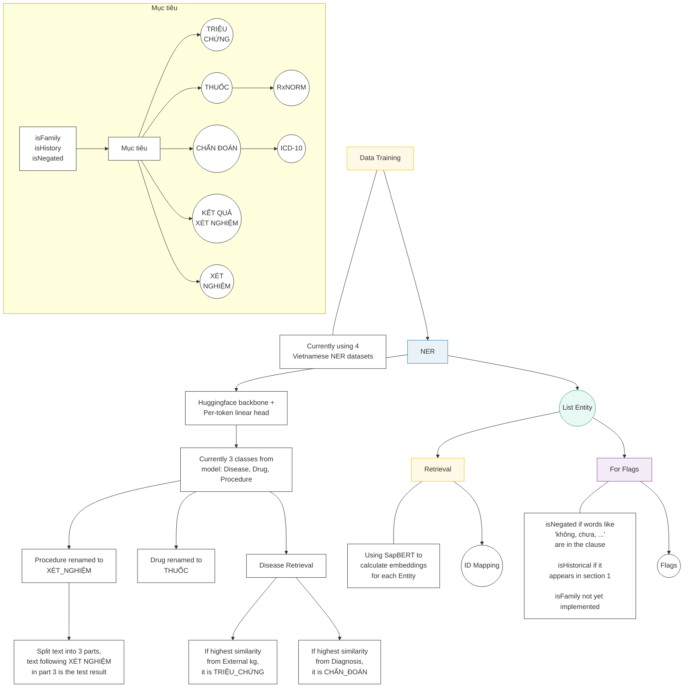

# Master Project State & Specification: Vietnamese Clinical NER

This document serves as the single source of truth for the project's requirements, current state, and the execution plan. Any AI agent reading this should be able to fully understand the project constraints and goals without further user explanation.

## System Architecture & Pipeline Overview
The following flowchart illustrates the current end-to-end processing pipeline, from data training and NER extraction to entity retrieval and flag assignments, based on the system diagram:



## 1. Project Goal & Core Requirements
The objective is to process raw Vietnamese clinical notes (unstructured text) and extract specific medical entities, map them to international ontologies, and identify contextual assertions.

### 1.1 The 5 Required Entity Labels
The pipeline MUST output exactly these 5 labels (no broad English categories are allowed in the final output):
1.  **`CHẨN_ĐOÁN`** (Diagnosis)
2.  **`THUỐC`** (Medication/Drug)
3.  **`TÊN_XÉT_NGHIỆM`** (Procedure/Test Name)
4.  **`TRIỆU_CHỨNG`** (Symptom/Phenotype)
5.  **`KẾT_QUẢ_XÉT_NGHIỆM`** (Test/Lab Result)

### 1.2 Ontology Standardization (Strict Requirements)
Extracted entities for specific labels MUST be mapped to their standardized IDs (returned in the `candidates` array):
*   **`CHẨN_ĐOÁN`** ➡️ MUST be mapped to **ICD-10**.
    *   *Active lookup:* `v_dataset/viettel/base/short_diagnosis.csv` (+ `.npy` embeddings)
*   **`THUỐC`** ➡️ MUST be mapped to **RxNorm**.
    *   *Active lookup:* `v_dataset/viettel/base/short_drug.csv` (+ `.npy` embeddings)
    *   *Raw sources:* under `v_dataset/viettel/mapping/` (RxNorm RRF / related files)

### 1.3 Contextual Assertions (Modifiers)
We must detect contextual states for the entities.
*   **Valid Flags:** `isNegated`, `isFamily`, `isHistorical`
*   **Applicable Labels:** These assertions are ONLY evaluated for `CHẨN_ĐOÁN`, `THUỐC`, and `TRIỆU_CHỨNG`.
*   *If an entity has no modifiers, its assertions list must be empty `[]`.*

---

## 2. Target Output & Submission Format
The final pipeline must produce predictions for the final test set.

*   **Test Set Location:** `v_dataset/var/test` (contains `1.txt`, `2.txt`, etc.)
*   **Output Location:** Versioned under `output/<pipeline>/runN/submission/` (or a flat `--output-dir` for submission ZIPs).
*   **File Structure:** 1-to-1 mapping. `1.json` corresponds to the predictions for `v_dataset/var/test/1.txt`.

### 2.1 JSON Schema Requirement
Each `.json` file must contain a JSON array of dictionaries. Each dictionary represents one extracted entity and MUST match this exact schema:

```json
[
  {
    "text": "amlodipine 10 mg po daily",
    "type": "THUỐC",
    "candidates": ["308135"],
    "assertions": ["isHistorical"],
    "position": [58, 83]
  },
  {
    "text": "ho",
    "type": "TRIỆU_CHỨNG",
    "candidates": [],
    "assertions": [],
    "position": [196, 198]
  }
]
```
**Schema Details:**
*   `text` (String): The exact matched substring from the raw text.
*   `type` (String): One of the 5 required labels.
*   `candidates` (List[String]): The mapped Ontology ID (e.g., RxNorm ID or ICD-10 code). Empty array `[]` if no mapping is found or required.
*   `assertions` (List[String]): The contextual flags. Empty array `[]` if none apply.
*   `position` (List[Int]): Exactly two integers `[start, end]` representing the **character-level** index mapped to the original `.txt` string.

---

## 3. Current Execution Plan

To reach the target output format, the execution is divided into three phases:

### Phase 1: NER Post-Processing & Knowledge Graph Mapping
We will NOT retrain the base Vietnamese NER model (which currently outputs `Disease/Symptom`, `Procedure`, `Drug`). Instead, we will apply post-processing:
*   **`Disease/Symptom` ➡️ `CHẨN_ĐOÁN`** (Derived from ICD-10).
*   **`Drug` ➡️ `THUỐC`**.
*   **`Procedure` ➡️ `TÊN_XÉT_NGHIỆM`**.
*   **Missing Labels Extraction:**
    *   **`TRIỆU_CHỨNG`:** Extract by querying the Knowledge Graph (`v_dataset\viettel\mapping\external_kg.parquet`) for `Disease` or `Phenotype` relationships.
    *   **`KẾT_QUẢ_XÉT_NGHIỆM`:** We will evaluate translating the English `MIMIC-IV Radiology Note` dataset to train a specialized extractor for diagnostic and lab results.

### Phase 2: Contextual Assertion Detection
*   **Strategy:** Explore the candidate dataset [PeterPaker123/mimic-iv-clinical-ner](https://huggingface.co/datasets/PeterPaker123/mimic-iv-clinical-ner) on HuggingFace.
*   **Action:** Evaluate translating this English dataset into Vietnamese to fine-tune a localized assertion classifier, or utilize zero-shot cross-lingual transfer methods.

### Phase 3: Dictionary Standardization & Term-ID Mapping (Immediate Next Step)
*   **Action:** Inspect the raw RxNorm dataset available at `F:\Din\Study\Education\Projects\Thesis\data\mapping\mapping\RxNorm`.
*   **Goal:** Write a script to process `rxnorm_terms.csv` (and any related `rrf` files) to create a structured `term-ID` CSV file (`drug_rxnorm.csv`). This file must be formatted similarly to `diagnosis_10.csv` to serve as the unified dictionary lookup for resolving `THUỐC` candidates.

---

## 4. What has been done

> Historical baseline notes below describe the **initial** end-to-end script before Ver 2–8. For the current system, use the Change Log and evaluation tables further down. Assertions, dual-retrieval symptoms, V6–V7 postprocessors, and versioned runners are implemented.

We have implemented the initial end-to-end evaluation script (`modules/evaluation/test_sample_pipeline.py`). For a given input sentence (chunked by the test script), the pipeline currently follows these steps:

1.  **NER Extraction:** The text is passed through the base NER model, which extracts entities using its original, pre-trained classes (`Disease`, `Drug`, and `Procedure`).
2.  **Label Mapping:** These original classes are explicitly mapped to our standardized target labels:
    *   `Disease` (and variants) ➡️ `CHẨN_ĐOÁN`
    *   `Drug` (and variants) ➡️ `THUỐC`
    *   `Procedure` (and variants) ➡️ `TÊN_XÉT_NGHIỆM`
    > [!WARNING]
    > **Missing Classes:** Currently, **2 required classes are missing entirely** (`TRIỆU_CHỨNG` and `KẾT_QUẢ_XÉT_NGHIỆM`) because the base model does not predict them.
3.  **Knowledge Graph Retrieval:** For the mapped entities, we run dense retrieval (SapBERT) against our mapping datasets to fetch standard IDs:
    *   **Diagnoses (`CHẨN_ĐOÁN`):** Queried against `v_dataset/viettel/base/short_diagnosis.csv` to retrieve the **ICD-10 ID**.
    *   **Drugs (`THUỐC`):** Queried against `v_dataset/viettel/base/short_drug.csv` to retrieve the **RxNorm ID**.
4.  **Target Output Formatter:** Predictions are formatted into the exact JSON schema and saved in the `output/` directory. Assertions are defaulted to an empty list `[]`.

### Current Accomplishments & Limitations

> [!NOTE]
> **Accomplishment:** We successfully established an end-to-end inference and evaluation pipeline that reads raw inputs, extracts core medical entities, retrieves standard dictionary IDs, and structures the final output. This gives us our baseline evaluation score.

> [!IMPORTANT]
> **Limitations to Address & Future Optimizations:**
> 0.  **NER Extraction is the Bottleneck:** A deep dive into the outputs shows that the Ontology mapping logic (SapBERT) is highly accurate. The primary cause for the poor `J_candidates` and `WER` scores is the base NER model itself: it frequently chops off words (e.g., "khó th"), completely misses obvious entities (e.g., "buồn nôn", "ecg"), and misclassifies types (e.g., classifying "phân tích nước tiểu" as a Disease).
> 1.  **Missing Entity Types:** The system cannot detect Lab Results (`KẾT_QUẢ_XÉT_NGHIỆM`). (Symptoms are now handled via dual-retrieval).
> 2.  **Missing Contextual Assertions:** All modifiers (`isNegated`, `isFamily`, `isHistorical`) default to empty arrays.
>     *   *Optimization Idea - Structure-based `isHistorical`:* Test notes follow a strict 3-part structure ("1. Tiền sử bệnh", "2. Tiền sử bệnh hiện tại", "3. Đánh giá tại bệnh viện"). We can track these section headers to automatically flag entities under "Tiền sử bệnh" as `isHistorical`. (Note: We cannot rely on sections to classify `CHẨN_ĐOÁN` vs `TRIỆU_CHỨNG`, as they can appear in any section).
>     *   *Optimization Idea - Regex-based `isNegated`:* Split sentences into clauses using commas. If the clause containing the extracted entity has words like "không" or "chưa" nearby, assign the `isNegated` flag.
> 3.  **Incomplete Drug Extraction Boundaries:** The base NER model only extracts the core drug name (e.g., "aspirin"), missing the dosage and frequency context.
>     *   *Optimization Idea - Regex Boundary Expansion:* Build a regex to find numbers or units of measurement (e.g., "325mg x 1") around the extracted drug in its clause. Mark that as the boundary and expand the final extracted `text` to include the full phrase (e.g., "aspirin 325mg x 1"). However, continue using *only* the core extracted drug term for SapBERT retrieval to avoid noise.
> 4.  **ID Retrieval Accuracy:** `J_candidates` can still be further optimized.

## 5. Change Log

### Modification Ver 2
1. **Symptom Dictionary Generation:** Created `generate_embedding_symptom.py` to extract Disease and Phenotype relationships from `external_kg.parquet` and build a massive ~54,000 term Symptom dictionary with embeddings.
2. **Dual-Retrieval Logic:** Rebuilt the `test_sample_pipeline.py` inference flow so that when the base NER model predicts a disease-related entity, we cross-reference it against both the Diagnosis dictionary and the Symptom dictionary. We dynamically classify it as `CHẨN_ĐOÁN` or `TRIỆU_CHỨNG` based on the highest cosine similarity score.
3. **Optimized JSON Format:** Stripped out the `candidates` key from the JSON outputs for `TRIỆU_CHỨNG` (and other irrelevant types) to adhere closer to the gold standard evaluation format.

### Modification Ver 3
1. **Lowercase Standardization:** Converted the entire matching architecture to be case-insensitive by `.lower()`ing all texts exactly prior to SapBERT embedding (for both the dictionary preprocessing scripts and the live inference pipeline), completely resolving the case mismatch errors.
2. **Similarity Thresholding:** Added a strict minimum cosine similarity cutoff of `0.7` for both `CHẨN_ĐOÁN` and `THUỐC` mapping. If the SapBERT score is below this, we drop the candidate ID instead of accidentally mapping a low-confidence false positive.

### Modification Ver 4
1. **Word Fragmentation Expansion:** Implemented a post-processing boundary fix for the base NER outputs. If an extracted entity boundary falls in the middle of a word (e.g., "khó th"), the script automatically expands the offset backwards and forwards to the nearest whitespace or punctuation to capture the complete word ("khó thở").
2. **Lab Test & Procedure Filtering:** Added hardcoded keyword matching for common lab/procedure stopwords (e.g., "phân tích", "xét nghiệm", "ct", "mri"). If these appear in the extracted entity, it is immediately routed to `TÊN_XÉT_NGHIỆM` instead of performing expensive (and inaccurate) SapBERT lookups for diseases.
3. **Drug Boundary Expansion:** Added regex matching to safely expand extracted drug boundaries to include trailing dosages and frequencies (e.g., "325mg x 1") in the final output string, while keeping the core drug term isolated for precise SapBERT ontology mapping.
4. **Training Data Word-Segmentation Fix:** Discovered the base NER model was trained on underscore-segmented text (e.g., "tiêu_chảy"), which caused fragmented outputs when inferencing on raw space-separated text. Executed a script to clean the `.conll` files, splitting underscored tokens into individual words and updating their BIO tags to prepare for a clean model retraining.

### Modification Ver 5
1. **Smarter Contextual Assertions:**
    *   **Strict `isHistorical`:** Dynamically tracked section boundaries to guarantee that `isHistorical` is only applied if the entity falls exactly within Section 1 (*Tiền sử bệnh*). It stops immediately at Section 2 to avoid false positives.
    *   **Advanced `isNegated`:** Replaced naive regex with a multi-rule system:
        *   Catches exact bullet-point negations (e.g., "- Không đau ngực").
        *   Catches comma-separated lists correctly (e.g., "Không ho, sốt, đau ngực" negates all three).
        *   Implements contrast-blocking (e.g., "Không sốt nhưng có ho" safely aborts the negation for "ho" because of "nhưng có").
    *   **Dropped `isFamily`:** Analysis revealed that "người nhà" mostly acts as an informant ("Theo lời người nhà"), causing massive false positives. We completely stripped `isFamily` to protect the score.
2. **Semantic-Lexical Hybrid Retrieval:**
    *   Upgraded the retrieval architecture to finally hit long Semantic Clinical Drug IDs (SCD) instead of falling back to short Ingredient IDs.
    *   Modified the pipeline to feed the **full expanded string** (e.g., "Chlorpheniramine 10ml") into SapBERT instead of just the core drug name.
    *   Implemented a "Retrieve and Rerank" algorithm: SapBERT instantly grabs the **Top 3** semantic matches. A `difflib` string similarity algorithm then acts as a tie-breaker, assigning a combined hybrid score to ensure exact dosage overlaps (e.g., matching "10ml" exactly) win out over purely semantic matches.

### Architecture Refactor for Iterative Refinement
1. **Legacy Preservation:** Copied the current working monolithic files to `modules/legacy/utils_legacy.py` and `modules/legacy/test_sample_pipeline_legacy.py` for rollback and regression comparison.
2. **OOP Component Layer:** Added typed schemas, base interfaces, and composable components under `modules/core/`, `modules/components/`, and `modules/pipelines/`.
3. **Versioned Runner:** Added `modules/evaluation/run_pipeline.py` with selectable pipelines: `legacy_v5` and `v5_refactored`.
4. **Refactor Documentation:** Added `docs/tung/refactor_architecture.md` to describe how to add future `v6`, `v7`, and ablation pipelines safely.

### Modification Ver 6
1. **Versioned V6 Pipeline:** Added `v6_refined` to `modules/evaluation/run_pipeline.py` via `modules/pipelines/v6.py`, preserving `v5_refactored` for regression comparison.
2. **Lab/Test Result Recall:** Added `ClinicalRecallPostProcessor` to recover high-value missed entities for `TÊN_XÉT_NGHIỆM`, `KẾT_QUẢ_XÉT_NGHIỆM`, and conservative symptom bullets from structured note sections.
3. **Type Correction:** Added `ClinicalTypeCorrectionPostProcessor` to correct common symptoms away from ICD diagnosis linking and recover medication spans mislabeled as procedures when dosage/medication context is present.
4. **Precision Cleanup:** Added `ClinicalPrecisionFilterPostProcessor` plus nested overlap cleanup to remove artifacts such as standalone dosing tokens and generic headers.
5. **Assertion Scope Tightening:** V6 restricts contextual assertions to the competition-eligible labels only (`CHẨN_ĐOÁN`, `THUỐC`, `TRIỆU_CHỨNG`).
6. **Generated Full V6 Outputs:** Full V6 runs now live inside the central `output/` folder. The current generated run is at `output/v6_refined/run1/submission/` with 100 note-level JSON files (traces under `output/v6_refined/run1/trace/`). External competition/evaluator score has been returned: 22.42480.

### Modification Ver 7 (`v7_structured`)
1. **Independent candidate generation:** Stopped treating base NER as the only entity source. Added section-aware + ontology lexical recall on top of the unchanged `v6_refined` stack.
2. **New components:**
    *   `VietnameseClinicalSectionParser` — shared section boundaries with original offsets.
    *   `SectionAwareRecallPostProcessor` — symptom bullets / short reason-for-admission phrases.
    *   `LabPairRecallPostProcessor` — lab name/result pairs (`kali là 6.6 mmol/l`, `WBC:14,43`, etc.).
    *   `OntologyDrugRecallPostProcessor` — exact + compact embedded drug recovery (`Dùngmethadonekéo dài`, `vancozosyn`, `bactrim`).
    *   `OntologyDiagnosisRecallPostProcessor` — conservative ICD lexical recall in priority sections.
    *   `CandidateMergePostProcessor` — deterministic conflict resolution by evidence source.
3. **Assertions:** Extended `RuleBasedAssertionDetector` with optional shared section context for `isHistorical` (v6 defaults preserved; v7 enables section parser).
4. **Linker:** `HybridEntityLinker` can now assign ICD candidates for already-typed `CHẨN_ĐOÁN` mentions (including preset concept IDs from ontology recall).
5. **Pipeline registration:** `v7_structured` in `modules/pipelines/v7.py` + `modules/pipelines/factory.py`.
6. **Diagnostics:** `modules/evaluation/analyze_outputs.py`, `compare_outputs.py`, and `analysis/v6_vs_v7.md`.
7. **Run command:** `python modules/evaluation/run_pipeline.py --pipeline v7_structured` → `output/v7_structured/runN/{submission,trace}/`
8. **External leaderboard:** Score **24.25880** (see evaluation table below).

### Remaining Ver 7+ / Ver 8+ Ideas
1. **Reduce nested/overlapping spans:** v7 still has more overlaps than v6; strengthen merge/dedup so ontology drug spans replace concatenated NER junk (`lasixđã`, `Dùngmethadonekéo dài`).
2. **Negation + diagnosis conflict:** e.g. `Không chảy máu mũi` still leaves a diagnosis span without `isNegated` and/or a whole-line symptom artifact.
3. **Upgrade the Drug Dictionary (RxNorm Expansion):** Local `short_drug.csv` still limits `J_candidates` ceiling for SCD-style IDs.
4. **Precision pass on lab-pair / section recall:** further gate false lab names and over-long symptom bullets.
5. **Carry ontology preset metadata across drug-boundary expansion / merge** so expanded NER drug spans can still use unambiguous RxCUI presets — attempted in `v8_candidate_rescue` via provenance transfer + rescue-only linking; same-env run rescued 0 (SapBERT already linked almost all drugs).
6. **Block embedded drug aliases inside symptom phrases** (e.g. `alpain` inside `abdominal pain`) — still open; rescue mode avoids override harm but does not remove the false span.

---

**Evaluation Results (1st Run - Baseline):**
*   **Score (Điểm):** 8.33930
*   **WER:** 85.948
*   **J_assertion:** 8.7434
*   **J_candidates:** 3.7516
*   **Records Scored:** 100

**Evaluation Results (2nd Run - Symptom Split & Formatting):**
*   **Score (Điểm):** 16.84840
*   **WER:** 80.785
*   **J_assertion:** 20.8896
*   **J_candidates:** 6.1360
*   **Records Scored:** 100

**Evaluation Results (3rd Run - Threshold & Lowercase):**
*   **Score (Điểm):** 16.97530
*   **WER:** 80.785
*   **J_assertion:** 20.8896
*   **J_candidates:** 12.3597
*   **Records Scored:** 100

**Evaluation Results (4th Run - ViHealthBERT + Chunking Fix + Drug Expansion):**
*   **Score (Điểm):** 18.42670 
*   **WER:** 78.0532           
*   **J_assertion:** 22.1193  
*   **J_candidates:** 13.0171  
*   **Records Scored:** 100

**Evaluation Results (5th Run - Mod Ver 5: Hybrid Retrieval & Smarter Assertions):**
*   **Score (Điểm):** 18.76750
*   **WER:** 77.9624
*   **J_assertion:** 22.8200
*   **J_candidates:** 13.2756
*   **Records Scored:** 100

**Evaluation Results (6th Run - Mod Ver 6: OOP Refactor, Recall & Cleanup Postprocessors):**
*   **Score (Điểm):** 22.42480
*   **WER:** 73.1428
*   **J_assertion:** 28.8905
*   **J_candidates:** 14.2511
*   **Records Scored:** 100

**Evaluation Results (7th Run - Mod Ver 7: Section-aware + Ontology Lexical Recall):**
*   **Intermediate / older v7 artifact (do not use as baseline):** Score **24.25880**
    *   WER: 72.035 / J_assertion: 30.2838 / J_candidates: 16.9605 / Records: 100
    *   Delta vs v6: Score +1.834 / WER −1.108 / J_assertion +1.393 / J_candidates +2.709
*   **Canonical finished v7 baseline (use for all comparisons):**
    *   Pipeline: `v7_structured`
    *   **Score (Điểm): 24.79660**
    *   **WER:** 72.0039
    *   **J_assertion:** 31.3672
    *   **J_candidates:** 17.4691
    *   **num_scored:** 87 / **num_records:** 100
    *   Artifact: `output/v7_structured/run1/submission` (3160 entities; drugs 259/276 linked)

### Modification Ver 8 (`v8_candidate_integrity`)
1. **Purpose:** Isolated candidate-integrity experiment. Preserve unambiguous RxCUI presets from `OntologyDrugRecallPostProcessor` instead of discarding them and re-running SapBERT.
2. **Exact single inference change:**
    *   `OntologyDrugRecallPostProcessor(track_rxcui_sets=True)` — attach full alias→RxCUI sets + ambiguity metadata (opt-in; v7 default unchanged).
    *   `HybridEntityLinker(use_unambiguous_preset_drug_rxcui=True)` — if ontology provenance + exact/embedded match + exactly one valid RxCUI, use it directly; else SapBERT fallback identical to v7.
3. **Alias ambiguity safeguards:** trust only when the complete dictionary maps the matched alias to exactly one RxCUI; never pick the first of many; never trust bare `metadata["rxcui"]` without `ontology_drug_recall=True`.
4. **v7 regression status:** Shared-class defaults preserve v7 behavior. Same-env original-code vs post-edit v7 outputs are bit-identical. Bit-identical reproduction of the scored canonical artifact is limited by SapBERT numerical nondeterminism (see `analysis/v7_regression_nondeterminism.md`); spans/text/assertions still match canonical.
5. **v7 → v8 candidate-change counts (same-env `v7_regression` → `v8_candidate_integrity`):**
    *   Hard invariants: PASS (3160 entities; identical text/positions/types/assertions; diagnosis candidates unchanged).
    *   Drug candidates changed: **1 / 276** (0.4%). Newly linked: 0. Newly unlinked: 0.
    *   Preset path used on 202 ontology-overlap drugs; 201 already agreed with SapBERT.
    *   The single change is a noisy embedded alias (`alpain` inside `abdominal pain`).
6. **Submission ZIP:** `output/v8_candidate_integrity_submission.zip` (also `output/output.zip`), structure `output/1.json`…`100.json`.
7. **Leaderboard:** No official v8 score yet — do not record metrics until submitted.
8. **Final conclusion:** **negative/no-op ablation**. Preset paths 202; candidate no-ops 201; 1 changed candidate (`al pain` inside `abdominal pain` — false-positive ontology match). **Not submitted.**


### Modification Ver 8b (`v8_candidate_rescue`)
1. **Goal:** Preserve exact v7 SapBERT drug candidates when present. Only use unambiguous RxNorm ontology evidence to **rescue** currently unlinked THUỐC (direct ontology recall or safe contained-donor provenance transfer). Never override a non-empty v7 candidate.
2. **Design:**
    *   Keep `v8_candidate_integrity` unchanged as the historical override ablation.
    *   New pipeline `v8_candidate_rescue` with:
        *   `OntologyDrugRecallPostProcessor(track_rxcui_sets=True)`
        *   `DrugOntologyProvenanceTransferPostProcessor` (after recalls, before `CandidateMerge`)
        *   `HybridEntityLinker(preset_drug_link_mode="rescue_unlinked")`
    *   Modes: `disabled` (v7) / `override_unambiguous` (old v8) / `rescue_unlinked` (new).
3. **Provenance-transfer rules (metadata only):** eligible ontology donors (`exact_norm`/`embedded_compact`, exactly one valid RxCUI); recipient THUỐC strictly contains donor; expansion limits prefix≤15 / suffix≤60 / total≤70 / len≤80; reject sentence markers; medication-extension check after stripping all donors; conflicting RxCUIs → no transfer.
4. **Same-env causal comparison** (`output/v7_structured/same_env` vs `output/v8_candidate_rescue/same_env`, CPU parallel runner, GPUs occupied by other users):
    *   Hard invariants: **PASS** (identical text/spans/types/assertions; diagnosis candidates unchanged; existing drug candidates unchanged/removed = 0).
    *   Total THUỐC: 271; v7 linked 270; v7 unlinked 1 (`NSAID`, no ontology evidence).
    *   Newly rescued drugs: **0**
    *   Traces: 100 files, 100 non-empty, 0 empty.
5. **Submission decision:** **NOT READY TO SUBMIT** (no-op ablation: 0 newly rescued drugs despite correct rescue-only behavior). Do not package a Viettel ZIP.
6. **Leaderboard:** Do not add metrics until an actual submission with ≥1 safe rescue.
7. **Path note:** After `data`→`v_dataset` rename, NER weights resolve via `v_dataset/statedict`; LFS objects must be pulled for `statedict` + `viettel/base` dictionaries.
8. **Final conclusion:** **no-op ablation** — newly rescued drugs: **0**. Same-env unlinked drug: `NSAID` (`NO_ONTOLOGY_EVIDENCE`). **Not submitted.** Do not spend more time improving v8.

### Modification Ver 9 (`v9_llm_recall`) — in progress
1. **Goal:** Use a self-hosted LLM as an independent high-recall entity candidate generator for missing clinical entities, while keeping the existing deterministic pipeline responsible for exact offsets, overlap handling, ICD/RxNorm linking, assertions, and final competition JSON.
2. **Model:** `Qwen/Qwen3.5-9B` (self-hosted only; no external API).
3. **Thinking:** disabled (`enable_thinking=false`).
4. **Target types:** `TRIỆU_CHỨNG`, `CHẨN_ĐOÁN`, `THUỐC` only.
5. **Architecture:**
    *   Phase A: offline LLM candidate cache (`modules/evaluation/generate_v9_llm_cache.py` → `cache/v9_llm_recall/<doc_sha256>.json`)
    *   strict exact line-indexed alignment (no fuzzy / no LLM offsets)
    *   second-pass verifier (accept only when proposer type == verifier type)
    *   Phase B: `v9_llm_recall` pipeline = `v7_structured` + additive non-overlapping `LLMRecallPostProcessor` before `CandidateMerge`
6. **Hard rules:** LLM must NOT emit competition JSON, ICD, RxNorm, offsets; must NOT replace/modify existing v7 entities/types/candidates/assertions.
7. **Canonical leaderboard baseline remains:** `v7_structured` score **24.79660** (do not replace).
8. **Leaderboard:** Do not add v9 metrics until an actual submission is scored.

